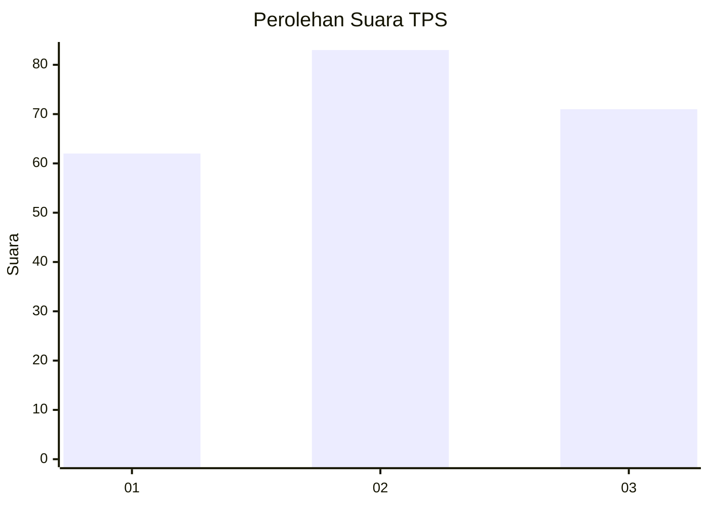
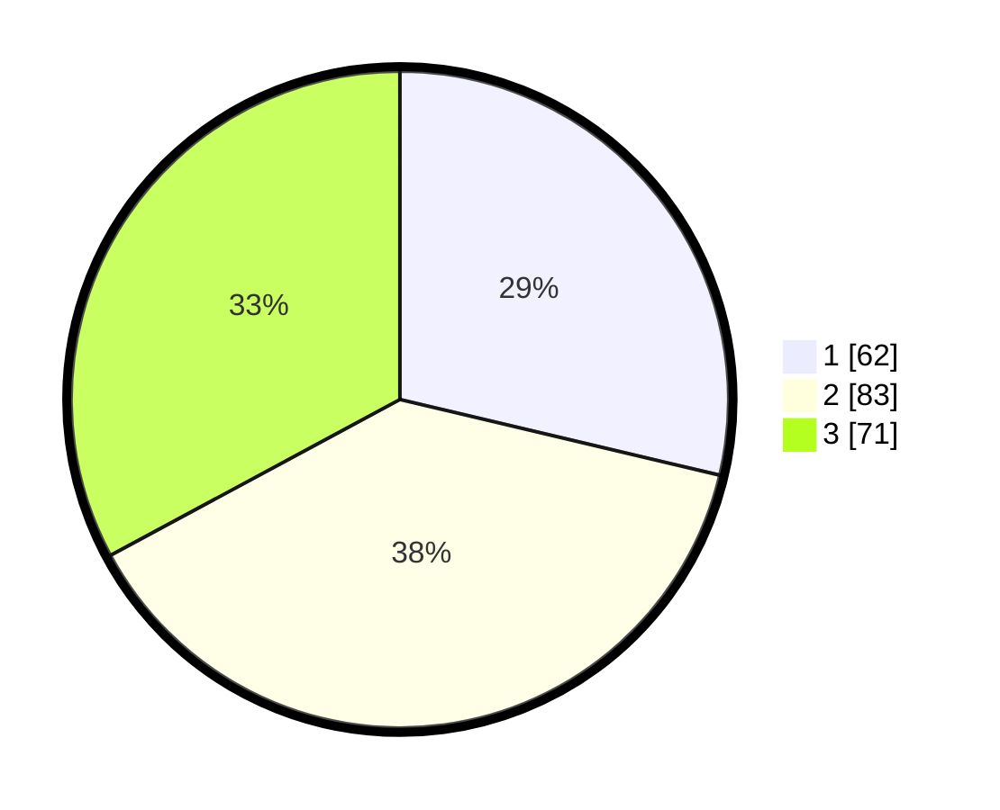

# Hasil

## Grafik

## Tabel

| No. | Nama Paslon    | Suara | Suara (raw) | Persentase |
|:--- |:-------------- | -----:| -----------:| ----------:|
| 1   | ANIES MUHAIMIN | 62    | [62][p-1]   | 28,70      |
| 2   | PRABOWO GIBRAN | 83    | [83][p-2]   | 38,43      |
| 3   | GANJAR MAHFUD  | 71    | [71][p-3]   | 32,87      |

[p-1]: https://github.com/gigit-pemilu/pemilu-2024-35-jawa-timur/blob/main/pilpres/hitung-suara/sub/35-jawa-timur/sub/73-kota-malang/sub/01-blimbing/sub/1007-purwantoro/sub/046-tps/sub/paslon-1.txt
[p-2]: https://github.com/gigit-pemilu/pemilu-2024-35-jawa-timur/blob/main/pilpres/hitung-suara/sub/35-jawa-timur/sub/73-kota-malang/sub/01-blimbing/sub/1007-purwantoro/sub/046-tps/sub/paslon-2.txt
[p-3]: https://github.com/gigit-pemilu/pemilu-2024-35-jawa-timur/blob/main/pilpres/hitung-suara/sub/35-jawa-timur/sub/73-kota-malang/sub/01-blimbing/sub/1007-purwantoro/sub/046-tps/sub/paslon-3.txt

## Foto C Plano

https://sirekap-obj-formc.kpu.go.id/c55e/pemilu/ppwp/35/73/01/10/07/3573011007046-20240214-215907--fb83eba9-70e9-40cb-b994-c691a80da798.jpg

https://sirekap-obj-formc.kpu.go.id/c55e/pemilu/ppwp/35/73/01/10/07/3573011007046-20240214-220007--5144a9ea-013f-46d9-b62c-b0da6d9a02eb.jpg

https://sirekap-obj-formc.kpu.go.id/c55e/pemilu/ppwp/35/73/01/10/07/3573011007046-20240214-220055--b76de23b-29f6-455f-813f-44c4c19aefa3.jpg

## Metadata

| Key        | Value               |
| ---------- | ------------------- |
| Time Stamp | 2024-02-15 12:00:28 |

