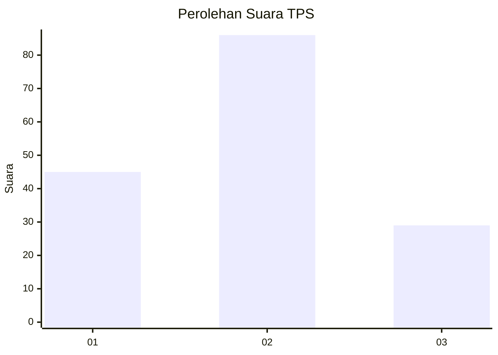
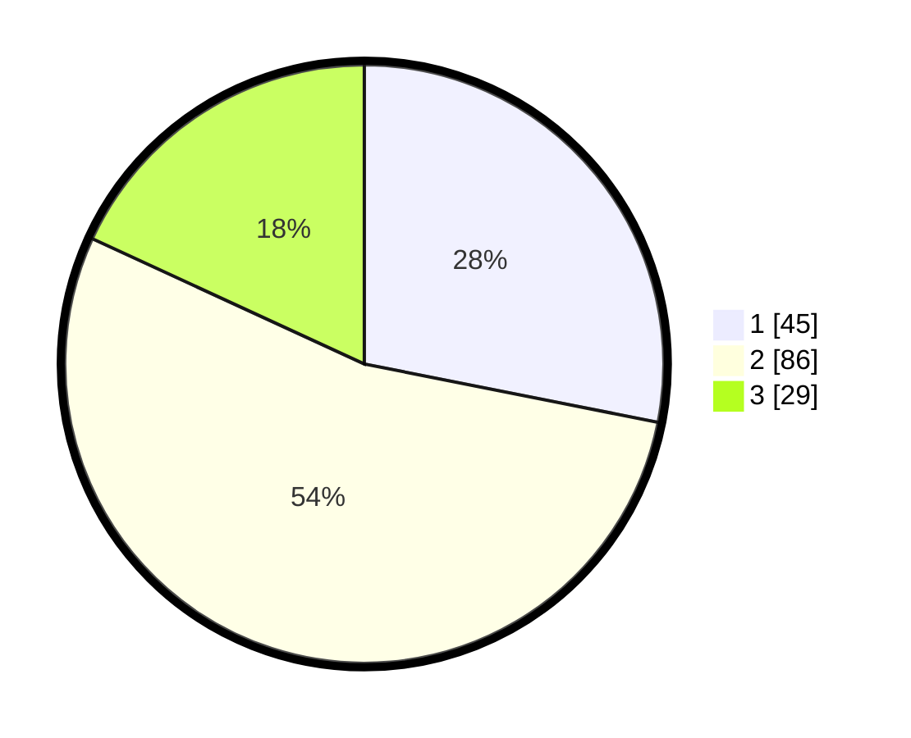

# Hasil

## Grafik

## Tabel

| No. | Nama Paslon    | Suara | Suara (raw) | Persentase |
|:--- |:-------------- | -----:| -----------:| ----------:|
| 1   | ANIES MUHAIMIN | 45    | [45][p-1]   | 28,13      |
| 2   | PRABOWO GIBRAN | 86    | [86][p-2]   | 53,75      |
| 3   | GANJAR MAHFUD  | 29    | [29][p-3]   | 18,13      |

[p-1]: https://github.com/gigit-pemilu/pemilu-2024/blob/main/pilpres/hitung-suara/sub/35-jawa-timur/sub/73-kota-malang/sub/01-blimbing/sub/1007-purwantoro/sub/061-tps/sub/paslon-1.txt
[p-2]: https://github.com/gigit-pemilu/pemilu-2024/blob/main/pilpres/hitung-suara/sub/35-jawa-timur/sub/73-kota-malang/sub/01-blimbing/sub/1007-purwantoro/sub/061-tps/sub/paslon-2.txt
[p-3]: https://github.com/gigit-pemilu/pemilu-2024/blob/main/pilpres/hitung-suara/sub/35-jawa-timur/sub/73-kota-malang/sub/01-blimbing/sub/1007-purwantoro/sub/061-tps/sub/paslon-3.txt

## Foto C Plano

https://sirekap-obj-formc.kpu.go.id/d409/pemilu/ppwp/35/73/01/10/07/3573011007061-20240215-100107--8d29c6a6-4da2-418a-b924-4e4a8c6b52ab.jpg

https://sirekap-obj-formc.kpu.go.id/d409/pemilu/ppwp/35/73/01/10/07/3573011007061-20240215-100119--747d1491-2e72-4f16-8e20-f6079cfbb268.jpg

https://sirekap-obj-formc.kpu.go.id/d409/pemilu/ppwp/35/73/01/10/07/3573011007061-20240215-100129--3d98a180-39da-4396-ab68-c16867270127.jpg

## Metadata

| Key        | Value               |
| ---------- | ------------------- |
| Time Stamp | 2024-02-26 00:00:00 |

