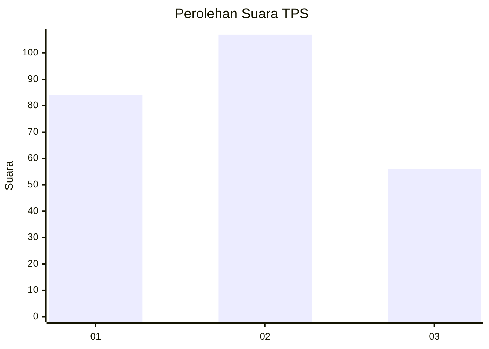
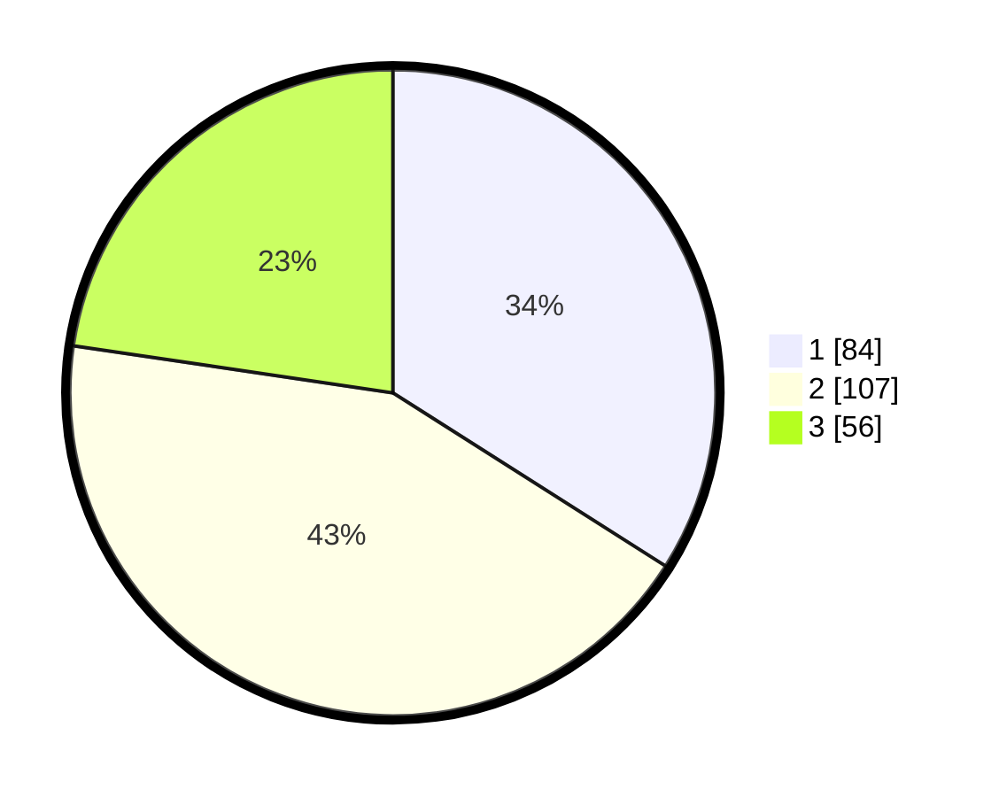

# Hasil

## Grafik

## Tabel

| No. | Nama Paslon    | Suara | Suara (raw) | Persentase |
|:--- |:-------------- | -----:| -----------:| ----------:|
| 1   | ANIES MUHAIMIN | 84    | [84][p-1]   | 34,01      |
| 2   | PRABOWO GIBRAN | 107   | [107][p-2]  | 43,32      |
| 3   | GANJAR MAHFUD  | 56    | [56][p-3]   | 22,67      |

[p-1]: https://github.com/gigit-pemilu/pemilu-2024/blob/main/pilpres/hitung-suara/sub/35-jawa-timur/sub/73-kota-malang/sub/01-blimbing/sub/1007-purwantoro/sub/067-tps/sub/paslon-1.txt
[p-2]: https://github.com/gigit-pemilu/pemilu-2024/blob/main/pilpres/hitung-suara/sub/35-jawa-timur/sub/73-kota-malang/sub/01-blimbing/sub/1007-purwantoro/sub/067-tps/sub/paslon-2.txt
[p-3]: https://github.com/gigit-pemilu/pemilu-2024/blob/main/pilpres/hitung-suara/sub/35-jawa-timur/sub/73-kota-malang/sub/01-blimbing/sub/1007-purwantoro/sub/067-tps/sub/paslon-3.txt

## Foto C Plano

https://sirekap-obj-formc.kpu.go.id/6b71/pemilu/ppwp/35/73/01/10/07/3573011007067-20240214-223535--7d02df0a-5aea-499c-8ae2-ca11edcf2a0a.jpg

https://sirekap-obj-formc.kpu.go.id/6b71/pemilu/ppwp/35/73/01/10/07/3573011007067-20240214-210936--fb97d6da-0554-4cb2-a1df-ac78d1ac622f.jpg

https://sirekap-obj-formc.kpu.go.id/6b71/pemilu/ppwp/35/73/01/10/07/3573011007067-20240214-211138--b1448d90-1f9c-40dd-9bc8-4c07d1c2009d.jpg

## Metadata

| Key        | Value               |
| ---------- | ------------------- |
| Time Stamp | 2024-02-16 08:00:28 |

