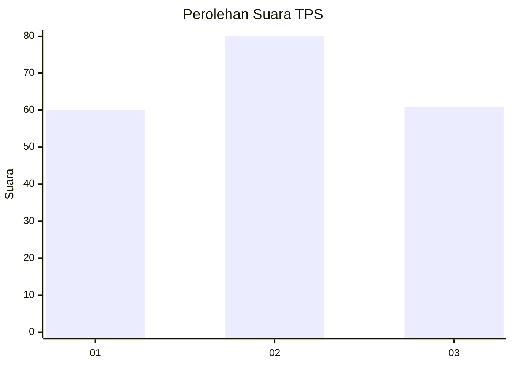
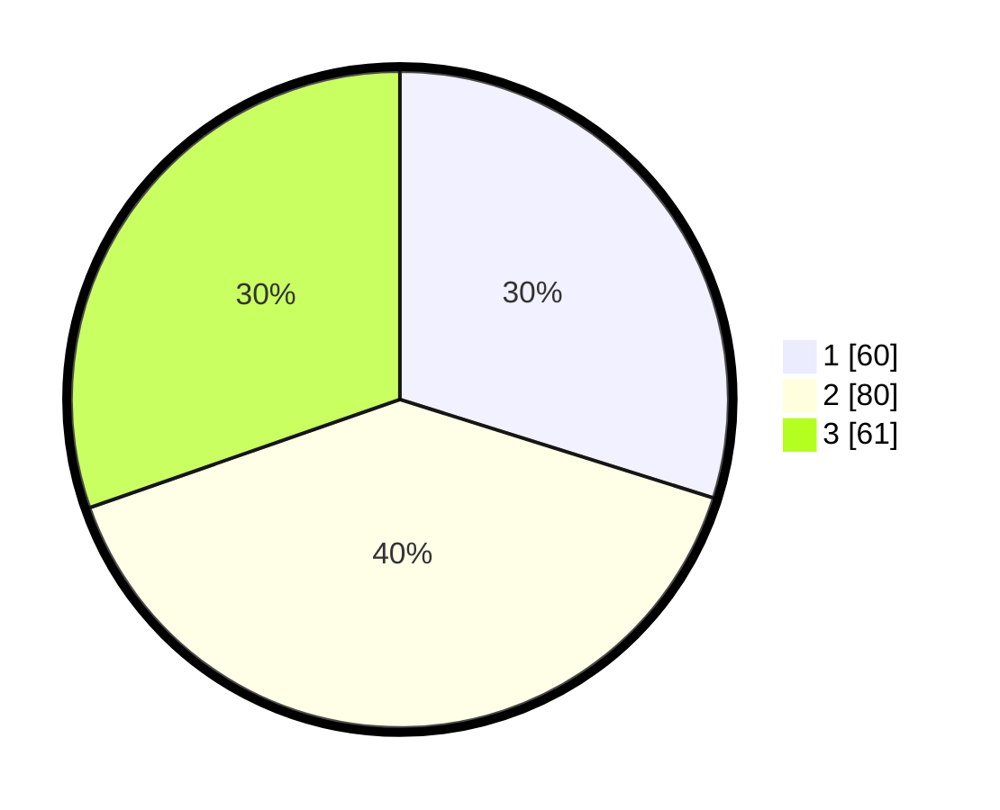

# Hasil

## Grafik

## Tabel

| No. | Nama Paslon    | Suara | Suara (raw) | Persentase |
|:--- |:-------------- | -----:| -----------:| ----------:|
| 1   | ANIES MUHAIMIN | 60    | [60][p-1]   | 29,85      |
| 2   | PRABOWO GIBRAN | 80    | [80][p-2]   | 39,80      |
| 3   | GANJAR MAHFUD  | 61    | [61][p-3]   | 30,35      |

[p-1]: https://github.com/gigit-pemilu/pemilu-2024/blob/main/pilpres/hitung-suara/sub/35-jawa-timur/sub/73-kota-malang/sub/01-blimbing/sub/1007-purwantoro/sub/073-tps/sub/paslon-1.txt
[p-2]: https://github.com/gigit-pemilu/pemilu-2024/blob/main/pilpres/hitung-suara/sub/35-jawa-timur/sub/73-kota-malang/sub/01-blimbing/sub/1007-purwantoro/sub/073-tps/sub/paslon-2.txt
[p-3]: https://github.com/gigit-pemilu/pemilu-2024/blob/main/pilpres/hitung-suara/sub/35-jawa-timur/sub/73-kota-malang/sub/01-blimbing/sub/1007-purwantoro/sub/073-tps/sub/paslon-3.txt

## Foto C Plano

https://sirekap-obj-formc.kpu.go.id/3787/pemilu/ppwp/35/73/01/10/07/3573011007073-20240214-224615--2dc802a3-2d6e-47dd-a7a8-c4b9f421986f.jpg

https://sirekap-obj-formc.kpu.go.id/3787/pemilu/ppwp/35/73/01/10/07/3573011007073-20240214-224647--be13e1d1-d1c0-42c2-97ba-5122e79c37a8.jpg

https://sirekap-obj-formc.kpu.go.id/3787/pemilu/ppwp/35/73/01/10/07/3573011007073-20240214-224718--81691d2e-6a35-4427-abcc-0c1095ce05cc.jpg

## Metadata

| Key        | Value               |
| ---------- | ------------------- |
| Time Stamp | 2024-02-25 15:00:00 |

