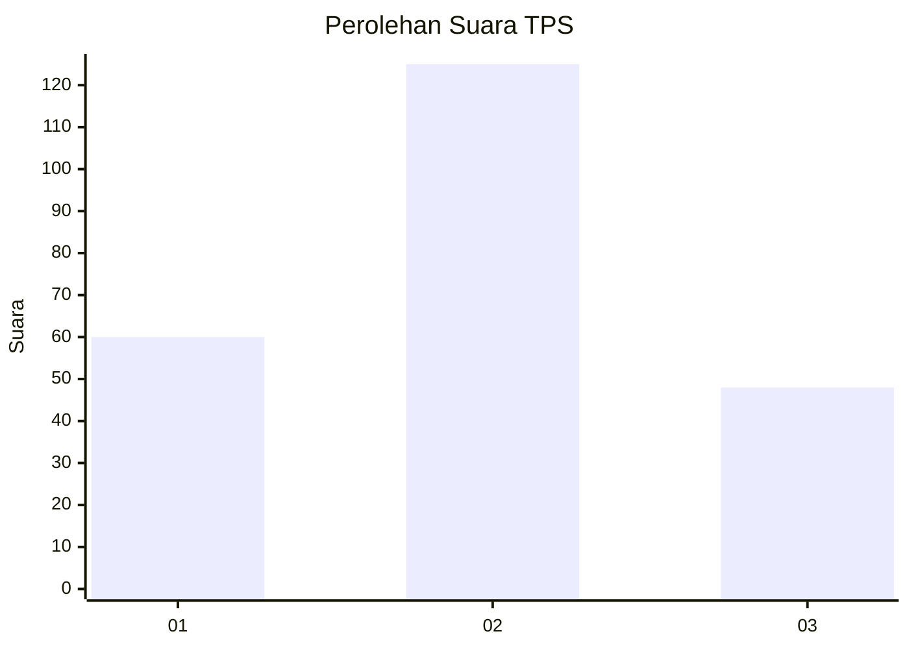
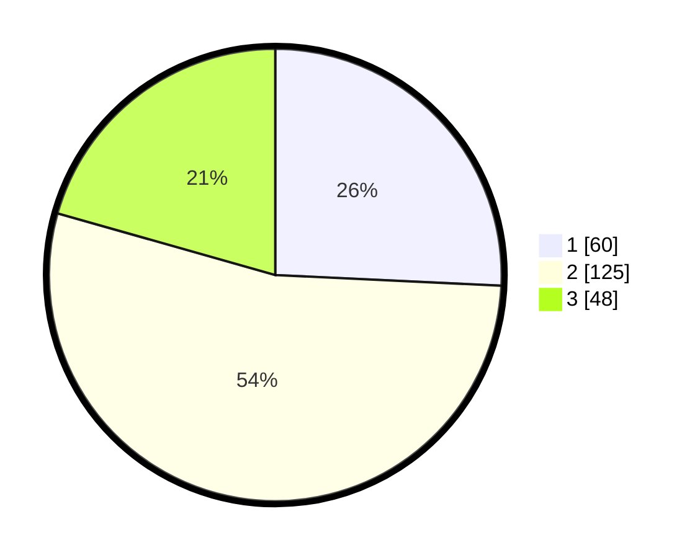

# Hasil

## Grafik

## Tabel

| No. | Nama Paslon    | Suara | Suara (raw) | Persentase |
|:--- |:-------------- | -----:| -----------:| ----------:|
| 1   | ANIES MUHAIMIN | 60    | [60][p-1]   | 25,75      |
| 2   | PRABOWO GIBRAN | 125   | [125][p-2]  | 53,65      |
| 3   | GANJAR MAHFUD  | 48    | [48][p-3]   | 20,60      |

[p-1]: https://github.com/gigit-pemilu/pemilu-2024-35-jawa-timur/blob/main/pilpres/hitung-suara/sub/35-jawa-timur/sub/73-kota-malang/sub/01-blimbing/sub/1008-bunulrejo/sub/031-tps/sub/paslon-1.txt
[p-2]: https://github.com/gigit-pemilu/pemilu-2024-35-jawa-timur/blob/main/pilpres/hitung-suara/sub/35-jawa-timur/sub/73-kota-malang/sub/01-blimbing/sub/1008-bunulrejo/sub/031-tps/sub/paslon-2.txt
[p-3]: https://github.com/gigit-pemilu/pemilu-2024-35-jawa-timur/blob/main/pilpres/hitung-suara/sub/35-jawa-timur/sub/73-kota-malang/sub/01-blimbing/sub/1008-bunulrejo/sub/031-tps/sub/paslon-3.txt

## Foto C Plano

https://sirekap-obj-formc.kpu.go.id/7c3f/pemilu/ppwp/35/73/01/10/08/3573011008031-20240215-023605--407edc28-be6a-4eba-9f73-ed8b2bc701b4.jpg

https://sirekap-obj-formc.kpu.go.id/7c3f/pemilu/ppwp/35/73/01/10/08/3573011008031-20240215-023356--c436cfac-8546-4673-9619-ee28f1a2a010.jpg

https://sirekap-obj-formc.kpu.go.id/7c3f/pemilu/ppwp/35/73/01/10/08/3573011008031-20240215-023122--a00cb51b-500e-4847-bb45-4c9407aa3899.jpg

## Metadata

| Key        | Value               |
| ---------- | ------------------- |
| Time Stamp | 2024-02-25 21:00:00 |

