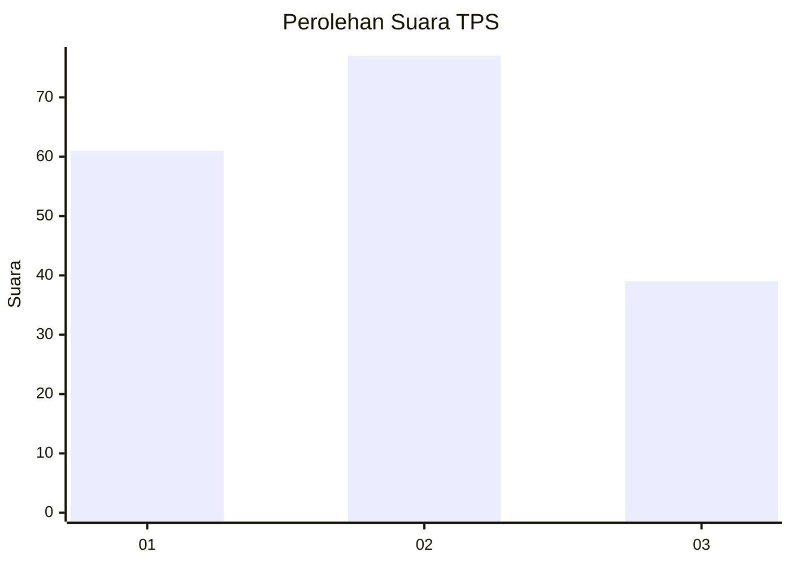
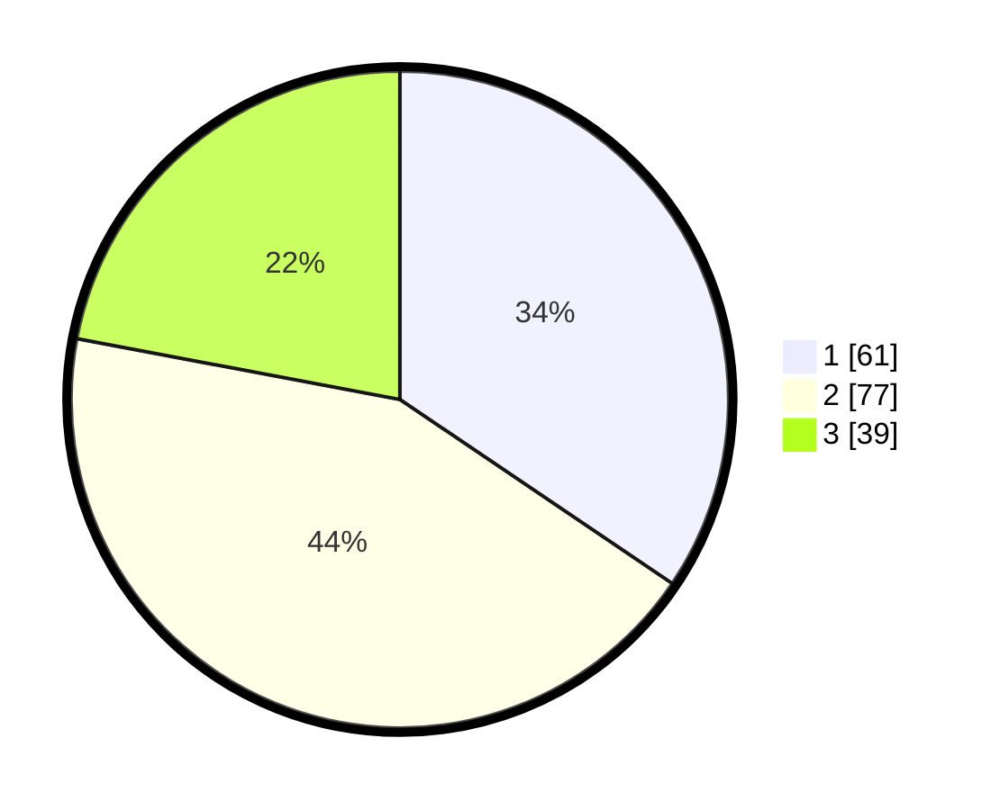

# Hasil

## Grafik

## Tabel

| No. | Nama Paslon    | Suara | Suara (raw) | Persentase |
|:--- |:-------------- | -----:| -----------:| ----------:|
| 1   | ANIES MUHAIMIN | 61    | [61][p-1]   | 34,46      |
| 2   | PRABOWO GIBRAN | 77    | [77][p-2]   | 43,50      |
| 3   | GANJAR MAHFUD  | 39    | [39][p-3]   | 22,03      |

[p-1]: https://github.com/gigit-pemilu/pemilu-2024-35-jawa-timur/blob/main/pilpres/hitung-suara/sub/35-jawa-timur/sub/73-kota-malang/sub/01-blimbing/sub/1008-bunulrejo/sub/057-tps/sub/paslon-1.txt
[p-2]: https://github.com/gigit-pemilu/pemilu-2024-35-jawa-timur/blob/main/pilpres/hitung-suara/sub/35-jawa-timur/sub/73-kota-malang/sub/01-blimbing/sub/1008-bunulrejo/sub/057-tps/sub/paslon-2.txt
[p-3]: https://github.com/gigit-pemilu/pemilu-2024-35-jawa-timur/blob/main/pilpres/hitung-suara/sub/35-jawa-timur/sub/73-kota-malang/sub/01-blimbing/sub/1008-bunulrejo/sub/057-tps/sub/paslon-3.txt

## Foto C Plano

https://sirekap-obj-formc.kpu.go.id/d7af/pemilu/ppwp/35/73/01/10/08/3573011008057-20240214-225534--fc14d4ac-a735-4c22-98b4-f75f79b6bb27.jpg

https://sirekap-obj-formc.kpu.go.id/d7af/pemilu/ppwp/35/73/01/10/08/3573011008057-20240214-230735--e6625094-6163-4241-a901-4f968cf3ee22.jpg

https://sirekap-obj-formc.kpu.go.id/d7af/pemilu/ppwp/35/73/01/10/08/3573011008057-20240214-230810--385af50a-4f78-4c99-ab08-ef14b1fb57cd.jpg

## Metadata

| Key        | Value               |
| ---------- | ------------------- |
| Time Stamp | 2024-02-24 22:31:28 |

