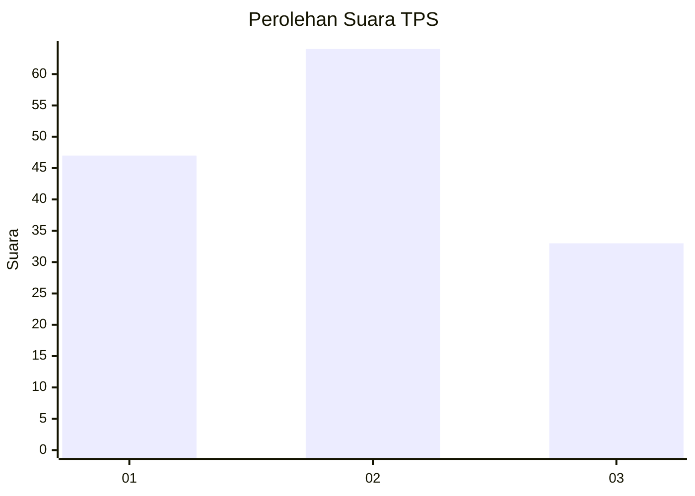
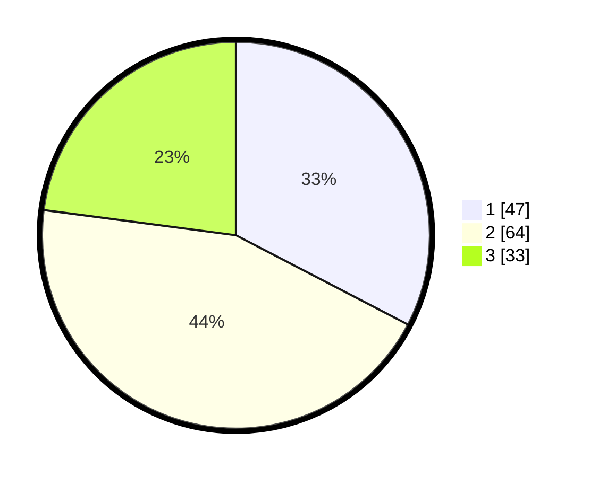

# Hasil

## Grafik

## Tabel

| No. | Nama Paslon    | Suara | Suara (raw) | Persentase |
|:--- |:-------------- | -----:| -----------:| ----------:|
| 1   | ANIES MUHAIMIN | 47    | [47][p-1]   | 32,64      |
| 2   | PRABOWO GIBRAN | 64    | [64][p-2]   | 44,44      |
| 3   | GANJAR MAHFUD  | 33    | [33][p-3]   | 22,92      |

[p-1]: https://github.com/gigit-pemilu/pemilu-2024-35-jawa-timur/blob/main/pilpres/hitung-suara/sub/35-jawa-timur/sub/73-kota-malang/sub/01-blimbing/sub/1008-bunulrejo/sub/068-tps/sub/paslon-1.txt
[p-2]: https://github.com/gigit-pemilu/pemilu-2024-35-jawa-timur/blob/main/pilpres/hitung-suara/sub/35-jawa-timur/sub/73-kota-malang/sub/01-blimbing/sub/1008-bunulrejo/sub/068-tps/sub/paslon-2.txt
[p-3]: https://github.com/gigit-pemilu/pemilu-2024-35-jawa-timur/blob/main/pilpres/hitung-suara/sub/35-jawa-timur/sub/73-kota-malang/sub/01-blimbing/sub/1008-bunulrejo/sub/068-tps/sub/paslon-3.txt

## Foto C Plano

https://sirekap-obj-formc.kpu.go.id/951d/pemilu/ppwp/35/73/01/10/08/3573011008068-20240214-224237--ad4dcdd2-e904-4942-9a62-e72708880e6d.jpg

https://sirekap-obj-formc.kpu.go.id/951d/pemilu/ppwp/35/73/01/10/08/3573011008068-20240214-224623--bef79029-7c2a-4eeb-bcc2-6b47f3a70fe9.jpg

https://sirekap-obj-formc.kpu.go.id/951d/pemilu/ppwp/35/73/01/10/08/3573011008068-20240214-224800--946d2f5c-3bb1-4e7b-ade7-fc348eae6082.jpg

## Metadata

| Key        | Value               |
| ---------- | ------------------- |
| Time Stamp | 2024-02-15 22:40:13 |

