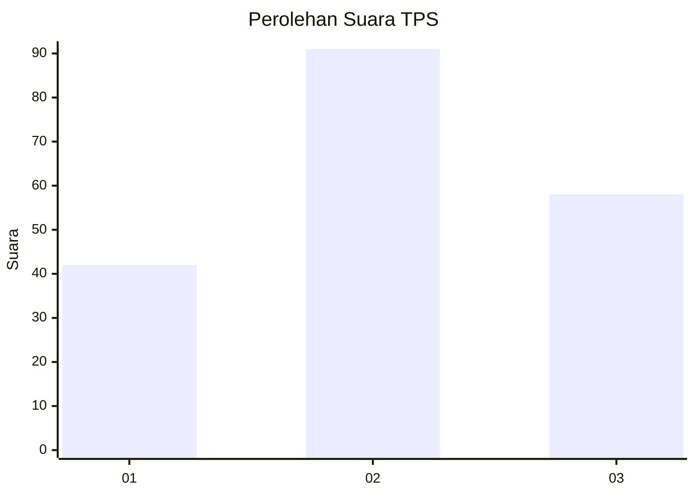
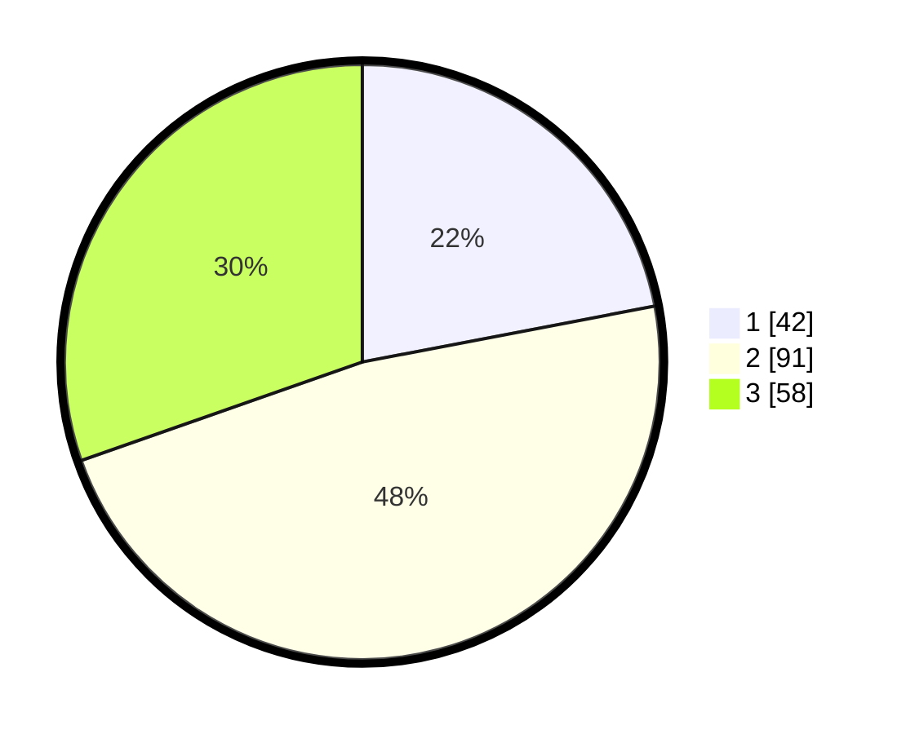

# Hasil

## Grafik

## Tabel

| No. | Nama Paslon    | Suara | Suara (raw) | Persentase |
|:--- |:-------------- | -----:| -----------:| ----------:|
| 1   | ANIES MUHAIMIN | 42    | [42][p-1]   | 21,99      |
| 2   | PRABOWO GIBRAN | 91    | [91][p-2]   | 47,64      |
| 3   | GANJAR MAHFUD  | 58    | [58][p-3]   | 30,37      |

[p-1]: https://github.com/gigit-pemilu/pemilu-2024/blob/main/pilpres/hitung-suara/sub/35-jawa-timur/sub/73-kota-malang/sub/01-blimbing/sub/1008-bunulrejo/sub/072-tps/sub/paslon-1.txt
[p-2]: https://github.com/gigit-pemilu/pemilu-2024/blob/main/pilpres/hitung-suara/sub/35-jawa-timur/sub/73-kota-malang/sub/01-blimbing/sub/1008-bunulrejo/sub/072-tps/sub/paslon-2.txt
[p-3]: https://github.com/gigit-pemilu/pemilu-2024/blob/main/pilpres/hitung-suara/sub/35-jawa-timur/sub/73-kota-malang/sub/01-blimbing/sub/1008-bunulrejo/sub/072-tps/sub/paslon-3.txt

## Foto C Plano

https://sirekap-obj-formc.kpu.go.id/9c70/pemilu/ppwp/35/73/01/10/08/3573011008072-20240214-225808--fee1a4f5-38e5-471b-9050-c4c3711761f3.jpg

https://sirekap-obj-formc.kpu.go.id/9c70/pemilu/ppwp/35/73/01/10/08/3573011008072-20240214-225952--b07482d3-d9ca-46e9-99de-e9f37ffa2e16.jpg

https://sirekap-obj-formc.kpu.go.id/9c70/pemilu/ppwp/35/73/01/10/08/3573011008072-20240214-230115--61d14ec2-44af-418b-92bb-f7e91902c02e.jpg

## Metadata

| Key        | Value               |
| ---------- | ------------------- |
| Time Stamp | 2024-02-25 15:00:00 |

