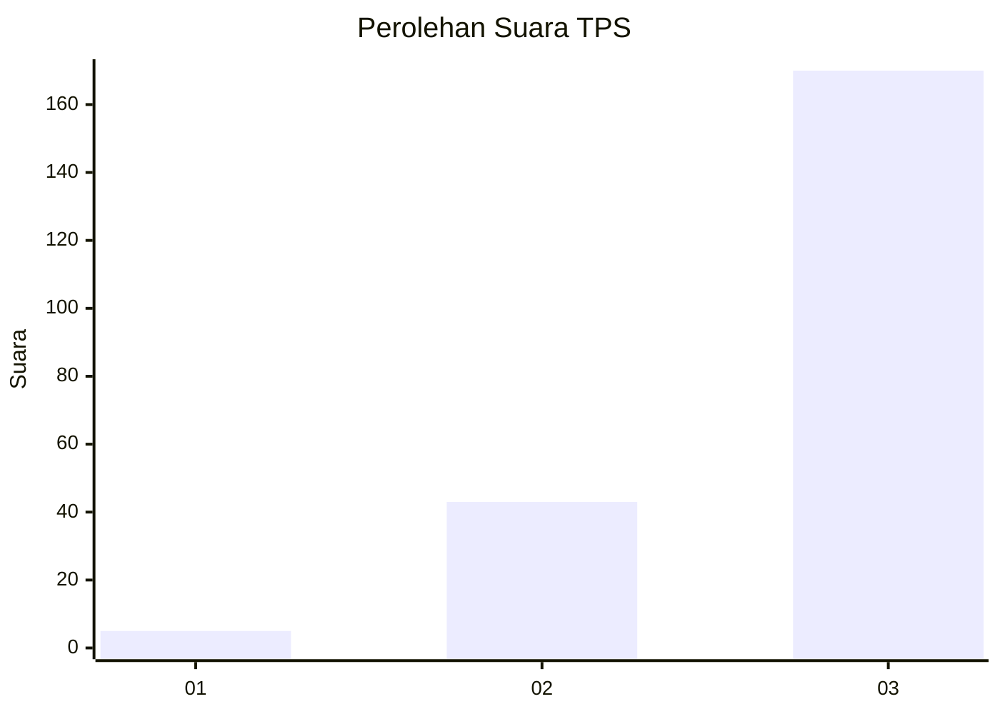
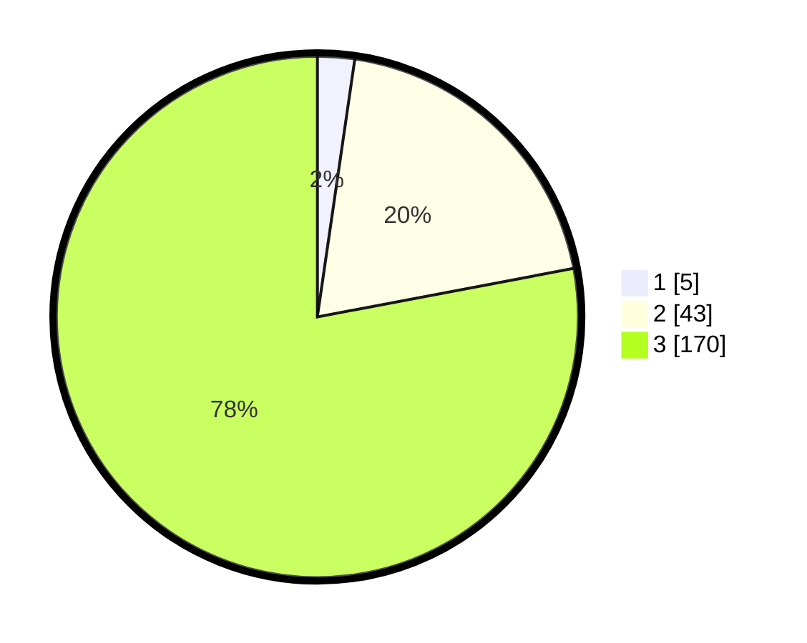

# Hasil

## Grafik

## Tabel

| No. | Nama Paslon    | Suara | Suara (raw) | Persentase |
|:--- |:-------------- | -----:| -----------:| ----------:|
| 1   | ANIES MUHAIMIN | 5     | [5][p-1]    | 2,29       |
| 2   | PRABOWO GIBRAN | 43    | [43][p-2]   | 19,72      |
| 3   | GANJAR MAHFUD  | 170   | [170][p-3]  | 77,98      |

[p-1]: https://github.com/gigit-pemilu/pemilu-2024-35-jawa-timur/blob/main/pilpres/hitung-suara/sub/35-jawa-timur/sub/73-kota-malang/sub/01-blimbing/sub/1008-bunulrejo/sub/905-tps/sub/paslon-1.txt
[p-2]: https://github.com/gigit-pemilu/pemilu-2024-35-jawa-timur/blob/main/pilpres/hitung-suara/sub/35-jawa-timur/sub/73-kota-malang/sub/01-blimbing/sub/1008-bunulrejo/sub/905-tps/sub/paslon-2.txt
[p-3]: https://github.com/gigit-pemilu/pemilu-2024-35-jawa-timur/blob/main/pilpres/hitung-suara/sub/35-jawa-timur/sub/73-kota-malang/sub/01-blimbing/sub/1008-bunulrejo/sub/905-tps/sub/paslon-3.txt

## Foto C Plano

https://sirekap-obj-formc.kpu.go.id/85c1/pemilu/ppwp/35/73/01/10/08/3573011008905-20240214-214538--eadecec9-4530-4390-93c6-f081a66bfe85.jpg

https://sirekap-obj-formc.kpu.go.id/85c1/pemilu/ppwp/35/73/01/10/08/3573011008905-20240214-214641--865cee6d-dd54-41fb-8b6b-8b224b09a2c9.jpg

https://sirekap-obj-formc.kpu.go.id/85c1/pemilu/ppwp/35/73/01/10/08/3573011008905-20240214-214759--51a1090c-3664-47e1-a120-7b54b40f6eee.jpg

## Metadata

| Key        | Value               |
| ---------- | ------------------- |
| Time Stamp | 2024-02-24 22:31:28 |

