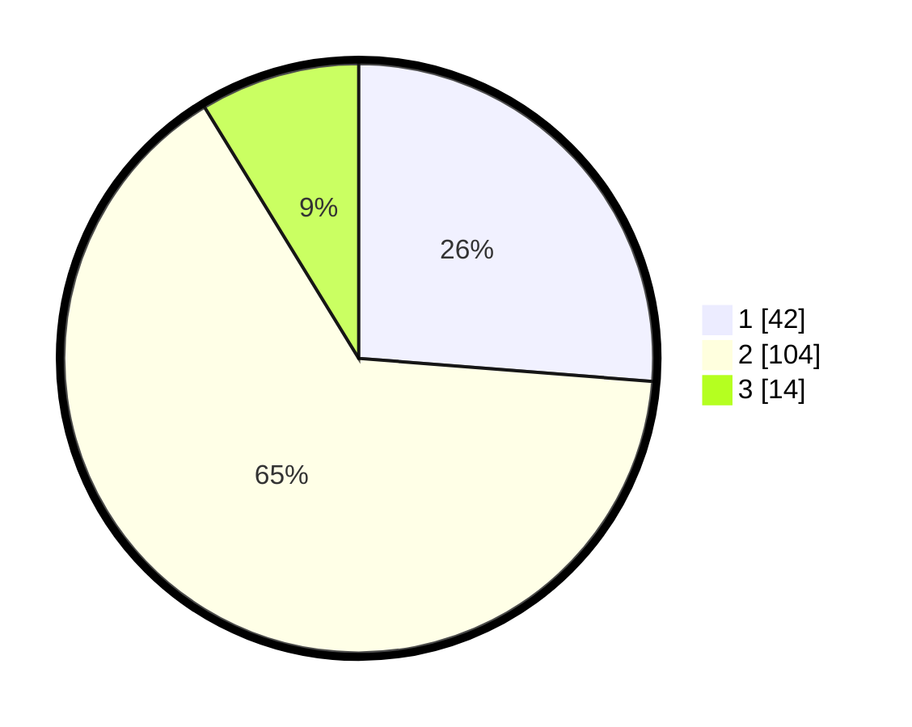

# Hasil

## Grafik

## Tabel

| No. | Nama Paslon    | Suara | Suara (raw) | Persentase |
|:--- |:-------------- | -----:| -----------:| ----------:|
| 1   | ANIES MUHAIMIN | 42    | [42][p-1]   | 26,25      |
| 2   | PRABOWO GIBRAN | 104   | [104][p-2]  | 65,00      |
| 3   | GANJAR MAHFUD  | 14    | [14][p-3]   | 8,75       |

[p-1]: https://github.com/gigit-pemilu/pemilu-2024-35-jawa-timur/blob/main/pilpres/hitung-suara/sub/35-jawa-timur/sub/73-kota-malang/sub/01-blimbing/sub/1009-kesatrian/sub/011-tps/sub/paslon-1.txt
[p-2]: https://github.com/gigit-pemilu/pemilu-2024-35-jawa-timur/blob/main/pilpres/hitung-suara/sub/35-jawa-timur/sub/73-kota-malang/sub/01-blimbing/sub/1009-kesatrian/sub/011-tps/sub/paslon-2.txt
[p-3]: https://github.com/gigit-pemilu/pemilu-2024-35-jawa-timur/blob/main/pilpres/hitung-suara/sub/35-jawa-timur/sub/73-kota-malang/sub/01-blimbing/sub/1009-kesatrian/sub/011-tps/sub/paslon-3.txt

## Foto C Plano

https://sirekap-obj-formc.kpu.go.id/38ff/pemilu/ppwp/35/73/01/10/09/3573011009011-20240215-002953--fe6a9745-a642-40aa-8f80-6a3e5fe93c82.jpg

https://sirekap-obj-formc.kpu.go.id/38ff/pemilu/ppwp/35/73/01/10/09/3573011009011-20240215-003005--36d5dd10-957a-4213-b843-41239781692b.jpg

https://sirekap-obj-formc.kpu.go.id/38ff/pemilu/ppwp/35/73/01/10/09/3573011009011-20240215-004451--94da4df5-bd14-4162-bc91-fae3b8fac4e3.jpg

## Metadata

| Key        | Value               |
| ---------- | ------------------- |
| Time Stamp | 2024-02-25 15:00:00 |

