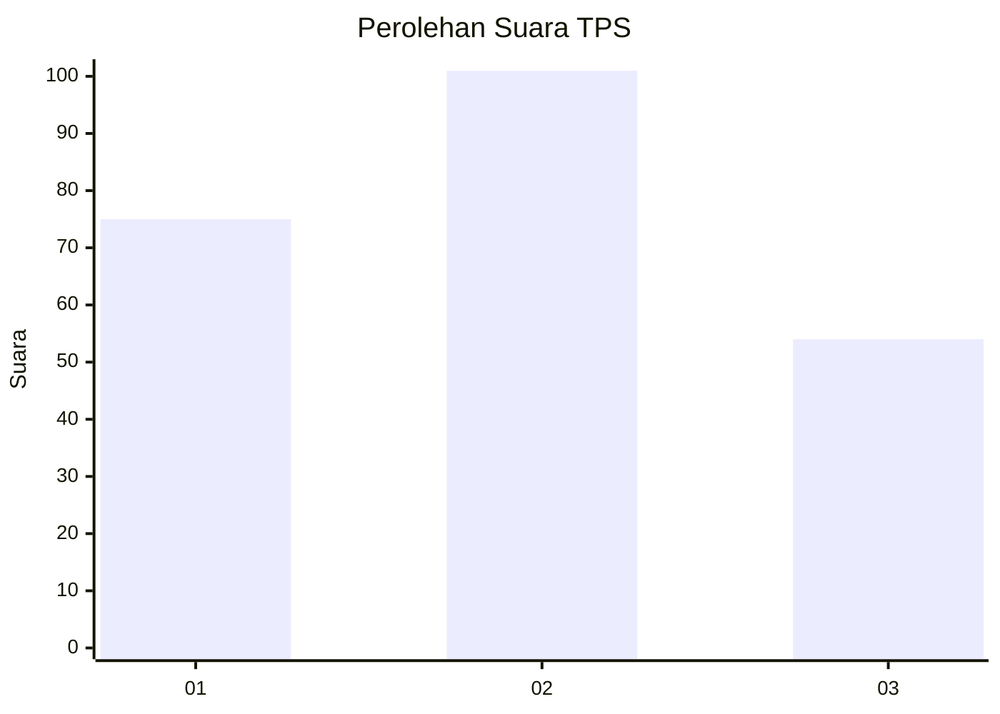
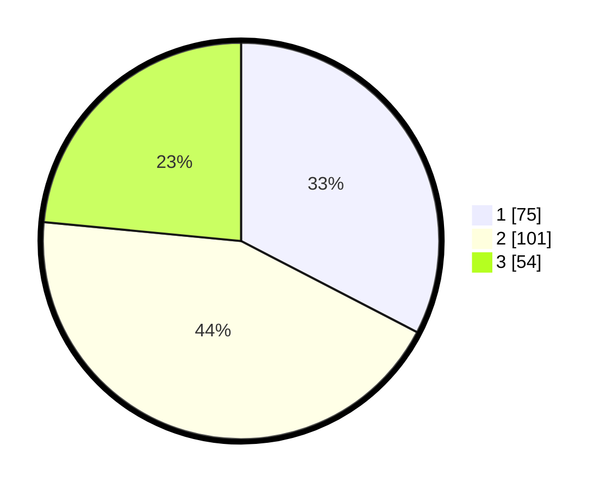

# Hasil

## Grafik

## Tabel

| No. | Nama Paslon    | Suara | Suara (raw) | Persentase |
|:--- |:-------------- | -----:| -----------:| ----------:|
| 1   | ANIES MUHAIMIN | 75    | [75][p-1]   | 32,61      |
| 2   | PRABOWO GIBRAN | 101   | [101][p-2]  | 43,91      |
| 3   | GANJAR MAHFUD  | 54    | [54][p-3]   | 23,48      |

[p-1]: https://github.com/gigit-pemilu/pemilu-2024-35-jawa-timur/blob/main/pilpres/hitung-suara/sub/35-jawa-timur/sub/73-kota-malang/sub/02-klojen/sub/1001-klojen/sub/001-tps/sub/paslon-1.txt
[p-2]: https://github.com/gigit-pemilu/pemilu-2024-35-jawa-timur/blob/main/pilpres/hitung-suara/sub/35-jawa-timur/sub/73-kota-malang/sub/02-klojen/sub/1001-klojen/sub/001-tps/sub/paslon-2.txt
[p-3]: https://github.com/gigit-pemilu/pemilu-2024-35-jawa-timur/blob/main/pilpres/hitung-suara/sub/35-jawa-timur/sub/73-kota-malang/sub/02-klojen/sub/1001-klojen/sub/001-tps/sub/paslon-3.txt

## Foto C Plano

https://sirekap-obj-formc.kpu.go.id/fa40/pemilu/ppwp/35/73/02/10/01/3573021001001-20240214-201340--8a477dd4-ceb1-478d-89db-a37d6729434f.jpg

https://sirekap-obj-formc.kpu.go.id/fa40/pemilu/ppwp/35/73/02/10/01/3573021001001-20240214-201241--54f83ee7-7116-44d3-b243-dfa09fc98dd5.jpg

https://sirekap-obj-formc.kpu.go.id/fa40/pemilu/ppwp/35/73/02/10/01/3573021001001-20240214-201512--bc7ccef6-8293-4cbd-b693-0838cc484d0a.jpg

## Metadata

| Key        | Value               |
| ---------- | ------------------- |
| Time Stamp | 2024-02-16 08:30:27 |

