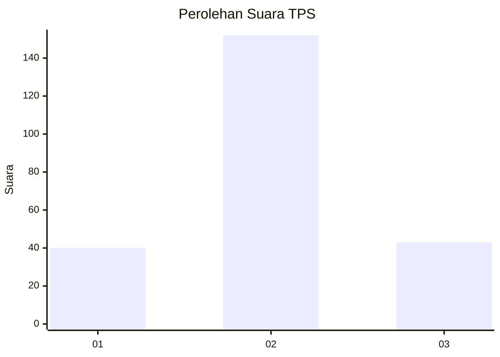
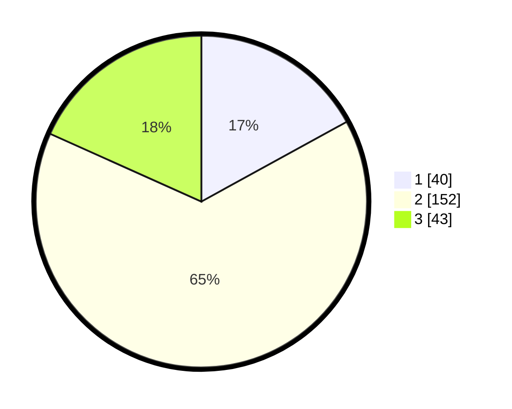

# Hasil

## Grafik

## Tabel

| No. | Nama Paslon    | Suara | Suara (raw) | Persentase |
|:--- |:-------------- | -----:| -----------:| ----------:|
| 1   | ANIES MUHAIMIN | 40    | [40][p-1]   | 17,02      |
| 2   | PRABOWO GIBRAN | 152   | [152][p-2]  | 64,68      |
| 3   | GANJAR MAHFUD  | 43    | [43][p-3]   | 18,30      |

[p-1]: https://github.com/gigit-pemilu/pemilu-2024-35-jawa-timur/blob/main/pilpres/hitung-suara/sub/35-jawa-timur/sub/73-kota-malang/sub/02-klojen/sub/1001-klojen/sub/007-tps/sub/paslon-1.txt
[p-2]: https://github.com/gigit-pemilu/pemilu-2024-35-jawa-timur/blob/main/pilpres/hitung-suara/sub/35-jawa-timur/sub/73-kota-malang/sub/02-klojen/sub/1001-klojen/sub/007-tps/sub/paslon-2.txt
[p-3]: https://github.com/gigit-pemilu/pemilu-2024-35-jawa-timur/blob/main/pilpres/hitung-suara/sub/35-jawa-timur/sub/73-kota-malang/sub/02-klojen/sub/1001-klojen/sub/007-tps/sub/paslon-3.txt

## Foto C Plano

https://sirekap-obj-formc.kpu.go.id/a116/pemilu/ppwp/35/73/02/10/01/3573021001007-20240214-201229--ec71e83d-e4d6-40bb-a694-e45696e07a54.jpg

https://sirekap-obj-formc.kpu.go.id/a116/pemilu/ppwp/35/73/02/10/01/3573021001007-20240214-201049--041e577c-0123-45d3-b56a-a94847e96a0c.jpg

https://sirekap-obj-formc.kpu.go.id/a116/pemilu/ppwp/35/73/02/10/01/3573021001007-20240214-225512--51962e51-5a89-44ac-be94-b4bedcc0cefb.jpg

## Metadata

| Key        | Value               |
| ---------- | ------------------- |
| Time Stamp | 2024-02-15 03:06:03 |

