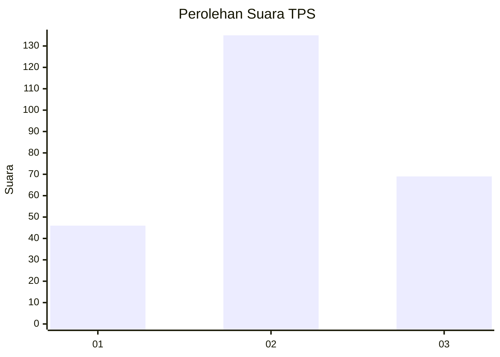
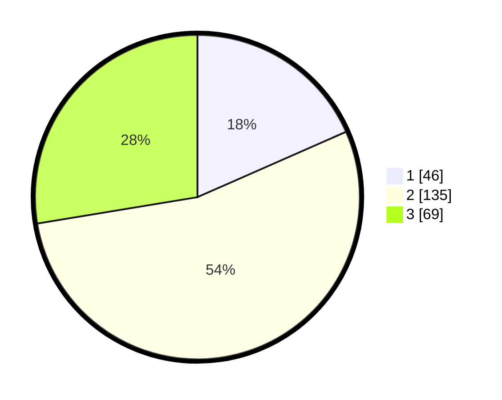

# Hasil

## Grafik

## Tabel

| No. | Nama Paslon    | Suara | Suara (raw) | Persentase |
|:--- |:-------------- | -----:| -----------:| ----------:|
| 1   | ANIES MUHAIMIN | 46    | [46][p-1]   | 18,40      |
| 2   | PRABOWO GIBRAN | 135   | [135][p-2]  | 54,00      |
| 3   | GANJAR MAHFUD  | 69    | [69][p-3]   | 27,60      |

[p-1]: https://github.com/gigit-pemilu/pemilu-2024/blob/main/pilpres/hitung-suara/sub/35-jawa-timur/sub/73-kota-malang/sub/02-klojen/sub/1001-klojen/sub/010-tps/sub/paslon-1.txt
[p-2]: https://github.com/gigit-pemilu/pemilu-2024/blob/main/pilpres/hitung-suara/sub/35-jawa-timur/sub/73-kota-malang/sub/02-klojen/sub/1001-klojen/sub/010-tps/sub/paslon-2.txt
[p-3]: https://github.com/gigit-pemilu/pemilu-2024/blob/main/pilpres/hitung-suara/sub/35-jawa-timur/sub/73-kota-malang/sub/02-klojen/sub/1001-klojen/sub/010-tps/sub/paslon-3.txt

## Foto C Plano

https://sirekap-obj-formc.kpu.go.id/f26b/pemilu/ppwp/35/73/02/10/01/3573021001010-20240215-010316--f9a75e76-1bab-40f4-bd10-12c5ab203854.jpg

https://sirekap-obj-formc.kpu.go.id/f26b/pemilu/ppwp/35/73/02/10/01/3573021001010-20240215-010438--df1c2fc9-81da-4162-bd7c-1b551ad7dca1.jpg

https://sirekap-obj-formc.kpu.go.id/f26b/pemilu/ppwp/35/73/02/10/01/3573021001010-20240215-010615--1fb34da2-d0c1-42a9-9712-3f390049dd94.jpg

## Metadata

| Key        | Value               |
| ---------- | ------------------- |
| Time Stamp | 2024-02-25 15:00:00 |

