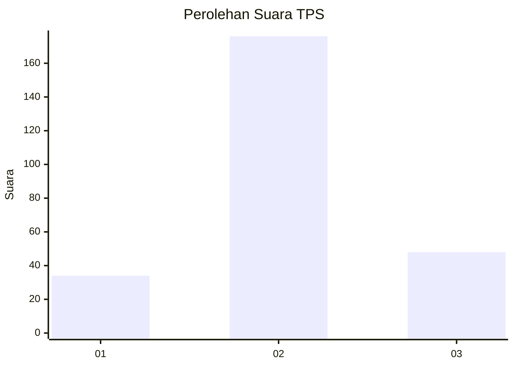
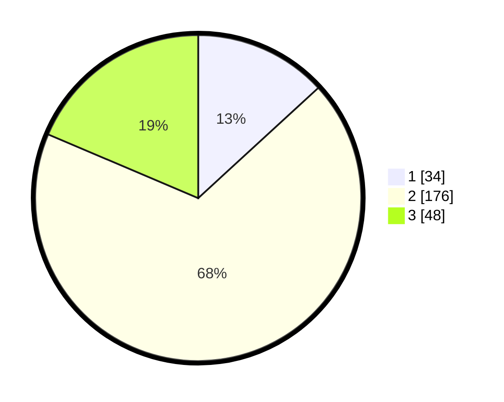

# Hasil

## Grafik

## Tabel

| No. | Nama Paslon    | Suara | Suara (raw) | Persentase |
|:--- |:-------------- | -----:| -----------:| ----------:|
| 1   | ANIES MUHAIMIN | 34    | [34][p-1]   | 13,18      |
| 2   | PRABOWO GIBRAN | 176   | [176][p-2]  | 68,22      |
| 3   | GANJAR MAHFUD  | 48    | [48][p-3]   | 18,60      |

[p-1]: https://github.com/gigit-pemilu/pemilu-2024-35-jawa-timur/blob/main/pilpres/hitung-suara/sub/35-jawa-timur/sub/73-kota-malang/sub/02-klojen/sub/1001-klojen/sub/014-tps/sub/paslon-1.txt
[p-2]: https://github.com/gigit-pemilu/pemilu-2024-35-jawa-timur/blob/main/pilpres/hitung-suara/sub/35-jawa-timur/sub/73-kota-malang/sub/02-klojen/sub/1001-klojen/sub/014-tps/sub/paslon-2.txt
[p-3]: https://github.com/gigit-pemilu/pemilu-2024-35-jawa-timur/blob/main/pilpres/hitung-suara/sub/35-jawa-timur/sub/73-kota-malang/sub/02-klojen/sub/1001-klojen/sub/014-tps/sub/paslon-3.txt

## Foto C Plano

https://sirekap-obj-formc.kpu.go.id/c7ed/pemilu/ppwp/35/73/02/10/01/3573021001014-20240215-042802--8efc3db9-ef66-450a-a66b-2ce49d4c3cd2.jpg

https://sirekap-obj-formc.kpu.go.id/c7ed/pemilu/ppwp/35/73/02/10/01/3573021001014-20240215-043000--6e1137ee-1ba4-40ab-a8a9-013a2f07523e.jpg

https://sirekap-obj-formc.kpu.go.id/c7ed/pemilu/ppwp/35/73/02/10/01/3573021001014-20240215-043309--d0b91cf1-5867-4c9b-937f-d4e4f05da49e.jpg

## Metadata

| Key        | Value               |
| ---------- | ------------------- |
| Time Stamp | 2024-02-24 22:31:28 |

