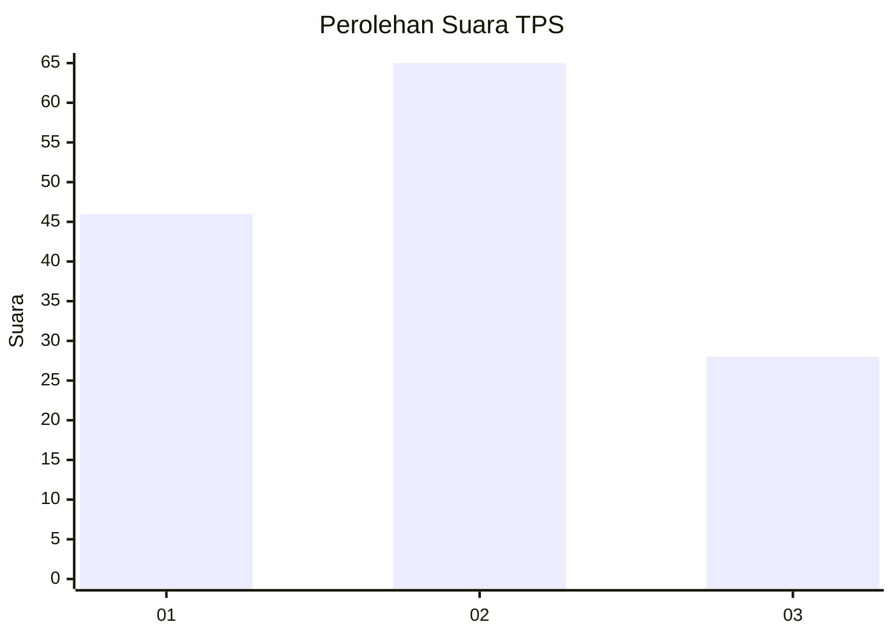
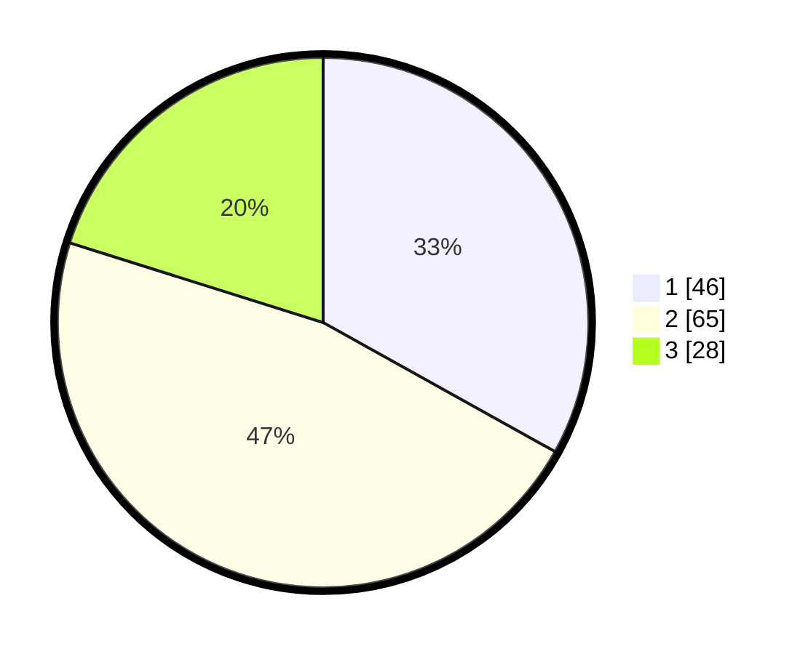

# Hasil

## Grafik

## Tabel

| No. | Nama Paslon    | Suara | Suara (raw) | Persentase |
|:--- |:-------------- | -----:| -----------:| ----------:|
| 1   | ANIES MUHAIMIN | 46    | [46][p-1]   | 33,09      |
| 2   | PRABOWO GIBRAN | 65    | [65][p-2]   | 46,76      |
| 3   | GANJAR MAHFUD  | 28    | [28][p-3]   | 20,14      |

[p-1]: https://github.com/gigit-pemilu/pemilu-2024/blob/main/pilpres/hitung-suara/sub/35-jawa-timur/sub/73-kota-malang/sub/02-klojen/sub/1001-klojen/sub/016-tps/sub/paslon-1.txt
[p-2]: https://github.com/gigit-pemilu/pemilu-2024/blob/main/pilpres/hitung-suara/sub/35-jawa-timur/sub/73-kota-malang/sub/02-klojen/sub/1001-klojen/sub/016-tps/sub/paslon-2.txt
[p-3]: https://github.com/gigit-pemilu/pemilu-2024/blob/main/pilpres/hitung-suara/sub/35-jawa-timur/sub/73-kota-malang/sub/02-klojen/sub/1001-klojen/sub/016-tps/sub/paslon-3.txt

## Foto C Plano

https://sirekap-obj-formc.kpu.go.id/38b7/pemilu/ppwp/35/73/02/10/01/3573021001016-20240215-014905--3f6618db-46a7-49a3-b330-9d31a29a84a8.jpg

https://sirekap-obj-formc.kpu.go.id/38b7/pemilu/ppwp/35/73/02/10/01/3573021001016-20240215-015215--c91b2261-1320-4dff-a71e-d1bab4d73aae.jpg

https://sirekap-obj-formc.kpu.go.id/38b7/pemilu/ppwp/35/73/02/10/01/3573021001016-20240215-015514--fd117a4e-a7a8-440a-8723-a8d55664de45.jpg

## Metadata

| Key        | Value               |
| ---------- | ------------------- |
| Time Stamp | 2024-02-25 15:00:00 |

