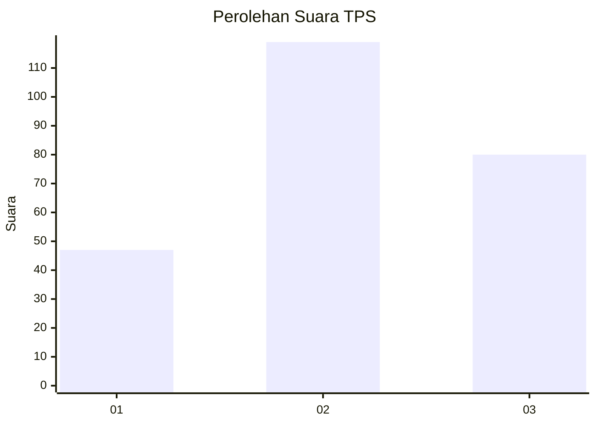
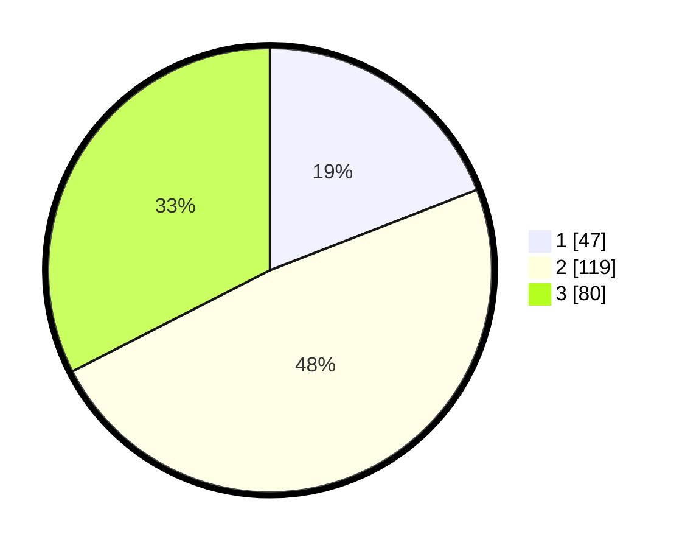

# Hasil

## Grafik

## Tabel

| No. | Nama Paslon    | Suara | Suara (raw) | Persentase |
|:--- |:-------------- | -----:| -----------:| ----------:|
| 1   | ANIES MUHAIMIN | 47    | [47][p-1]   | 19,11      |
| 2   | PRABOWO GIBRAN | 119   | [119][p-2]  | 48,37      |
| 3   | GANJAR MAHFUD  | 80    | [80][p-3]   | 32,52      |

[p-1]: https://github.com/gigit-pemilu/pemilu-2024-35-jawa-timur/blob/main/pilpres/hitung-suara/sub/35-jawa-timur/sub/73-kota-malang/sub/02-klojen/sub/1002-rampalcelaket/sub/002-tps/sub/paslon-1.txt
[p-2]: https://github.com/gigit-pemilu/pemilu-2024-35-jawa-timur/blob/main/pilpres/hitung-suara/sub/35-jawa-timur/sub/73-kota-malang/sub/02-klojen/sub/1002-rampalcelaket/sub/002-tps/sub/paslon-2.txt
[p-3]: https://github.com/gigit-pemilu/pemilu-2024-35-jawa-timur/blob/main/pilpres/hitung-suara/sub/35-jawa-timur/sub/73-kota-malang/sub/02-klojen/sub/1002-rampalcelaket/sub/002-tps/sub/paslon-3.txt

## Foto C Plano

https://sirekap-obj-formc.kpu.go.id/2b6a/pemilu/ppwp/35/73/02/10/02/3573021002002-20240214-155343--76686dff-4471-40be-9a31-09022d4d5dad.jpg

https://sirekap-obj-formc.kpu.go.id/2b6a/pemilu/ppwp/35/73/02/10/02/3573021002002-20240214-155202--dc92ef4a-b232-4446-a59e-2653407b228d.jpg

https://sirekap-obj-formc.kpu.go.id/2b6a/pemilu/ppwp/35/73/02/10/02/3573021002002-20240214-155235--f289a079-6ec3-42cb-bc8c-b6a6af9aacdf.jpg

## Metadata

| Key        | Value               |
| ---------- | ------------------- |
| Time Stamp | 2024-02-25 11:00:00 |

