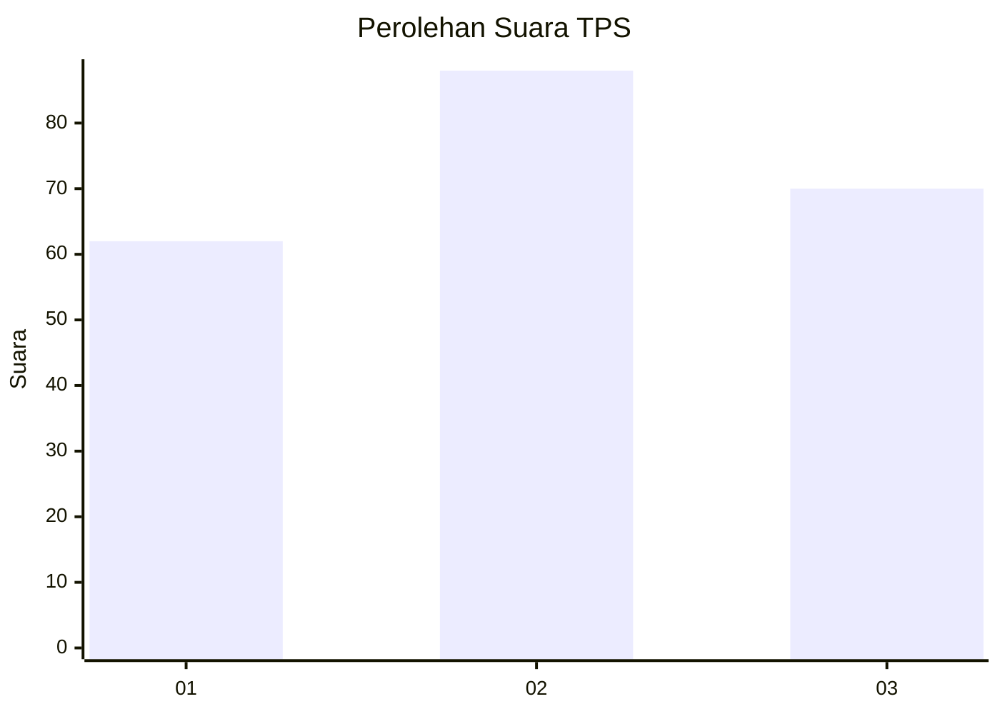
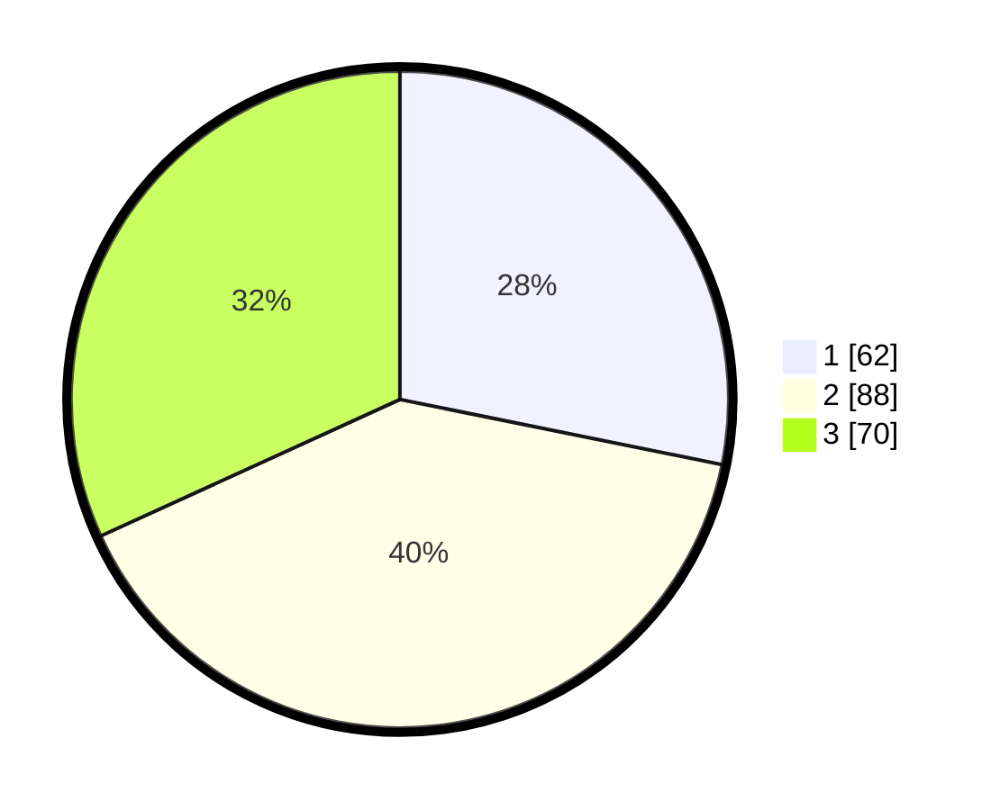

# Hasil

## Grafik

## Tabel

| No. | Nama Paslon    | Suara | Suara (raw) | Persentase |
|:--- |:-------------- | -----:| -----------:| ----------:|
| 1   | ANIES MUHAIMIN | 62    | [62][p-1]   | 28,18      |
| 2   | PRABOWO GIBRAN | 88    | [88][p-2]   | 40,00      |
| 3   | GANJAR MAHFUD  | 70    | [70][p-3]   | 31,82      |

[p-1]: https://github.com/gigit-pemilu/pemilu-2024-35-jawa-timur/blob/main/pilpres/hitung-suara/sub/35-jawa-timur/sub/73-kota-malang/sub/02-klojen/sub/1002-rampalcelaket/sub/007-tps/sub/paslon-1.txt
[p-2]: https://github.com/gigit-pemilu/pemilu-2024-35-jawa-timur/blob/main/pilpres/hitung-suara/sub/35-jawa-timur/sub/73-kota-malang/sub/02-klojen/sub/1002-rampalcelaket/sub/007-tps/sub/paslon-2.txt
[p-3]: https://github.com/gigit-pemilu/pemilu-2024-35-jawa-timur/blob/main/pilpres/hitung-suara/sub/35-jawa-timur/sub/73-kota-malang/sub/02-klojen/sub/1002-rampalcelaket/sub/007-tps/sub/paslon-3.txt

## Foto C Plano

https://sirekap-obj-formc.kpu.go.id/36f3/pemilu/ppwp/35/73/02/10/02/3573021002007-20240215-123757--77b386fa-de91-4cf1-a251-794dca72c84f.jpg

https://sirekap-obj-formc.kpu.go.id/36f3/pemilu/ppwp/35/73/02/10/02/3573021002007-20240215-123822--dd904ee6-9670-4c7a-a5aa-c5b068057009.jpg

https://sirekap-obj-formc.kpu.go.id/36f3/pemilu/ppwp/35/73/02/10/02/3573021002007-20240215-123838--fd8137f4-c49d-443d-8da0-b4dd6cb6290d.jpg

## Metadata

| Key        | Value               |
| ---------- | ------------------- |
| Time Stamp | 2024-02-25 14:00:00 |

