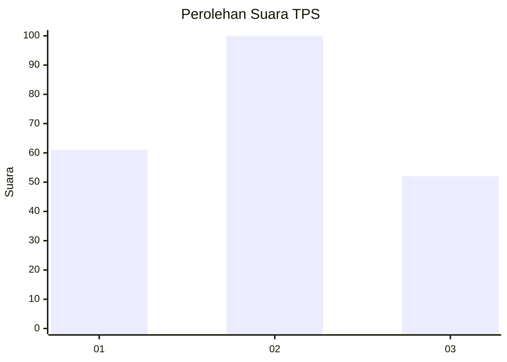
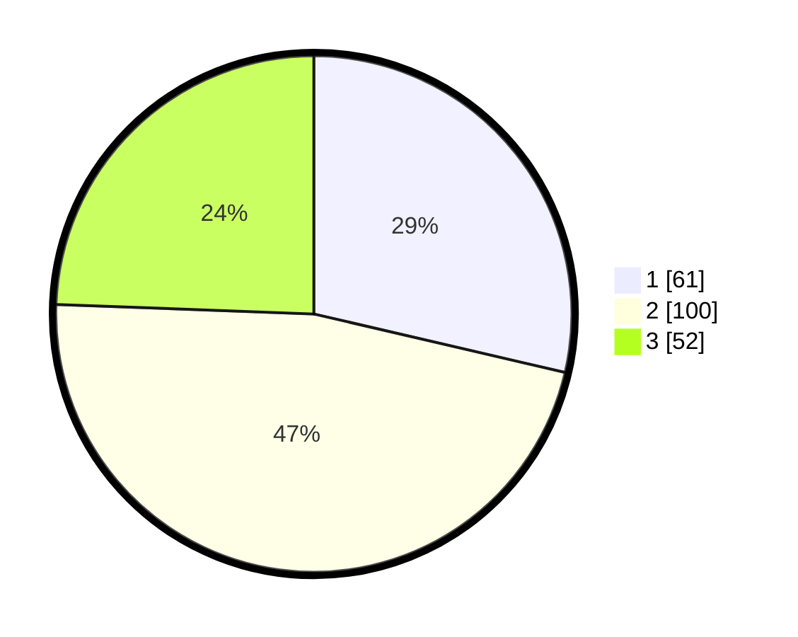

# Hasil

## Grafik

## Tabel

| No. | Nama Paslon    | Suara | Suara (raw) | Persentase |
|:--- |:-------------- | -----:| -----------:| ----------:|
| 1   | ANIES MUHAIMIN | 61    | [61][p-1]   | 28,64      |
| 2   | PRABOWO GIBRAN | 100   | [100][p-2]  | 46,95      |
| 3   | GANJAR MAHFUD  | 52    | [52][p-3]   | 24,41      |

[p-1]: https://github.com/gigit-pemilu/pemilu-2024/blob/main/pilpres/hitung-suara/sub/35-jawa-timur/sub/73-kota-malang/sub/02-klojen/sub/1002-rampalcelaket/sub/008-tps/sub/paslon-1.txt
[p-2]: https://github.com/gigit-pemilu/pemilu-2024/blob/main/pilpres/hitung-suara/sub/35-jawa-timur/sub/73-kota-malang/sub/02-klojen/sub/1002-rampalcelaket/sub/008-tps/sub/paslon-2.txt
[p-3]: https://github.com/gigit-pemilu/pemilu-2024/blob/main/pilpres/hitung-suara/sub/35-jawa-timur/sub/73-kota-malang/sub/02-klojen/sub/1002-rampalcelaket/sub/008-tps/sub/paslon-3.txt

## Foto C Plano

https://sirekap-obj-formc.kpu.go.id/7dd1/pemilu/ppwp/35/73/02/10/02/3573021002008-20240214-223945--290f0ab0-00ad-44ba-a4b9-0e9dd7886a02.jpg

https://sirekap-obj-formc.kpu.go.id/7dd1/pemilu/ppwp/35/73/02/10/02/3573021002008-20240214-221108--5f792079-20e8-48a6-a29d-3b974e83402b.jpg

https://sirekap-obj-formc.kpu.go.id/7dd1/pemilu/ppwp/35/73/02/10/02/3573021002008-20240214-221245--3704a33a-13f4-4c0b-b968-6d745b0a2fb1.jpg

## Metadata

| Key        | Value               |
| ---------- | ------------------- |
| Time Stamp | 2024-02-24 22:31:28 |

