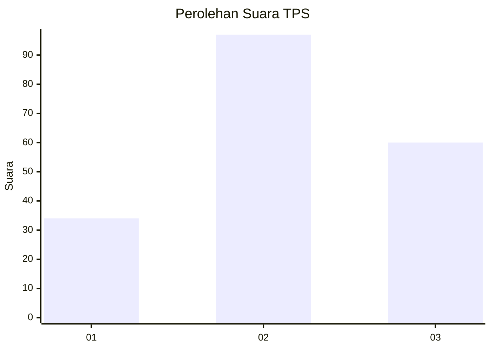
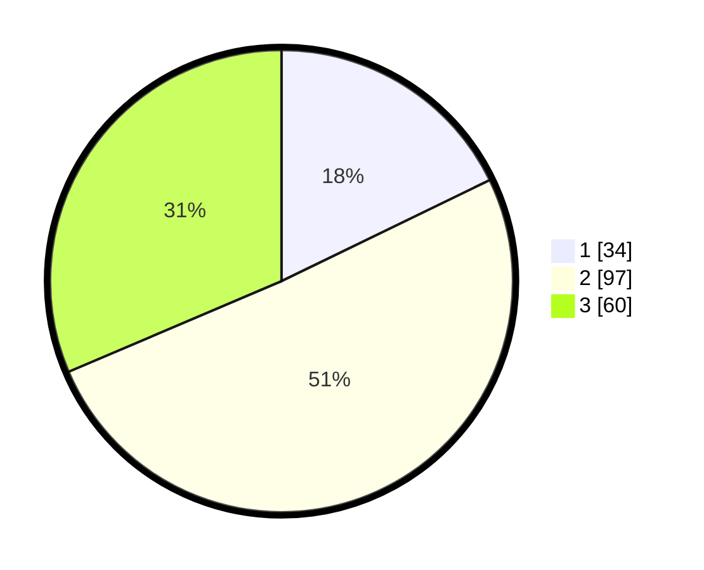

# Hasil

## Grafik

## Tabel

| No. | Nama Paslon    | Suara | Suara (raw) | Persentase |
|:--- |:-------------- | -----:| -----------:| ----------:|
| 1   | ANIES MUHAIMIN | 34    | [34][p-1]   | 17,80      |
| 2   | PRABOWO GIBRAN | 97    | [97][p-2]   | 50,79      |
| 3   | GANJAR MAHFUD  | 60    | [60][p-3]   | 31,41      |

[p-1]: https://github.com/gigit-pemilu/pemilu-2024-35-jawa-timur/blob/main/pilpres/hitung-suara/sub/35-jawa-timur/sub/73-kota-malang/sub/02-klojen/sub/1003-samaan/sub/014-tps/sub/paslon-1.txt
[p-2]: https://github.com/gigit-pemilu/pemilu-2024-35-jawa-timur/blob/main/pilpres/hitung-suara/sub/35-jawa-timur/sub/73-kota-malang/sub/02-klojen/sub/1003-samaan/sub/014-tps/sub/paslon-2.txt
[p-3]: https://github.com/gigit-pemilu/pemilu-2024-35-jawa-timur/blob/main/pilpres/hitung-suara/sub/35-jawa-timur/sub/73-kota-malang/sub/02-klojen/sub/1003-samaan/sub/014-tps/sub/paslon-3.txt

## Foto C Plano

https://sirekap-obj-formc.kpu.go.id/c110/pemilu/ppwp/35/73/02/10/03/3573021003014-20240214-212126--56bd4b25-f5fd-408c-a32b-46fba5141cb7.jpg

https://sirekap-obj-formc.kpu.go.id/c110/pemilu/ppwp/35/73/02/10/03/3573021003014-20240214-212155--e84bd9e0-481a-47d3-856f-1b756b560156.jpg

https://sirekap-obj-formc.kpu.go.id/c110/pemilu/ppwp/35/73/02/10/03/3573021003014-20240214-212209--8094c79c-9aca-4627-ae03-9400aaed1322.jpg

## Metadata

| Key        | Value               |
| ---------- | ------------------- |
| Time Stamp | 2024-02-25 14:00:00 |

