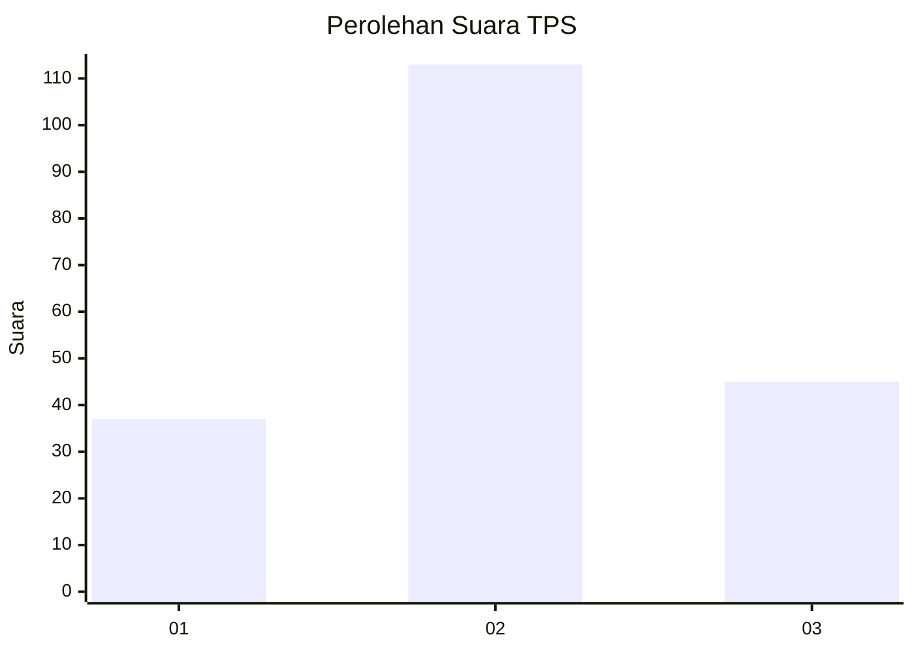
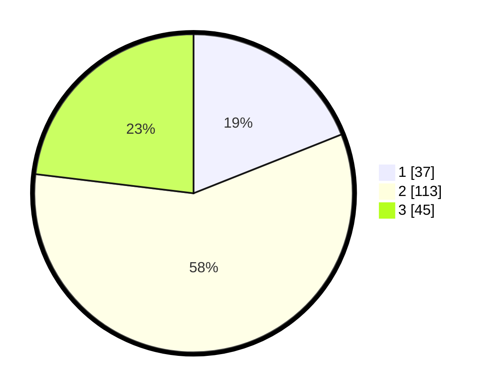

# Hasil

## Grafik

## Tabel

| No. | Nama Paslon    | Suara | Suara (raw) | Persentase |
|:--- |:-------------- | -----:| -----------:| ----------:|
| 1   | ANIES MUHAIMIN | 37    | [37][p-1]   | 18,97      |
| 2   | PRABOWO GIBRAN | 113   | [113][p-2]  | 57,95      |
| 3   | GANJAR MAHFUD  | 45    | [45][p-3]   | 23,08      |

[p-1]: https://github.com/gigit-pemilu/pemilu-2024/blob/main/pilpres/hitung-suara/sub/35-jawa-timur/sub/73-kota-malang/sub/02-klojen/sub/1004-kiduldalem/sub/003-tps/sub/paslon-1.txt
[p-2]: https://github.com/gigit-pemilu/pemilu-2024/blob/main/pilpres/hitung-suara/sub/35-jawa-timur/sub/73-kota-malang/sub/02-klojen/sub/1004-kiduldalem/sub/003-tps/sub/paslon-2.txt
[p-3]: https://github.com/gigit-pemilu/pemilu-2024/blob/main/pilpres/hitung-suara/sub/35-jawa-timur/sub/73-kota-malang/sub/02-klojen/sub/1004-kiduldalem/sub/003-tps/sub/paslon-3.txt

## Foto C Plano

https://sirekap-obj-formc.kpu.go.id/0cf8/pemilu/ppwp/35/73/02/10/04/3573021004003-20240215-003451--d47fea43-0843-45c0-8ce9-5a796f1fdf5e.jpg

https://sirekap-obj-formc.kpu.go.id/0cf8/pemilu/ppwp/35/73/02/10/04/3573021004003-20240215-003539--2d2bcfda-bc7f-4c7f-95cc-f0b69d588f25.jpg

https://sirekap-obj-formc.kpu.go.id/0cf8/pemilu/ppwp/35/73/02/10/04/3573021004003-20240215-003834--ca7d61c8-4bfc-4659-9a1e-eeab4b1f3ee0.jpg

## Metadata

| Key        | Value               |
| ---------- | ------------------- |
| Time Stamp | 2024-02-24 22:31:28 |

