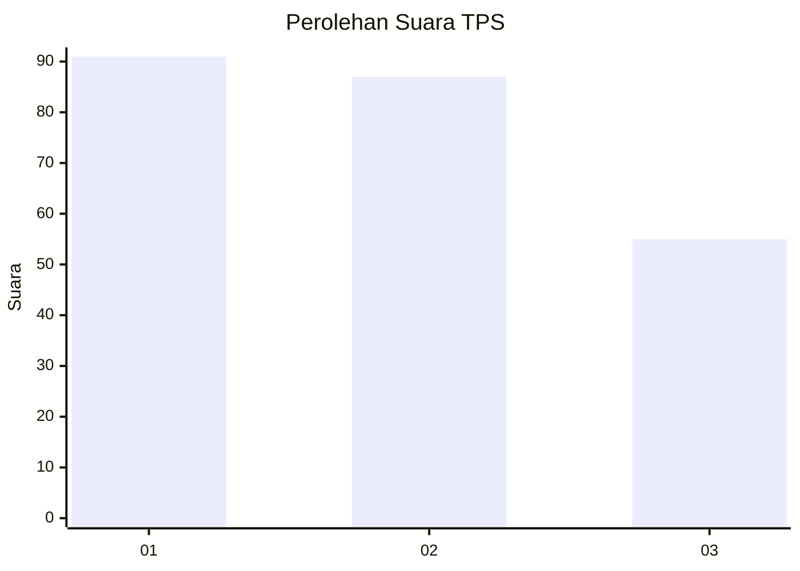
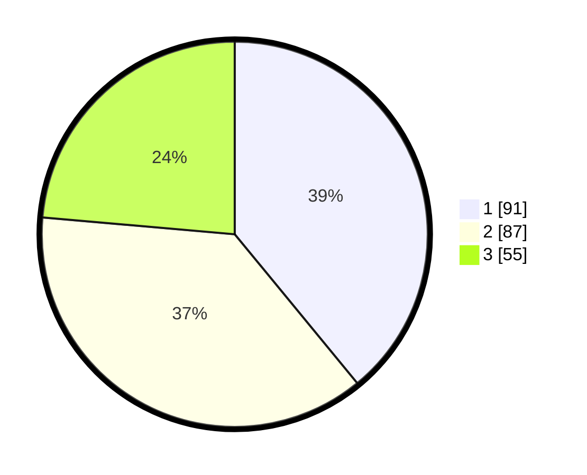

# Hasil

## Grafik

## Tabel

| No. | Nama Paslon    | Suara | Suara (raw) | Persentase |
|:--- |:-------------- | -----:| -----------:| ----------:|
| 1   | ANIES MUHAIMIN | 91    | [91][p-1]   | 39,06      |
| 2   | PRABOWO GIBRAN | 87    | [87][p-2]   | 37,34      |
| 3   | GANJAR MAHFUD  | 55    | [55][p-3]   | 23,61      |

[p-1]: https://github.com/gigit-pemilu/pemilu-2024/blob/main/pilpres/hitung-suara/sub/35-jawa-timur/sub/73-kota-malang/sub/02-klojen/sub/1004-kiduldalem/sub/004-tps/sub/paslon-1.txt
[p-2]: https://github.com/gigit-pemilu/pemilu-2024/blob/main/pilpres/hitung-suara/sub/35-jawa-timur/sub/73-kota-malang/sub/02-klojen/sub/1004-kiduldalem/sub/004-tps/sub/paslon-2.txt
[p-3]: https://github.com/gigit-pemilu/pemilu-2024/blob/main/pilpres/hitung-suara/sub/35-jawa-timur/sub/73-kota-malang/sub/02-klojen/sub/1004-kiduldalem/sub/004-tps/sub/paslon-3.txt

## Foto C Plano

https://sirekap-obj-formc.kpu.go.id/4341/pemilu/ppwp/35/73/02/10/04/3573021004004-20240214-211831--bfe5c997-5d58-4e38-a090-b7c6e53a29e7.jpg

https://sirekap-obj-formc.kpu.go.id/4341/pemilu/ppwp/35/73/02/10/04/3573021004004-20240214-211836--05073f72-c486-484e-a6e5-6db055c532b2.jpg

https://sirekap-obj-formc.kpu.go.id/4341/pemilu/ppwp/35/73/02/10/04/3573021004004-20240215-185831--2f01eb41-6589-40fd-bf51-a3f4bfd2d66d.jpg

## Metadata

| Key        | Value               |
| ---------- | ------------------- |
| Time Stamp | 2024-02-16 08:30:27 |

