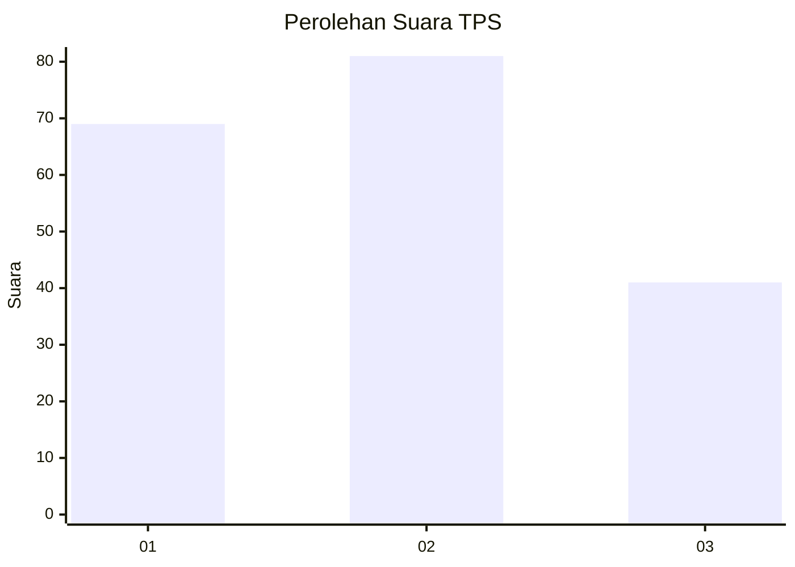
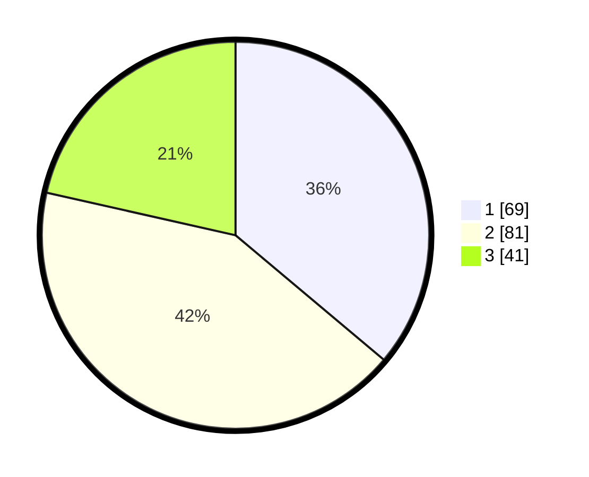

# Hasil

## Grafik

## Tabel

| No. | Nama Paslon    | Suara | Suara (raw) | Persentase |
|:--- |:-------------- | -----:| -----------:| ----------:|
| 1   | ANIES MUHAIMIN | 69    | [69][p-1]   | 36,13      |
| 2   | PRABOWO GIBRAN | 81    | [81][p-2]   | 42,41      |
| 3   | GANJAR MAHFUD  | 41    | [41][p-3]   | 21,47      |

[p-1]: https://github.com/gigit-pemilu/pemilu-2024/blob/main/pilpres/hitung-suara/sub/35-jawa-timur/sub/73-kota-malang/sub/02-klojen/sub/1004-kiduldalem/sub/006-tps/sub/paslon-1.txt
[p-2]: https://github.com/gigit-pemilu/pemilu-2024/blob/main/pilpres/hitung-suara/sub/35-jawa-timur/sub/73-kota-malang/sub/02-klojen/sub/1004-kiduldalem/sub/006-tps/sub/paslon-2.txt
[p-3]: https://github.com/gigit-pemilu/pemilu-2024/blob/main/pilpres/hitung-suara/sub/35-jawa-timur/sub/73-kota-malang/sub/02-klojen/sub/1004-kiduldalem/sub/006-tps/sub/paslon-3.txt

## Foto C Plano

https://sirekap-obj-formc.kpu.go.id/36c1/pemilu/ppwp/35/73/02/10/04/3573021004006-20240214-155700--7c097abc-a560-4d28-ac26-0be5af8a3b98.jpg

https://sirekap-obj-formc.kpu.go.id/36c1/pemilu/ppwp/35/73/02/10/04/3573021004006-20240214-155448--d52cbb33-7b5a-4930-b91d-550f358bbeb1.jpg

https://sirekap-obj-formc.kpu.go.id/36c1/pemilu/ppwp/35/73/02/10/04/3573021004006-20240214-155411--f9096ab3-71da-44ad-97aa-e777b31c6af2.jpg

## Metadata

| Key        | Value               |
| ---------- | ------------------- |
| Time Stamp | 2024-02-25 18:00:00 |

