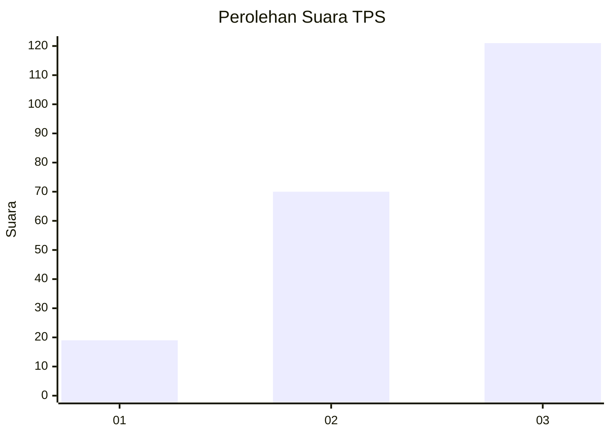
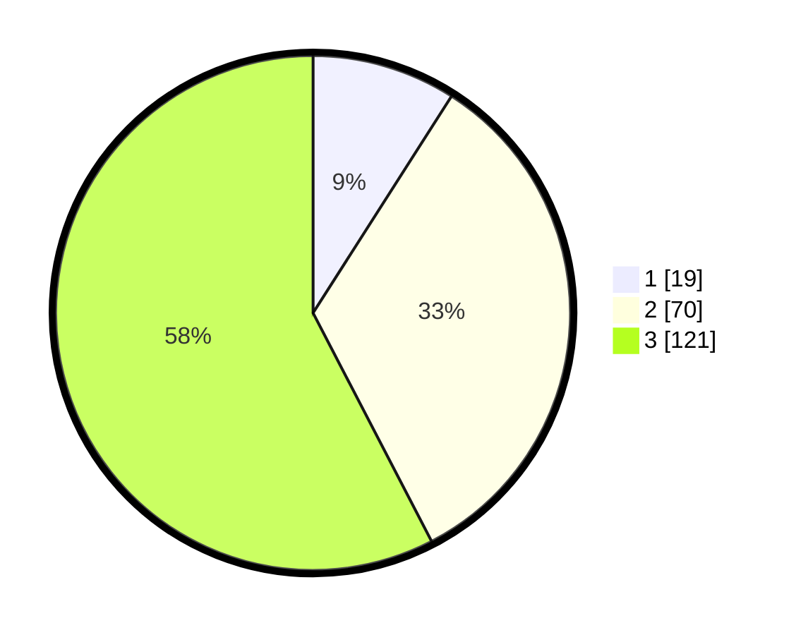

# Hasil

## Grafik

## Tabel

| No. | Nama Paslon    | Suara | Suara (raw) | Persentase |
|:--- |:-------------- | -----:| -----------:| ----------:|
| 1   | ANIES MUHAIMIN | 19    | [19][p-1]   | 9,05       |
| 2   | PRABOWO GIBRAN | 70    | [70][p-2]   | 33,33      |
| 3   | GANJAR MAHFUD  | 121   | [121][p-3]  | 57,62      |

[p-1]: https://github.com/gigit-pemilu/pemilu-2024/blob/main/pilpres/hitung-suara/sub/35-jawa-timur/sub/73-kota-malang/sub/02-klojen/sub/1005-sukoharjo/sub/012-tps/sub/paslon-1.txt
[p-2]: https://github.com/gigit-pemilu/pemilu-2024/blob/main/pilpres/hitung-suara/sub/35-jawa-timur/sub/73-kota-malang/sub/02-klojen/sub/1005-sukoharjo/sub/012-tps/sub/paslon-2.txt
[p-3]: https://github.com/gigit-pemilu/pemilu-2024/blob/main/pilpres/hitung-suara/sub/35-jawa-timur/sub/73-kota-malang/sub/02-klojen/sub/1005-sukoharjo/sub/012-tps/sub/paslon-3.txt

## Foto C Plano

https://sirekap-obj-formc.kpu.go.id/8379/pemilu/ppwp/35/73/02/10/05/3573021005012-20240214-190302--4a983620-fa44-4cc7-bd04-1515cccf4d98.jpg

https://sirekap-obj-formc.kpu.go.id/8379/pemilu/ppwp/35/73/02/10/05/3573021005012-20240214-190717--c90af193-9fc0-4751-a24c-0186366c7e67.jpg

https://sirekap-obj-formc.kpu.go.id/8379/pemilu/ppwp/35/73/02/10/05/3573021005012-20240214-190852--ca7477bc-5a79-4551-8b63-b103c5a0518f.jpg

## Metadata

| Key        | Value               |
| ---------- | ------------------- |
| Time Stamp | 2024-02-14 21:46:01 |

