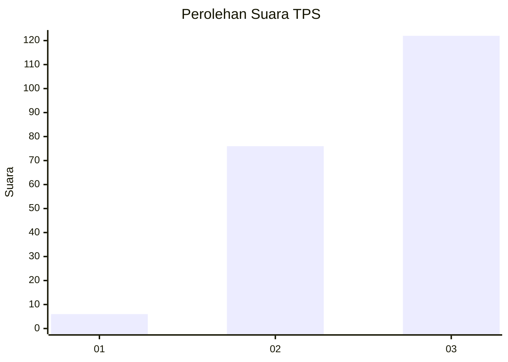
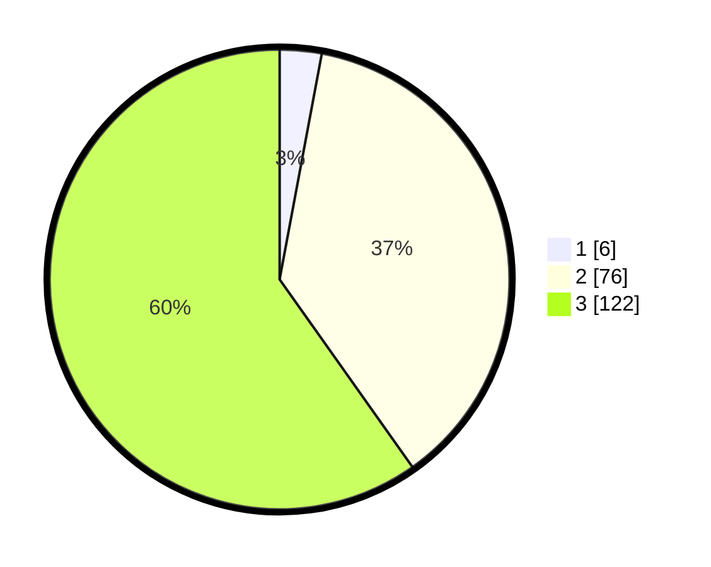

# Hasil

## Grafik

## Tabel

| No. | Nama Paslon    | Suara | Suara (raw) | Persentase |
|:--- |:-------------- | -----:| -----------:| ----------:|
| 1   | ANIES MUHAIMIN | 6     | [6][p-1]    | 2,94       |
| 2   | PRABOWO GIBRAN | 76    | [76][p-2]   | 37,25      |
| 3   | GANJAR MAHFUD  | 122   | [122][p-3]  | 59,80      |

[p-1]: https://github.com/gigit-pemilu/pemilu-2024/blob/main/pilpres/hitung-suara/sub/35-jawa-timur/sub/73-kota-malang/sub/02-klojen/sub/1006-kasin/sub/015-tps/sub/paslon-1.txt
[p-2]: https://github.com/gigit-pemilu/pemilu-2024/blob/main/pilpres/hitung-suara/sub/35-jawa-timur/sub/73-kota-malang/sub/02-klojen/sub/1006-kasin/sub/015-tps/sub/paslon-2.txt
[p-3]: https://github.com/gigit-pemilu/pemilu-2024/blob/main/pilpres/hitung-suara/sub/35-jawa-timur/sub/73-kota-malang/sub/02-klojen/sub/1006-kasin/sub/015-tps/sub/paslon-3.txt

## Foto C Plano

https://sirekap-obj-formc.kpu.go.id/ded4/pemilu/ppwp/35/73/02/10/06/3573021006015-20240215-020256--ca385d01-2cc6-43fb-b06b-f88cc9057709.jpg

https://sirekap-obj-formc.kpu.go.id/ded4/pemilu/ppwp/35/73/02/10/06/3573021006015-20240214-184919--067dd954-a460-4215-859b-3868b47880be.jpg

https://sirekap-obj-formc.kpu.go.id/ded4/pemilu/ppwp/35/73/02/10/06/3573021006015-20240214-184922--0de34f9d-324a-4894-a32f-7b6173dd5573.jpg

## Metadata

| Key        | Value               |
| ---------- | ------------------- |
| Time Stamp | 2024-02-15 02:10:27 |

