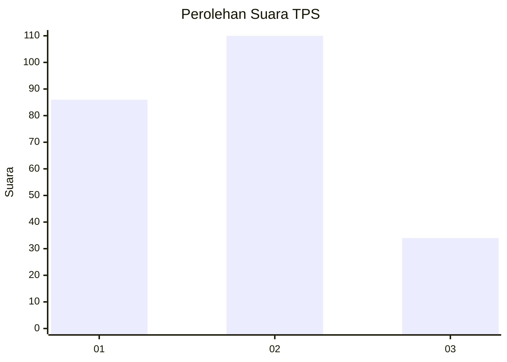
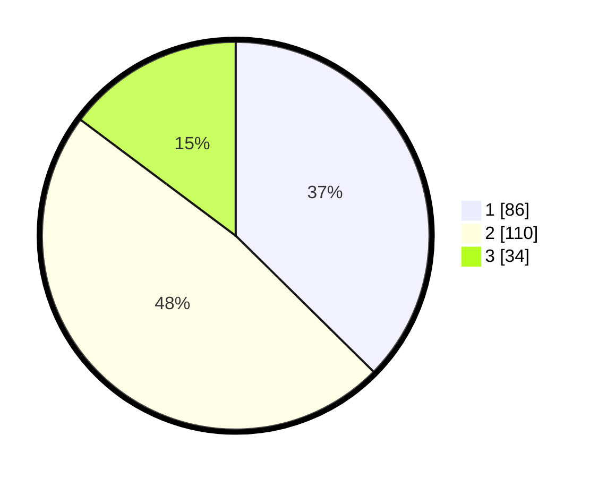

# Hasil

## Grafik

## Tabel

| No. | Nama Paslon    | Suara | Suara (raw) | Persentase |
|:--- |:-------------- | -----:| -----------:| ----------:|
| 1   | ANIES MUHAIMIN | 86    | [86][p-1]   | 37,39      |
| 2   | PRABOWO GIBRAN | 110   | [110][p-2]  | 47,83      |
| 3   | GANJAR MAHFUD  | 34    | [34][p-3]   | 14,78      |

[p-1]: https://github.com/gigit-pemilu/pemilu-2024-35-jawa-timur/blob/main/pilpres/hitung-suara/sub/35-jawa-timur/sub/73-kota-malang/sub/02-klojen/sub/1006-kasin/sub/021-tps/sub/paslon-1.txt
[p-2]: https://github.com/gigit-pemilu/pemilu-2024-35-jawa-timur/blob/main/pilpres/hitung-suara/sub/35-jawa-timur/sub/73-kota-malang/sub/02-klojen/sub/1006-kasin/sub/021-tps/sub/paslon-2.txt
[p-3]: https://github.com/gigit-pemilu/pemilu-2024-35-jawa-timur/blob/main/pilpres/hitung-suara/sub/35-jawa-timur/sub/73-kota-malang/sub/02-klojen/sub/1006-kasin/sub/021-tps/sub/paslon-3.txt

## Foto C Plano

https://sirekap-obj-formc.kpu.go.id/ef7e/pemilu/ppwp/35/73/02/10/06/3573021006021-20240214-225037--00b03167-4f0f-41a2-bd2e-043c07d07d16.jpg

https://sirekap-obj-formc.kpu.go.id/ef7e/pemilu/ppwp/35/73/02/10/06/3573021006021-20240214-225058--f8c1c9c2-8a1f-4a51-93cc-cd855a5d77c5.jpg

https://sirekap-obj-formc.kpu.go.id/ef7e/pemilu/ppwp/35/73/02/10/06/3573021006021-20240214-225127--347a04f5-6c90-4f88-b93d-ccb719a908be.jpg

## Metadata

| Key        | Value               |
| ---------- | ------------------- |
| Time Stamp | 2024-02-24 22:31:28 |

