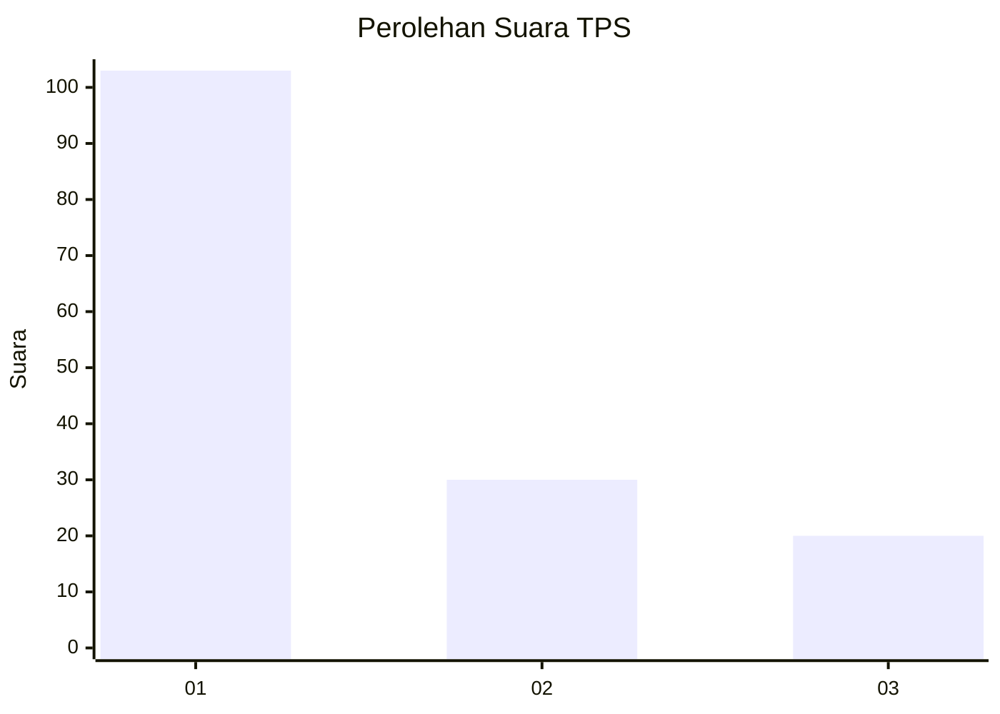
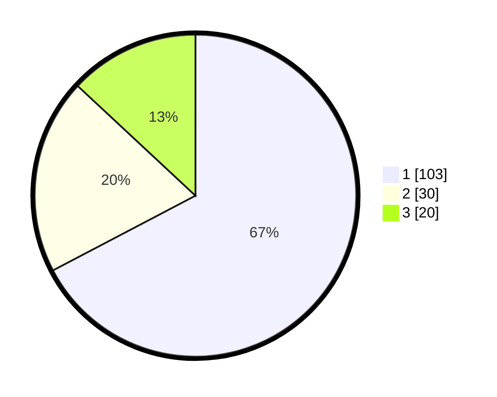

# Hasil

## Grafik

## Tabel

| No. | Nama Paslon    | Suara | Suara (raw) | Persentase |
|:--- |:-------------- | -----:| -----------:| ----------:|
| 1   | ANIES MUHAIMIN | 103   | [103][p-1]  | 67,32      |
| 2   | PRABOWO GIBRAN | 30    | [30][p-2]   | 19,61      |
| 3   | GANJAR MAHFUD  | 20    | [20][p-3]   | 13,07      |

[p-1]: https://github.com/gigit-pemilu/pemilu-2024/blob/main/pilpres/hitung-suara/sub/35-jawa-timur/sub/73-kota-malang/sub/02-klojen/sub/1006-kasin/sub/031-tps/sub/paslon-1.txt
[p-2]: https://github.com/gigit-pemilu/pemilu-2024/blob/main/pilpres/hitung-suara/sub/35-jawa-timur/sub/73-kota-malang/sub/02-klojen/sub/1006-kasin/sub/031-tps/sub/paslon-2.txt
[p-3]: https://github.com/gigit-pemilu/pemilu-2024/blob/main/pilpres/hitung-suara/sub/35-jawa-timur/sub/73-kota-malang/sub/02-klojen/sub/1006-kasin/sub/031-tps/sub/paslon-3.txt

## Foto C Plano

https://sirekap-obj-formc.kpu.go.id/bc46/pemilu/ppwp/35/73/02/10/06/3573021006031-20240214-194532--2b8551eb-ea1f-4100-bb37-173ab25d4c37.jpg

https://sirekap-obj-formc.kpu.go.id/bc46/pemilu/ppwp/35/73/02/10/06/3573021006031-20240214-194537--987ed20e-d837-4572-81b0-f7f9100f8ade.jpg

https://sirekap-obj-formc.kpu.go.id/bc46/pemilu/ppwp/35/73/02/10/06/3573021006031-20240214-194544--0f062e31-7e52-45cb-b74b-59888dd683bf.jpg

## Metadata

| Key        | Value               |
| ---------- | ------------------- |
| Time Stamp | 2024-02-15 00:41:44 |

