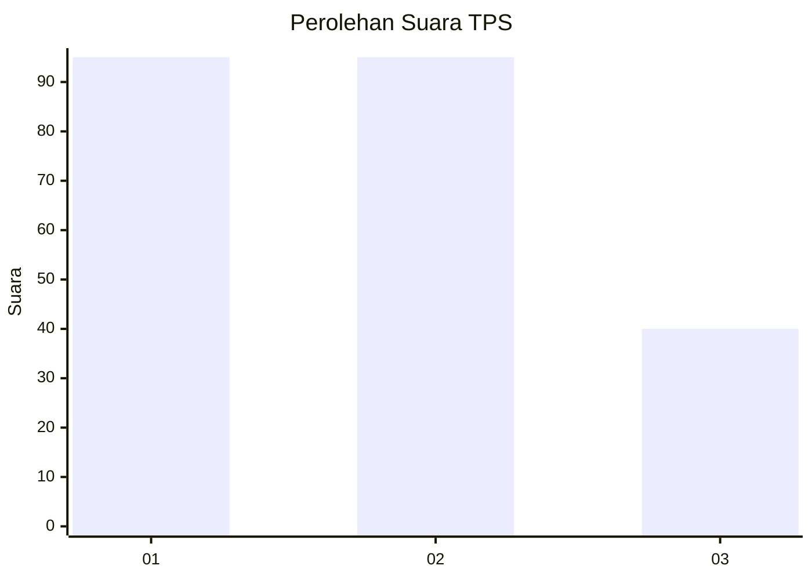
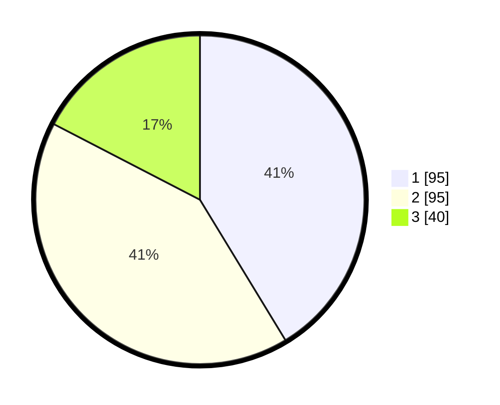

# Hasil

## Grafik

## Tabel

| No. | Nama Paslon    | Suara | Suara (raw) | Persentase |
|:--- |:-------------- | -----:| -----------:| ----------:|
| 1   | ANIES MUHAIMIN | 95    | [95][p-1]   | 41,30      |
| 2   | PRABOWO GIBRAN | 95    | [95][p-2]   | 41,30      |
| 3   | GANJAR MAHFUD  | 40    | [40][p-3]   | 17,39      |

[p-1]: https://github.com/gigit-pemilu/pemilu-2024/blob/main/pilpres/hitung-suara/sub/35-jawa-timur/sub/73-kota-malang/sub/02-klojen/sub/1007-kauman/sub/007-tps/sub/paslon-1.txt
[p-2]: https://github.com/gigit-pemilu/pemilu-2024/blob/main/pilpres/hitung-suara/sub/35-jawa-timur/sub/73-kota-malang/sub/02-klojen/sub/1007-kauman/sub/007-tps/sub/paslon-2.txt
[p-3]: https://github.com/gigit-pemilu/pemilu-2024/blob/main/pilpres/hitung-suara/sub/35-jawa-timur/sub/73-kota-malang/sub/02-klojen/sub/1007-kauman/sub/007-tps/sub/paslon-3.txt

## Foto C Plano

https://sirekap-obj-formc.kpu.go.id/be97/pemilu/ppwp/35/73/02/10/07/3573021007007-20240215-004427--4476b6d5-6f09-4952-8f01-bbe7ef91f5c6.jpg

https://sirekap-obj-formc.kpu.go.id/be97/pemilu/ppwp/35/73/02/10/07/3573021007007-20240215-004954--1fc154b0-c9e9-4bef-93de-9a1f1fa0780b.jpg

https://sirekap-obj-formc.kpu.go.id/be97/pemilu/ppwp/35/73/02/10/07/3573021007007-20240214-210847--5c3a3daa-64ac-49b4-9ffa-d819e9677bb9.jpg

## Metadata

| Key        | Value               |
| ---------- | ------------------- |
| Time Stamp | 2024-02-26 22:00:00 |

