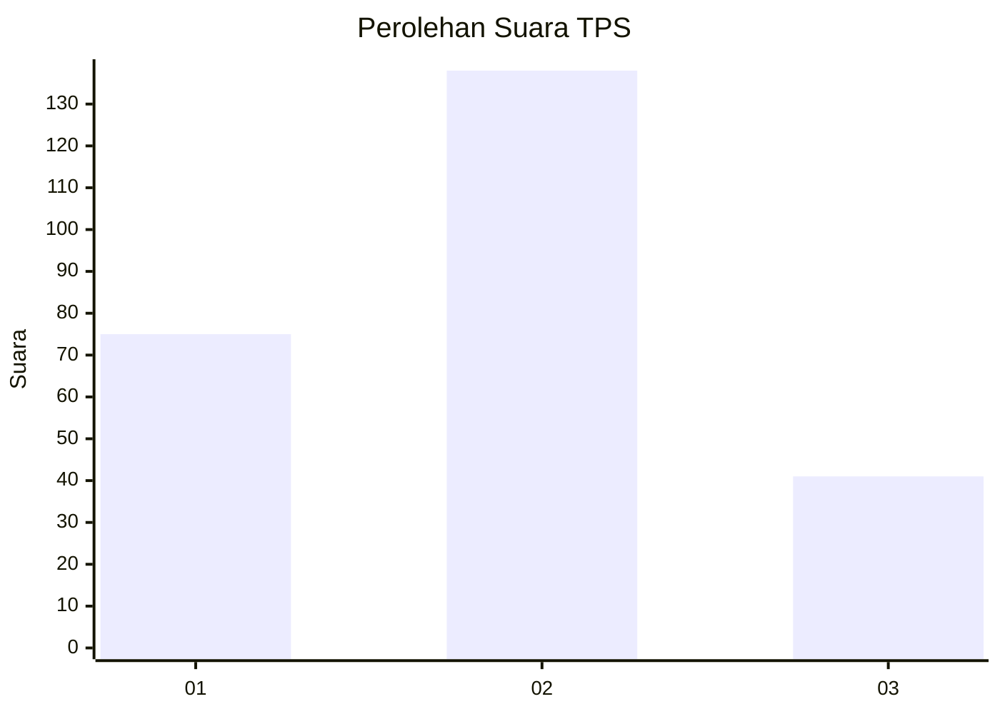
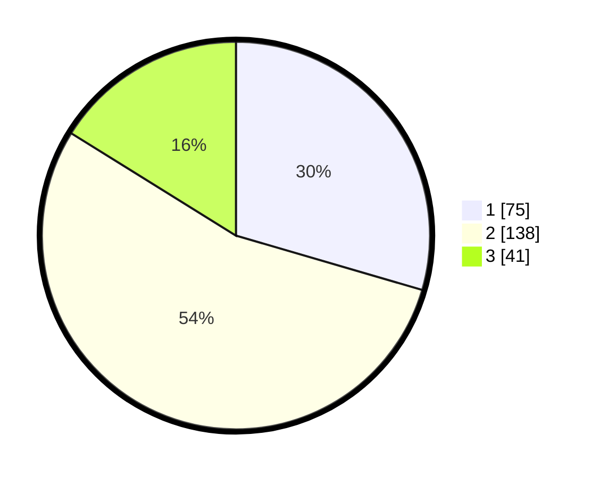

# Hasil

## Grafik

## Tabel

| No. | Nama Paslon    | Suara | Suara (raw) | Persentase |
|:--- |:-------------- | -----:| -----------:| ----------:|
| 1   | ANIES MUHAIMIN | 75    | [75][p-1]   | 29,53      |
| 2   | PRABOWO GIBRAN | 138   | [138][p-2]  | 54,33      |
| 3   | GANJAR MAHFUD  | 41    | [41][p-3]   | 16,14      |

[p-1]: https://github.com/gigit-pemilu/pemilu-2024/blob/main/pilpres/hitung-suara/sub/35-jawa-timur/sub/73-kota-malang/sub/02-klojen/sub/1007-kauman/sub/008-tps/sub/paslon-1.txt
[p-2]: https://github.com/gigit-pemilu/pemilu-2024/blob/main/pilpres/hitung-suara/sub/35-jawa-timur/sub/73-kota-malang/sub/02-klojen/sub/1007-kauman/sub/008-tps/sub/paslon-2.txt
[p-3]: https://github.com/gigit-pemilu/pemilu-2024/blob/main/pilpres/hitung-suara/sub/35-jawa-timur/sub/73-kota-malang/sub/02-klojen/sub/1007-kauman/sub/008-tps/sub/paslon-3.txt

## Foto C Plano

https://sirekap-obj-formc.kpu.go.id/f2e8/pemilu/ppwp/35/73/02/10/07/3573021007008-20240214-224508--55b64234-3e7f-43c9-8d3e-6d5c3661534f.jpg

https://sirekap-obj-formc.kpu.go.id/f2e8/pemilu/ppwp/35/73/02/10/07/3573021007008-20240214-224652--30ecded3-d2ed-46c8-8318-d8d9ec77805d.jpg

https://sirekap-obj-formc.kpu.go.id/f2e8/pemilu/ppwp/35/73/02/10/07/3573021007008-20240214-224810--f1898e7c-913c-4450-88af-ad01711bf728.jpg

## Metadata

| Key        | Value               |
| ---------- | ------------------- |
| Time Stamp | 2024-02-24 22:31:28 |

