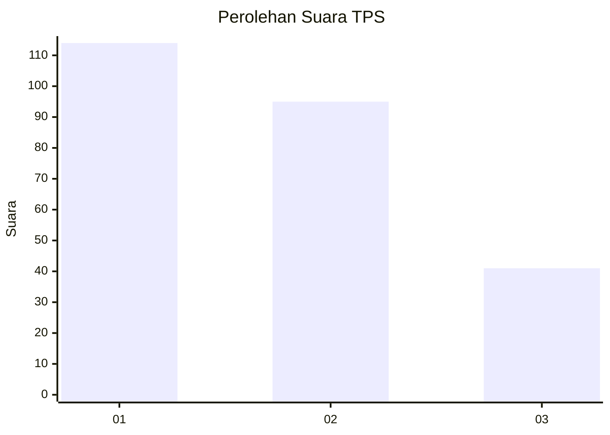
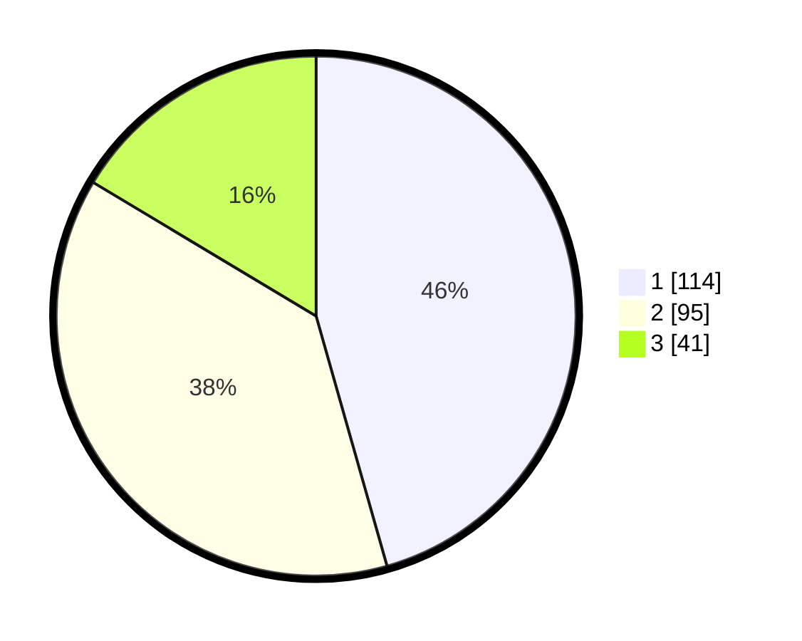

# Hasil

## Grafik

## Tabel

| No. | Nama Paslon    | Suara | Suara (raw) | Persentase |
|:--- |:-------------- | -----:| -----------:| ----------:|
| 1   | ANIES MUHAIMIN | 114   | [114][p-1]  | 45,60      |
| 2   | PRABOWO GIBRAN | 95    | [95][p-2]   | 38,00      |
| 3   | GANJAR MAHFUD  | 41    | [41][p-3]   | 16,40      |

[p-1]: https://github.com/gigit-pemilu/pemilu-2024/blob/main/pilpres/hitung-suara/sub/35-jawa-timur/sub/73-kota-malang/sub/02-klojen/sub/1007-kauman/sub/009-tps/sub/paslon-1.txt
[p-2]: https://github.com/gigit-pemilu/pemilu-2024/blob/main/pilpres/hitung-suara/sub/35-jawa-timur/sub/73-kota-malang/sub/02-klojen/sub/1007-kauman/sub/009-tps/sub/paslon-2.txt
[p-3]: https://github.com/gigit-pemilu/pemilu-2024/blob/main/pilpres/hitung-suara/sub/35-jawa-timur/sub/73-kota-malang/sub/02-klojen/sub/1007-kauman/sub/009-tps/sub/paslon-3.txt

## Foto C Plano

https://sirekap-obj-formc.kpu.go.id/1bc4/pemilu/ppwp/35/73/02/10/07/3573021007009-20240214-231612--1442bb10-6115-43f8-9d85-e8c4f0ba314c.jpg

https://sirekap-obj-formc.kpu.go.id/1bc4/pemilu/ppwp/35/73/02/10/07/3573021007009-20240214-232201--f9e92212-73a5-43f9-acfa-afc5487bc080.jpg

https://sirekap-obj-formc.kpu.go.id/1bc4/pemilu/ppwp/35/73/02/10/07/3573021007009-20240214-232241--38e87e9f-b410-40b3-b602-6aa92f6db584.jpg

## Metadata

| Key        | Value               |
| ---------- | ------------------- |
| Time Stamp | 2024-02-24 22:31:28 |

