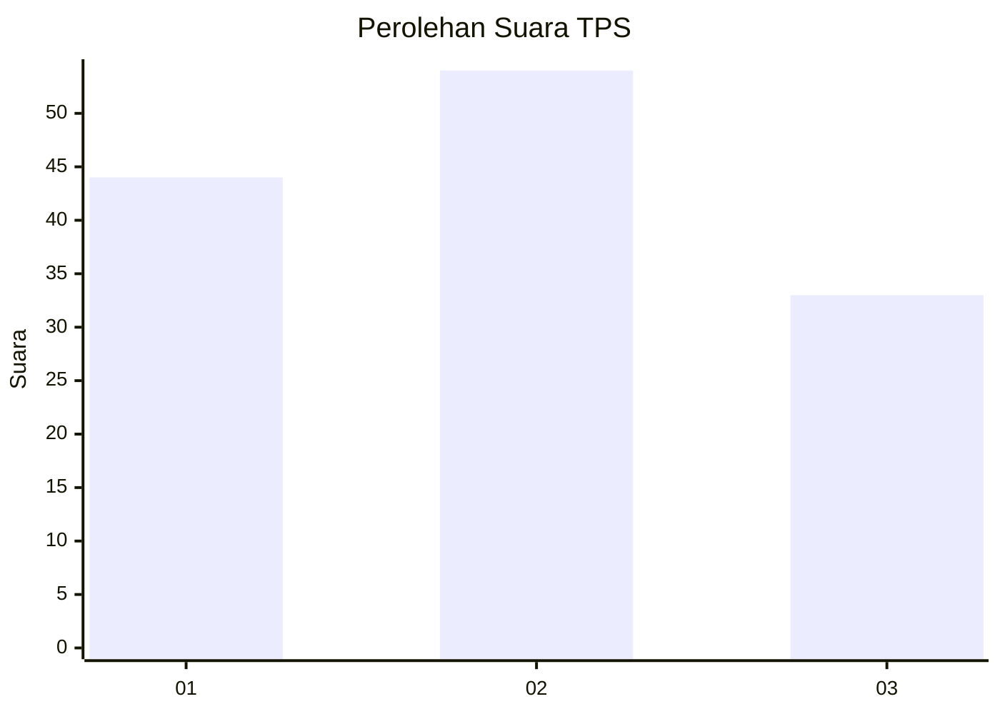
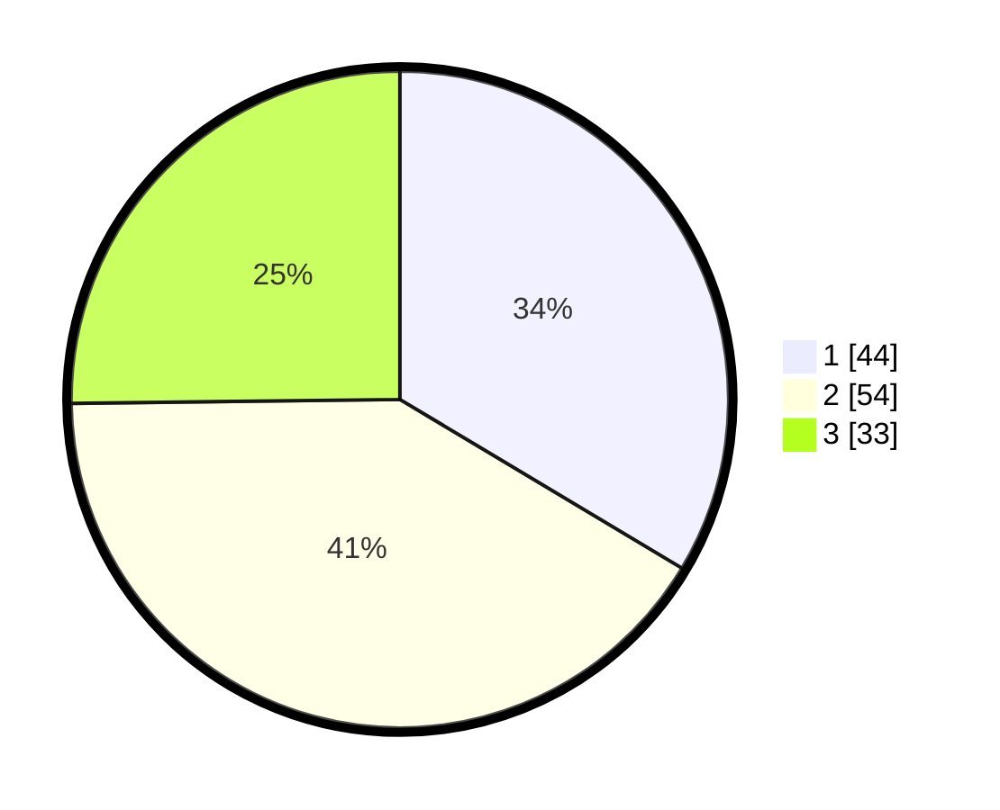

# Hasil

## Grafik

## Tabel

| No. | Nama Paslon    | Suara | Suara (raw) | Persentase |
|:--- |:-------------- | -----:| -----------:| ----------:|
| 1   | ANIES MUHAIMIN | 44    | [44][p-1]   | 33,59      |
| 2   | PRABOWO GIBRAN | 54    | [54][p-2]   | 41,22      |
| 3   | GANJAR MAHFUD  | 33    | [33][p-3]   | 25,19      |

[p-1]: https://github.com/gigit-pemilu/pemilu-2024/blob/main/pilpres/hitung-suara/sub/35-jawa-timur/sub/73-kota-malang/sub/02-klojen/sub/1007-kauman/sub/022-tps/sub/paslon-1.txt
[p-2]: https://github.com/gigit-pemilu/pemilu-2024/blob/main/pilpres/hitung-suara/sub/35-jawa-timur/sub/73-kota-malang/sub/02-klojen/sub/1007-kauman/sub/022-tps/sub/paslon-2.txt
[p-3]: https://github.com/gigit-pemilu/pemilu-2024/blob/main/pilpres/hitung-suara/sub/35-jawa-timur/sub/73-kota-malang/sub/02-klojen/sub/1007-kauman/sub/022-tps/sub/paslon-3.txt

## Foto C Plano

https://sirekap-obj-formc.kpu.go.id/77b0/pemilu/ppwp/35/73/02/10/07/3573021007022-20240214-230940--7aeb00bc-8050-458d-ab25-1688889965ad.jpg

https://sirekap-obj-formc.kpu.go.id/77b0/pemilu/ppwp/35/73/02/10/07/3573021007022-20240214-231714--ae5a2777-e3f9-4123-bc49-176d02e223bf.jpg

https://sirekap-obj-formc.kpu.go.id/77b0/pemilu/ppwp/35/73/02/10/07/3573021007022-20240214-231852--a9bbdf9d-8af3-4a24-a3cd-f06a3831785f.jpg

## Metadata

| Key        | Value               |
| ---------- | ------------------- |
| Time Stamp | 2024-02-24 22:31:28 |

