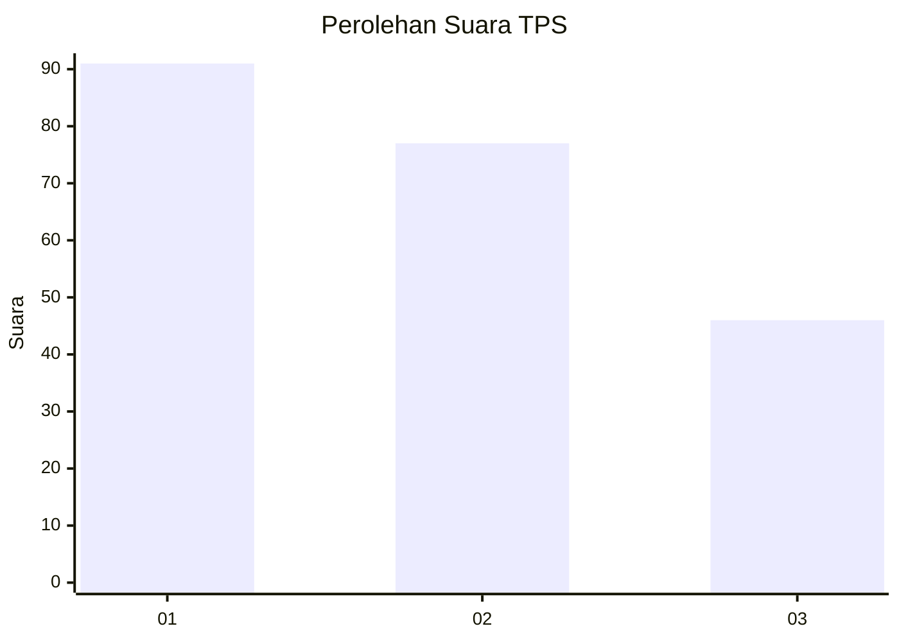
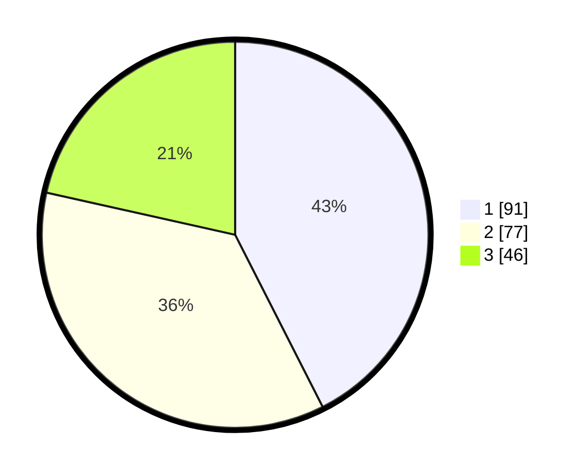

# Hasil

## Grafik

## Tabel

| No. | Nama Paslon    | Suara | Suara (raw) | Persentase |
|:--- |:-------------- | -----:| -----------:| ----------:|
| 1   | ANIES MUHAIMIN | 91    | [91][p-1]   | 42,52      |
| 2   | PRABOWO GIBRAN | 77    | [77][p-2]   | 35,98      |
| 3   | GANJAR MAHFUD  | 46    | [46][p-3]   | 21,50      |

[p-1]: https://github.com/gigit-pemilu/pemilu-2024/blob/main/pilpres/hitung-suara/sub/35-jawa-timur/sub/73-kota-malang/sub/02-klojen/sub/1007-kauman/sub/023-tps/sub/paslon-1.txt
[p-2]: https://github.com/gigit-pemilu/pemilu-2024/blob/main/pilpres/hitung-suara/sub/35-jawa-timur/sub/73-kota-malang/sub/02-klojen/sub/1007-kauman/sub/023-tps/sub/paslon-2.txt
[p-3]: https://github.com/gigit-pemilu/pemilu-2024/blob/main/pilpres/hitung-suara/sub/35-jawa-timur/sub/73-kota-malang/sub/02-klojen/sub/1007-kauman/sub/023-tps/sub/paslon-3.txt

## Foto C Plano

https://sirekap-obj-formc.kpu.go.id/b434/pemilu/ppwp/35/73/02/10/07/3573021007023-20240215-004300--76ac1256-3c63-418e-b0da-a5868130da53.jpg

https://sirekap-obj-formc.kpu.go.id/b434/pemilu/ppwp/35/73/02/10/07/3573021007023-20240215-004419--7de66d9b-5a9b-46e2-932c-874aee6fbd1e.jpg

https://sirekap-obj-formc.kpu.go.id/b434/pemilu/ppwp/35/73/02/10/07/3573021007023-20240215-004535--9e534338-5e1e-45d9-868a-c7a39fd648ab.jpg

## Metadata

| Key        | Value               |
| ---------- | ------------------- |
| Time Stamp | 2024-02-25 11:00:00 |

