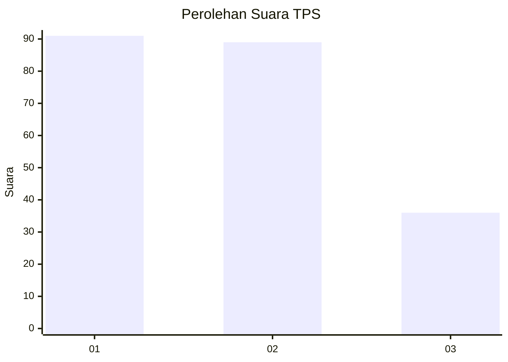
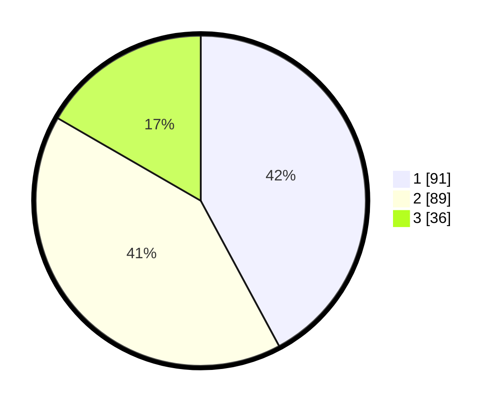

# Hasil

## Grafik

## Tabel

| No. | Nama Paslon    | Suara | Suara (raw) | Persentase |
|:--- |:-------------- | -----:| -----------:| ----------:|
| 1   | ANIES MUHAIMIN | 91    | [91][p-1]   | 42,13      |
| 2   | PRABOWO GIBRAN | 89    | [89][p-2]   | 41,20      |
| 3   | GANJAR MAHFUD  | 36    | [36][p-3]   | 16,67      |

[p-1]: https://github.com/gigit-pemilu/pemilu-2024/blob/main/pilpres/hitung-suara/sub/35-jawa-timur/sub/73-kota-malang/sub/02-klojen/sub/1007-kauman/sub/024-tps/sub/paslon-1.txt
[p-2]: https://github.com/gigit-pemilu/pemilu-2024/blob/main/pilpres/hitung-suara/sub/35-jawa-timur/sub/73-kota-malang/sub/02-klojen/sub/1007-kauman/sub/024-tps/sub/paslon-2.txt
[p-3]: https://github.com/gigit-pemilu/pemilu-2024/blob/main/pilpres/hitung-suara/sub/35-jawa-timur/sub/73-kota-malang/sub/02-klojen/sub/1007-kauman/sub/024-tps/sub/paslon-3.txt

## Foto C Plano

https://sirekap-obj-formc.kpu.go.id/51e3/pemilu/ppwp/35/73/02/10/07/3573021007024-20240215-003518--1b435ca6-1c20-4966-9fd5-45113fe5cfbb.jpg

https://sirekap-obj-formc.kpu.go.id/51e3/pemilu/ppwp/35/73/02/10/07/3573021007024-20240214-225243--4886b95f-3995-4e0e-bc24-674d81558618.jpg

https://sirekap-obj-formc.kpu.go.id/51e3/pemilu/ppwp/35/73/02/10/07/3573021007024-20240214-225351--77ff52a7-7361-4624-a37e-0b6831a0a959.jpg

## Metadata

| Key        | Value               |
| ---------- | ------------------- |
| Time Stamp | 2024-02-25 17:00:00 |

