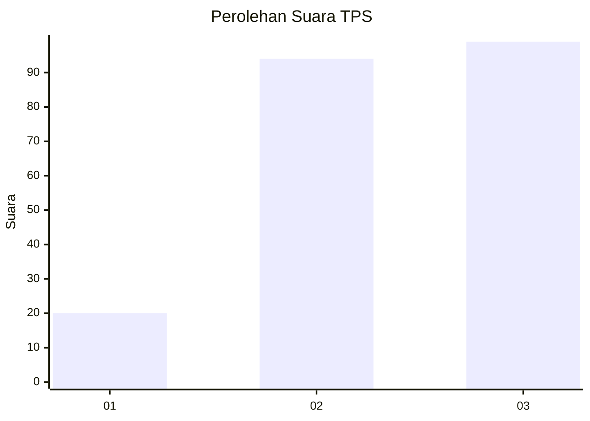
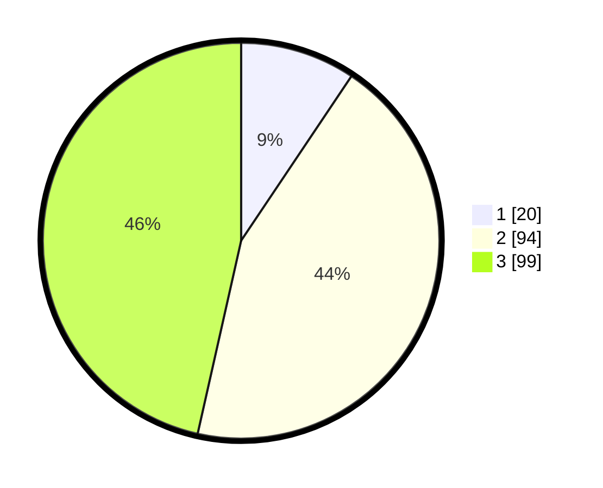

# Hasil

## Grafik

## Tabel

| No. | Nama Paslon    | Suara | Suara (raw) | Persentase |
|:--- |:-------------- | -----:| -----------:| ----------:|
| 1   | ANIES MUHAIMIN | 20    | [20][p-1]   | 9,39       |
| 2   | PRABOWO GIBRAN | 94    | [94][p-2]   | 44,13      |
| 3   | GANJAR MAHFUD  | 99    | [99][p-3]   | 46,48      |

[p-1]: https://github.com/gigit-pemilu/pemilu-2024/blob/main/pilpres/hitung-suara/sub/35-jawa-timur/sub/73-kota-malang/sub/02-klojen/sub/1008-oro-oro-dowo/sub/002-tps/sub/paslon-1.txt
[p-2]: https://github.com/gigit-pemilu/pemilu-2024/blob/main/pilpres/hitung-suara/sub/35-jawa-timur/sub/73-kota-malang/sub/02-klojen/sub/1008-oro-oro-dowo/sub/002-tps/sub/paslon-2.txt
[p-3]: https://github.com/gigit-pemilu/pemilu-2024/blob/main/pilpres/hitung-suara/sub/35-jawa-timur/sub/73-kota-malang/sub/02-klojen/sub/1008-oro-oro-dowo/sub/002-tps/sub/paslon-3.txt

## Foto C Plano

https://sirekap-obj-formc.kpu.go.id/db9b/pemilu/ppwp/35/73/02/10/08/3573021008002-20240215-011137--a176fd3e-1884-44d3-9fd9-854d3229a84c.jpg

https://sirekap-obj-formc.kpu.go.id/db9b/pemilu/ppwp/35/73/02/10/08/3573021008002-20240215-011201--1420a7eb-f90a-4113-9b93-b1b2b108089b.jpg

https://sirekap-obj-formc.kpu.go.id/db9b/pemilu/ppwp/35/73/02/10/08/3573021008002-20240215-011221--f2750379-0371-439d-97cb-8b630dcfa82d.jpg

## Metadata

| Key        | Value               |
| ---------- | ------------------- |
| Time Stamp | 2024-02-15 15:00:29 |

