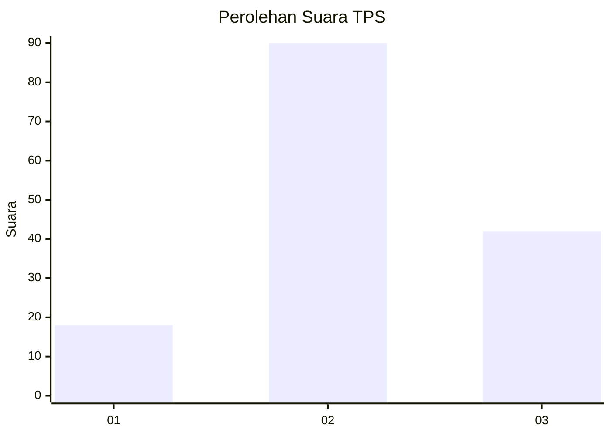
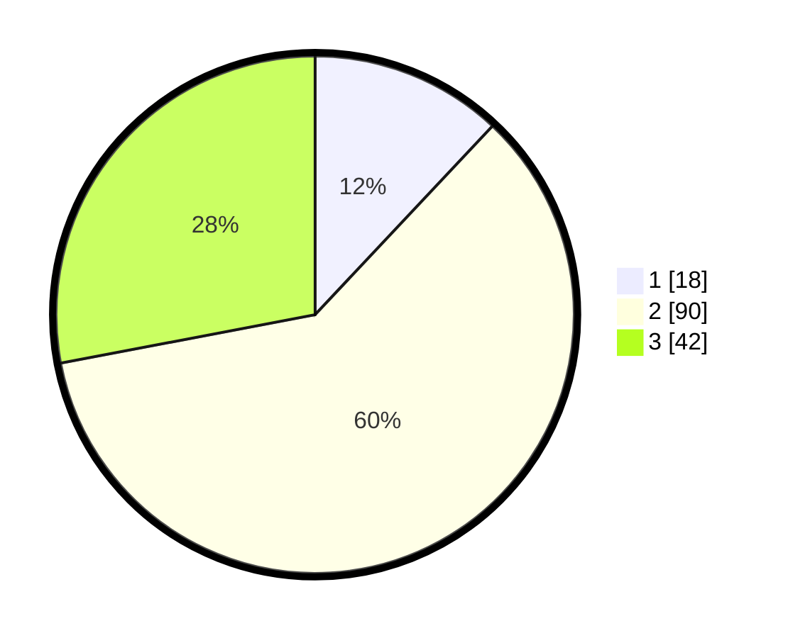

# Hasil

## Grafik

## Tabel

| No. | Nama Paslon    | Suara | Suara (raw) | Persentase |
|:--- |:-------------- | -----:| -----------:| ----------:|
| 1   | ANIES MUHAIMIN | 18    | [18][p-1]   | 12,00      |
| 2   | PRABOWO GIBRAN | 90    | [90][p-2]   | 60,00      |
| 3   | GANJAR MAHFUD  | 42    | [42][p-3]   | 28,00      |

[p-1]: https://github.com/gigit-pemilu/pemilu-2024/blob/main/pilpres/hitung-suara/sub/35-jawa-timur/sub/73-kota-malang/sub/02-klojen/sub/1008-oro-oro-dowo/sub/010-tps/sub/paslon-1.txt
[p-2]: https://github.com/gigit-pemilu/pemilu-2024/blob/main/pilpres/hitung-suara/sub/35-jawa-timur/sub/73-kota-malang/sub/02-klojen/sub/1008-oro-oro-dowo/sub/010-tps/sub/paslon-2.txt
[p-3]: https://github.com/gigit-pemilu/pemilu-2024/blob/main/pilpres/hitung-suara/sub/35-jawa-timur/sub/73-kota-malang/sub/02-klojen/sub/1008-oro-oro-dowo/sub/010-tps/sub/paslon-3.txt

## Foto C Plano

https://sirekap-obj-formc.kpu.go.id/2316/pemilu/ppwp/35/73/02/10/08/3573021008010-20240215-001210--db6c5523-6d84-43ce-84f8-b4a326a722e6.jpg

https://sirekap-obj-formc.kpu.go.id/2316/pemilu/ppwp/35/73/02/10/08/3573021008010-20240215-010137--d7913fcb-0eef-4027-980a-dc1afd78def4.jpg

https://sirekap-obj-formc.kpu.go.id/2316/pemilu/ppwp/35/73/02/10/08/3573021008010-20240215-010222--1c08c25e-4543-4818-ae32-8a711b2d8aa7.jpg

## Metadata

| Key        | Value               |
| ---------- | ------------------- |
| Time Stamp | 2024-02-19 06:16:00 |

