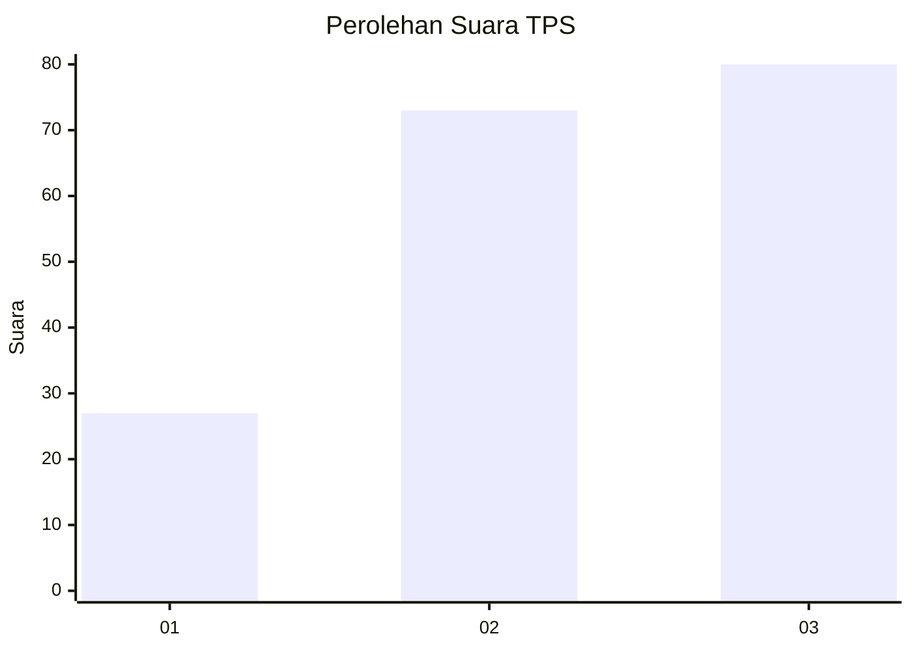
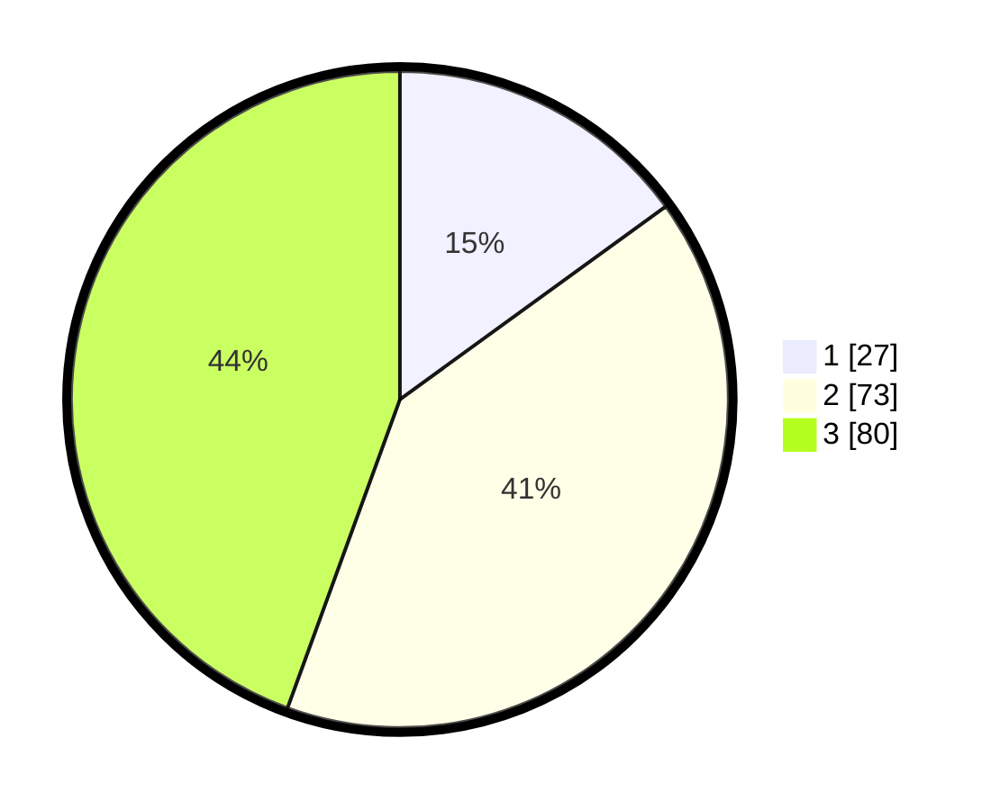

# Hasil

## Grafik

## Tabel

| No. | Nama Paslon    | Suara | Suara (raw) | Persentase |
|:--- |:-------------- | -----:| -----------:| ----------:|
| 1   | ANIES MUHAIMIN | 27    | [27][p-1]   | 15,00      |
| 2   | PRABOWO GIBRAN | 73    | [73][p-2]   | 40,56      |
| 3   | GANJAR MAHFUD  | 80    | [80][p-3]   | 44,44      |

[p-1]: https://github.com/gigit-pemilu/pemilu-2024/blob/main/pilpres/hitung-suara/sub/35-jawa-timur/sub/73-kota-malang/sub/02-klojen/sub/1008-oro-oro-dowo/sub/015-tps/sub/paslon-1.txt
[p-2]: https://github.com/gigit-pemilu/pemilu-2024/blob/main/pilpres/hitung-suara/sub/35-jawa-timur/sub/73-kota-malang/sub/02-klojen/sub/1008-oro-oro-dowo/sub/015-tps/sub/paslon-2.txt
[p-3]: https://github.com/gigit-pemilu/pemilu-2024/blob/main/pilpres/hitung-suara/sub/35-jawa-timur/sub/73-kota-malang/sub/02-klojen/sub/1008-oro-oro-dowo/sub/015-tps/sub/paslon-3.txt

## Foto C Plano

https://sirekap-obj-formc.kpu.go.id/6a2c/pemilu/ppwp/35/73/02/10/08/3573021008015-20240215-013507--21ad8d0c-3cfd-49ed-adcd-0c037efad6e7.jpg

https://sirekap-obj-formc.kpu.go.id/6a2c/pemilu/ppwp/35/73/02/10/08/3573021008015-20240215-013852--1853dc99-ec1d-45bc-9f76-399e66581471.jpg

https://sirekap-obj-formc.kpu.go.id/6a2c/pemilu/ppwp/35/73/02/10/08/3573021008015-20240215-020411--6e990635-52ac-485e-bba1-28fe6ba97ae8.jpg

## Metadata

| Key        | Value               |
| ---------- | ------------------- |
| Time Stamp | 2024-02-15 15:00:29 |

