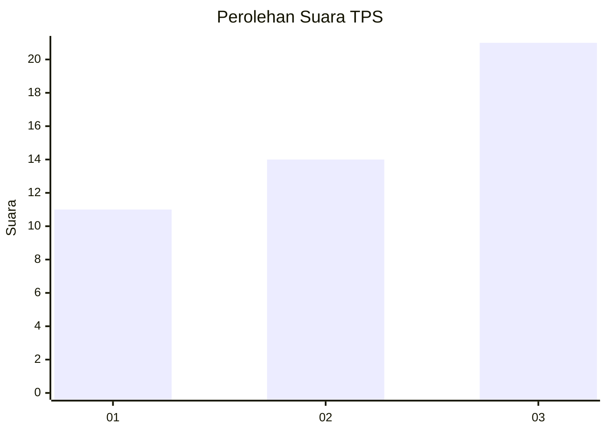
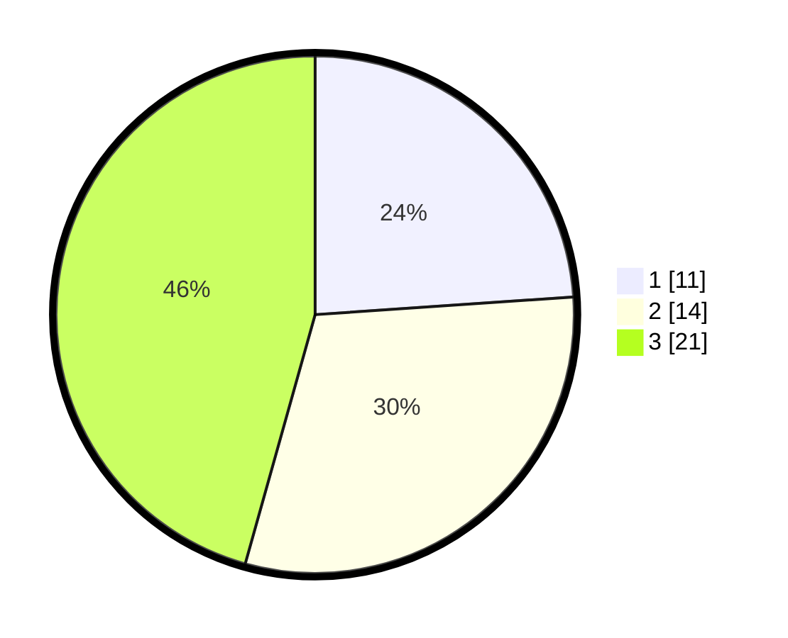

# Hasil

## Grafik

## Tabel

| No. | Nama Paslon    | Suara | Suara (raw) | Persentase |
|:--- |:-------------- | -----:| -----------:| ----------:|
| 1   | ANIES MUHAIMIN | 11    | [11][p-1]   | 23,91      |
| 2   | PRABOWO GIBRAN | 14    | [14][p-2]   | 30,43      |
| 3   | GANJAR MAHFUD  | 21    | [21][p-3]   | 45,65      |

[p-1]: https://github.com/gigit-pemilu/pemilu-2024/blob/main/pilpres/hitung-suara/sub/35-jawa-timur/sub/73-kota-malang/sub/02-klojen/sub/1008-oro-oro-dowo/sub/029-tps/sub/paslon-1.txt
[p-2]: https://github.com/gigit-pemilu/pemilu-2024/blob/main/pilpres/hitung-suara/sub/35-jawa-timur/sub/73-kota-malang/sub/02-klojen/sub/1008-oro-oro-dowo/sub/029-tps/sub/paslon-2.txt
[p-3]: https://github.com/gigit-pemilu/pemilu-2024/blob/main/pilpres/hitung-suara/sub/35-jawa-timur/sub/73-kota-malang/sub/02-klojen/sub/1008-oro-oro-dowo/sub/029-tps/sub/paslon-3.txt

## Foto C Plano

https://sirekap-obj-formc.kpu.go.id/dd53/pemilu/ppwp/35/73/02/10/08/3573021008029-20240215-110705--cdec3d3f-a39e-4b32-9617-75dfc72a41f0.jpg

https://sirekap-obj-formc.kpu.go.id/dd53/pemilu/ppwp/35/73/02/10/08/3573021008029-20240215-110722--74419ec1-bfa0-41de-98e9-c4a02c83d4d4.jpg

https://sirekap-obj-formc.kpu.go.id/dd53/pemilu/ppwp/35/73/02/10/08/3573021008029-20240215-110738--906d6760-4414-484a-a3a6-d51d93c10e0b.jpg

## Metadata

| Key        | Value               |
| ---------- | ------------------- |
| Time Stamp | 2024-02-26 01:00:00 |

