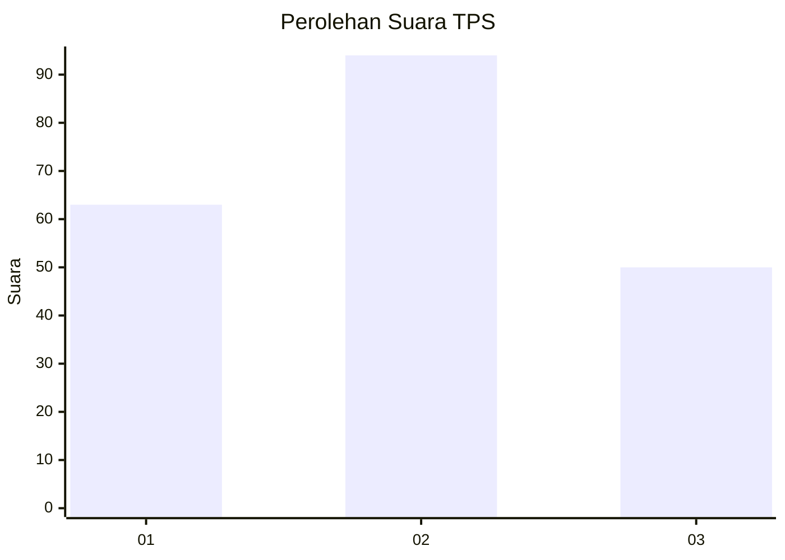
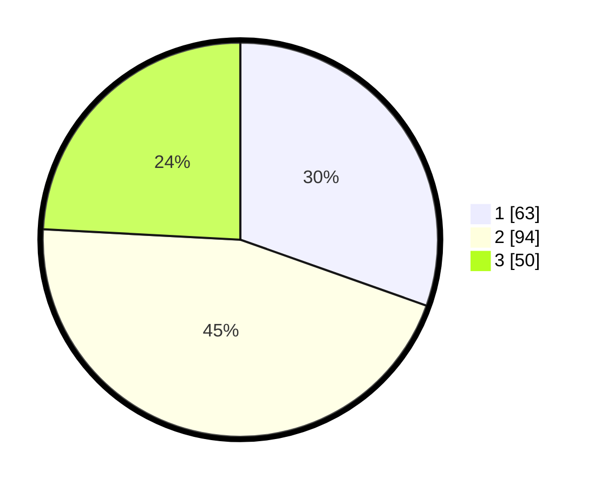

# Hasil

## Grafik

## Tabel

| No. | Nama Paslon    | Suara | Suara (raw) | Persentase |
|:--- |:-------------- | -----:| -----------:| ----------:|
| 1   | ANIES MUHAIMIN | 63    | [63][p-1]   | 30,43      |
| 2   | PRABOWO GIBRAN | 94    | [94][p-2]   | 45,41      |
| 3   | GANJAR MAHFUD  | 50    | [50][p-3]   | 24,15      |

[p-1]: https://github.com/gigit-pemilu/pemilu-2024/blob/main/pilpres/hitung-suara/sub/35-jawa-timur/sub/73-kota-malang/sub/02-klojen/sub/1009-bareng/sub/030-tps/sub/paslon-1.txt
[p-2]: https://github.com/gigit-pemilu/pemilu-2024/blob/main/pilpres/hitung-suara/sub/35-jawa-timur/sub/73-kota-malang/sub/02-klojen/sub/1009-bareng/sub/030-tps/sub/paslon-2.txt
[p-3]: https://github.com/gigit-pemilu/pemilu-2024/blob/main/pilpres/hitung-suara/sub/35-jawa-timur/sub/73-kota-malang/sub/02-klojen/sub/1009-bareng/sub/030-tps/sub/paslon-3.txt

## Foto C Plano

https://sirekap-obj-formc.kpu.go.id/961b/pemilu/ppwp/35/73/02/10/09/3573021009030-20240214-222320--6ac8126f-b3e8-4917-b837-9d2798cdf23c.jpg

https://sirekap-obj-formc.kpu.go.id/961b/pemilu/ppwp/35/73/02/10/09/3573021009030-20240214-222711--1ad717b7-eeb3-42bc-8f9a-0538d6bac0a4.jpg

https://sirekap-obj-formc.kpu.go.id/961b/pemilu/ppwp/35/73/02/10/09/3573021009030-20240214-222944--9bd18034-2227-4729-8022-20576bcb5d9a.jpg

## Metadata

| Key        | Value               |
| ---------- | ------------------- |
| Time Stamp | 2024-02-24 22:31:28 |

