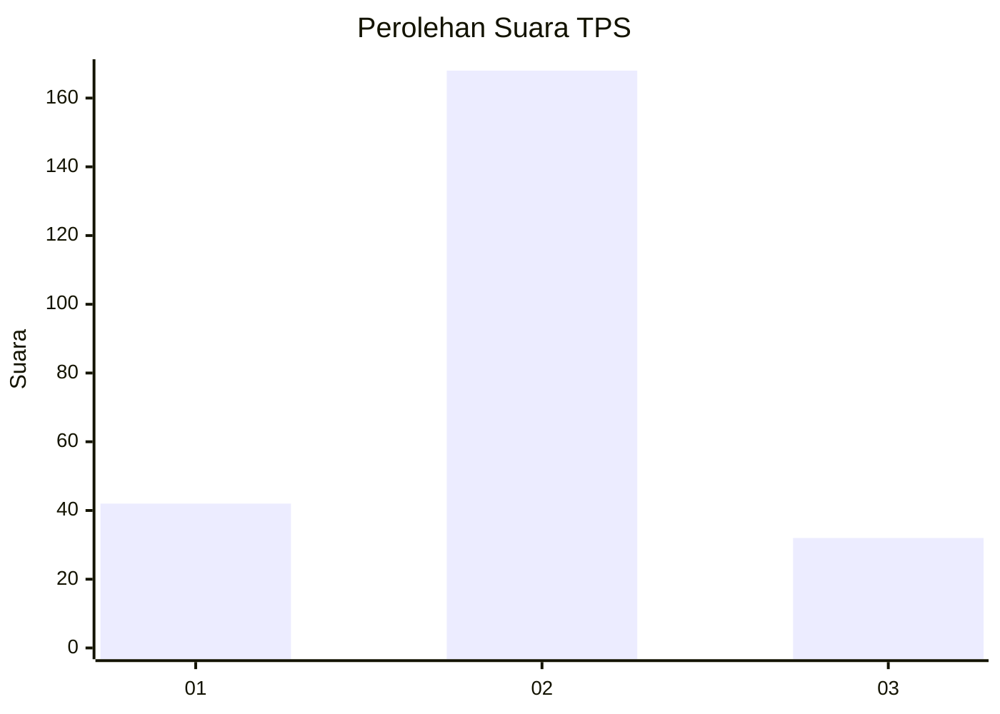
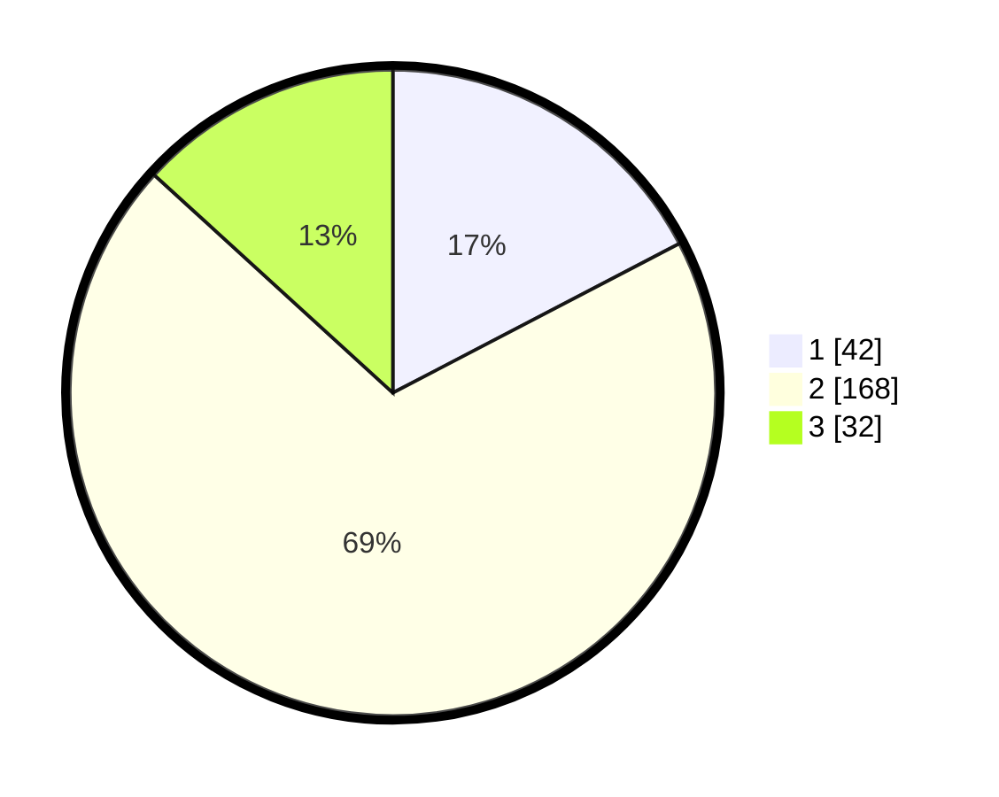

# Hasil

## Grafik

## Tabel

| No. | Nama Paslon    | Suara | Suara (raw) | Persentase |
|:--- |:-------------- | -----:| -----------:| ----------:|
| 1   | ANIES MUHAIMIN | 42    | [42][p-1]   | 17,36      |
| 2   | PRABOWO GIBRAN | 168   | [168][p-2]  | 69,42      |
| 3   | GANJAR MAHFUD  | 32    | [32][p-3]   | 13,22      |

[p-1]: https://github.com/gigit-pemilu/pemilu-2024/blob/main/pilpres/hitung-suara/sub/35-jawa-timur/sub/73-kota-malang/sub/02-klojen/sub/1010-gading-kasri/sub/004-tps/sub/paslon-1.txt
[p-2]: https://github.com/gigit-pemilu/pemilu-2024/blob/main/pilpres/hitung-suara/sub/35-jawa-timur/sub/73-kota-malang/sub/02-klojen/sub/1010-gading-kasri/sub/004-tps/sub/paslon-2.txt
[p-3]: https://github.com/gigit-pemilu/pemilu-2024/blob/main/pilpres/hitung-suara/sub/35-jawa-timur/sub/73-kota-malang/sub/02-klojen/sub/1010-gading-kasri/sub/004-tps/sub/paslon-3.txt

## Foto C Plano

https://sirekap-obj-formc.kpu.go.id/b5f4/pemilu/ppwp/35/73/02/10/10/3573021010004-20240215-003243--79d2f85c-fdb7-42cb-9af5-5650f9979a3b.jpg

https://sirekap-obj-formc.kpu.go.id/b5f4/pemilu/ppwp/35/73/02/10/10/3573021010004-20240215-003403--373fd46c-11f4-48c8-a2d8-7663ba6c607a.jpg

https://sirekap-obj-formc.kpu.go.id/b5f4/pemilu/ppwp/35/73/02/10/10/3573021010004-20240215-003457--3cb32839-de1c-46a0-8882-41c7905fbb33.jpg

## Metadata

| Key        | Value               |
| ---------- | ------------------- |
| Time Stamp | 2024-02-25 13:00:00 |

