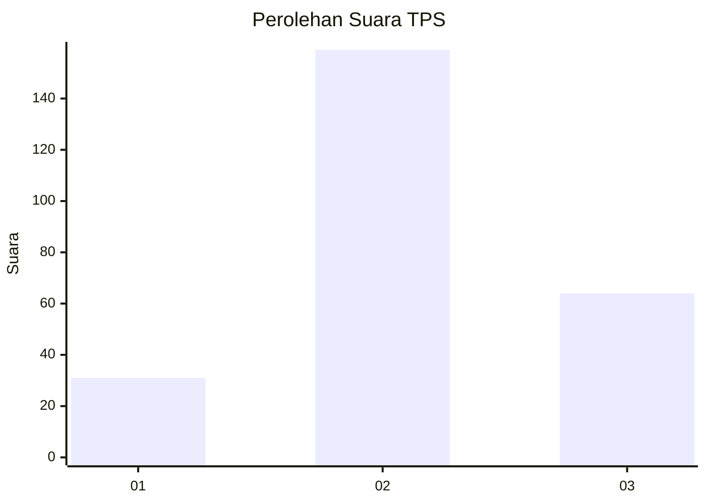
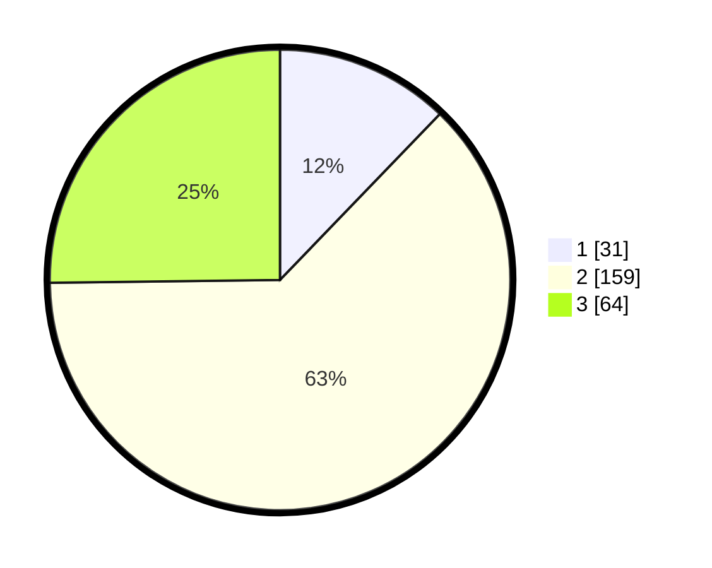

# Hasil

## Grafik

## Tabel

| No. | Nama Paslon    | Suara | Suara (raw) | Persentase |
|:--- |:-------------- | -----:| -----------:| ----------:|
| 1   | ANIES MUHAIMIN | 31    | [31][p-1]   | 12,20      |
| 2   | PRABOWO GIBRAN | 159   | [159][p-2]  | 62,60      |
| 3   | GANJAR MAHFUD  | 64    | [64][p-3]   | 25,20      |

[p-1]: https://github.com/gigit-pemilu/pemilu-2024-35-jawa-timur/blob/main/pilpres/hitung-suara/sub/35-jawa-timur/sub/73-kota-malang/sub/02-klojen/sub/1010-gading-kasri/sub/009-tps/sub/paslon-1.txt
[p-2]: https://github.com/gigit-pemilu/pemilu-2024-35-jawa-timur/blob/main/pilpres/hitung-suara/sub/35-jawa-timur/sub/73-kota-malang/sub/02-klojen/sub/1010-gading-kasri/sub/009-tps/sub/paslon-2.txt
[p-3]: https://github.com/gigit-pemilu/pemilu-2024-35-jawa-timur/blob/main/pilpres/hitung-suara/sub/35-jawa-timur/sub/73-kota-malang/sub/02-klojen/sub/1010-gading-kasri/sub/009-tps/sub/paslon-3.txt

## Foto C Plano

https://sirekap-obj-formc.kpu.go.id/8113/pemilu/ppwp/35/73/02/10/10/3573021010009-20240214-214509--c967b3a8-3933-4e34-9e95-3545104fcbc9.jpg

https://sirekap-obj-formc.kpu.go.id/8113/pemilu/ppwp/35/73/02/10/10/3573021010009-20240214-214520--ccadde20-e420-45cf-a23a-b1f643c8bad8.jpg

https://sirekap-obj-formc.kpu.go.id/8113/pemilu/ppwp/35/73/02/10/10/3573021010009-20240214-214605--213fb132-da86-428c-9d53-0fc14c767d48.jpg

## Metadata

| Key        | Value               |
| ---------- | ------------------- |
| Time Stamp | 2024-02-24 22:31:28 |

