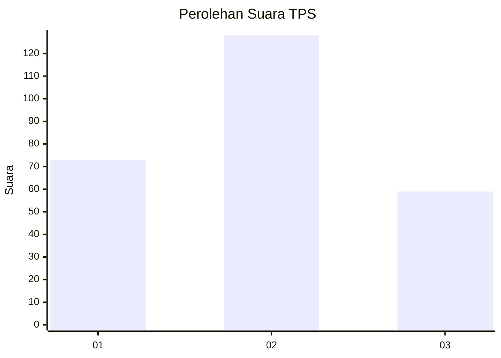
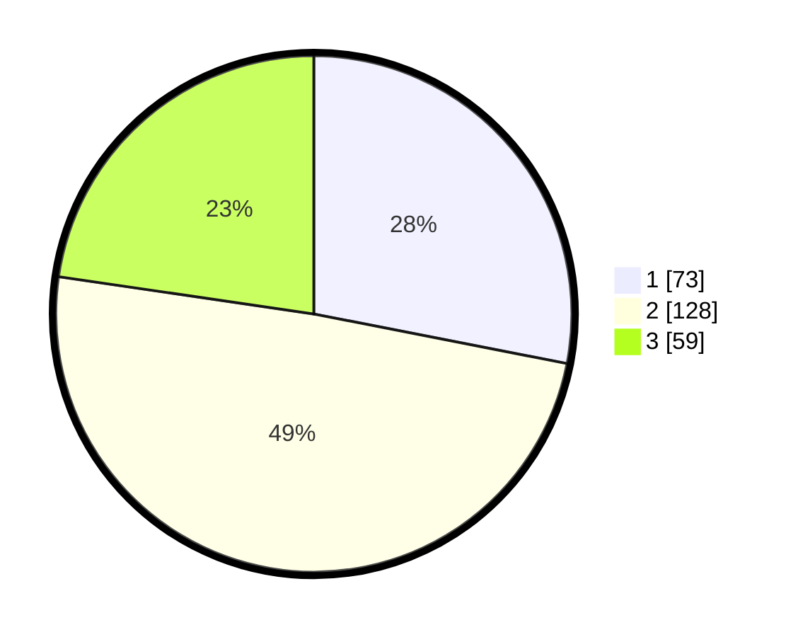

# Hasil

## Grafik

## Tabel

| No. | Nama Paslon    | Suara | Suara (raw) | Persentase |
|:--- |:-------------- | -----:| -----------:| ----------:|
| 1   | ANIES MUHAIMIN | 73    | [73][p-1]   | 28,08      |
| 2   | PRABOWO GIBRAN | 128   | [128][p-2]  | 49,23      |
| 3   | GANJAR MAHFUD  | 59    | [59][p-3]   | 22,69      |

[p-1]: https://github.com/gigit-pemilu/pemilu-2024-35-jawa-timur/blob/main/pilpres/hitung-suara/sub/35-jawa-timur/sub/73-kota-malang/sub/02-klojen/sub/1010-gading-kasri/sub/017-tps/sub/paslon-1.txt
[p-2]: https://github.com/gigit-pemilu/pemilu-2024-35-jawa-timur/blob/main/pilpres/hitung-suara/sub/35-jawa-timur/sub/73-kota-malang/sub/02-klojen/sub/1010-gading-kasri/sub/017-tps/sub/paslon-2.txt
[p-3]: https://github.com/gigit-pemilu/pemilu-2024-35-jawa-timur/blob/main/pilpres/hitung-suara/sub/35-jawa-timur/sub/73-kota-malang/sub/02-klojen/sub/1010-gading-kasri/sub/017-tps/sub/paslon-3.txt

## Foto C Plano

https://sirekap-obj-formc.kpu.go.id/be69/pemilu/ppwp/35/73/02/10/10/3573021010017-20240214-193127--0dc26c53-157c-4d78-bf91-e1bbb8e4349c.jpg

https://sirekap-obj-formc.kpu.go.id/be69/pemilu/ppwp/35/73/02/10/10/3573021010017-20240214-193214--5aa775ac-8688-4f6b-8de5-1fa25a9c7b03.jpg

https://sirekap-obj-formc.kpu.go.id/be69/pemilu/ppwp/35/73/02/10/10/3573021010017-20240214-193259--1eae7ef5-8245-4da6-828c-20ef18535e61.jpg

## Metadata

| Key        | Value               |
| ---------- | ------------------- |
| Time Stamp | 2024-02-19 06:16:00 |

