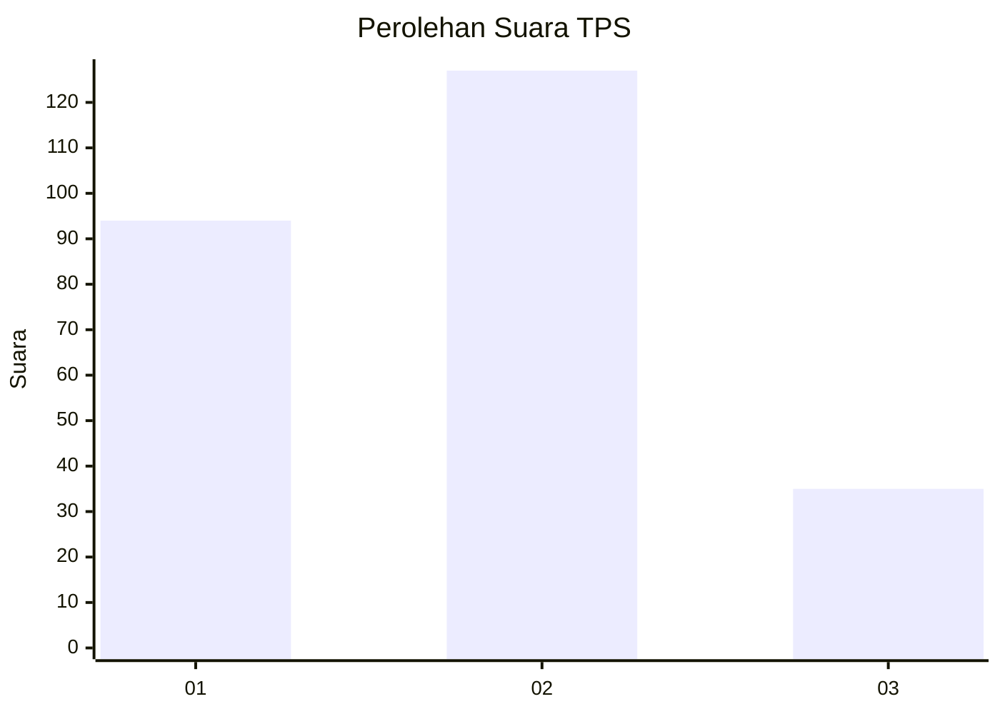
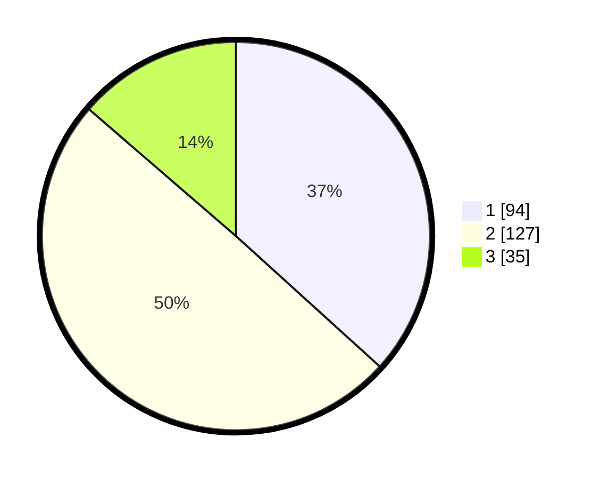

# Hasil

## Grafik

## Tabel

| No. | Nama Paslon    | Suara | Suara (raw) | Persentase |
|:--- |:-------------- | -----:| -----------:| ----------:|
| 1   | ANIES MUHAIMIN | 94    | [94][p-1]   | 36,72      |
| 2   | PRABOWO GIBRAN | 127   | [127][p-2]  | 49,61      |
| 3   | GANJAR MAHFUD  | 35    | [35][p-3]   | 13,67      |

[p-1]: https://github.com/gigit-pemilu/pemilu-2024-35-jawa-timur/blob/main/pilpres/hitung-suara/sub/35-jawa-timur/sub/73-kota-malang/sub/02-klojen/sub/1011-penanggungan/sub/021-tps/sub/paslon-1.txt
[p-2]: https://github.com/gigit-pemilu/pemilu-2024-35-jawa-timur/blob/main/pilpres/hitung-suara/sub/35-jawa-timur/sub/73-kota-malang/sub/02-klojen/sub/1011-penanggungan/sub/021-tps/sub/paslon-2.txt
[p-3]: https://github.com/gigit-pemilu/pemilu-2024-35-jawa-timur/blob/main/pilpres/hitung-suara/sub/35-jawa-timur/sub/73-kota-malang/sub/02-klojen/sub/1011-penanggungan/sub/021-tps/sub/paslon-3.txt

## Foto C Plano

https://sirekap-obj-formc.kpu.go.id/82d2/pemilu/ppwp/35/73/02/10/11/3573021011021-20240214-215024--f75ce5a7-78d4-41b0-be94-67d79cc92eb4.jpg

https://sirekap-obj-formc.kpu.go.id/82d2/pemilu/ppwp/35/73/02/10/11/3573021011021-20240214-215111--6829516b-92d2-497a-a9c3-e9e088010655.jpg

https://sirekap-obj-formc.kpu.go.id/82d2/pemilu/ppwp/35/73/02/10/11/3573021011021-20240214-215148--f7b55ec4-5380-4905-bd9d-d5a83019d858.jpg

## Metadata

| Key        | Value               |
| ---------- | ------------------- |
| Time Stamp | 2024-02-24 22:31:28 |

