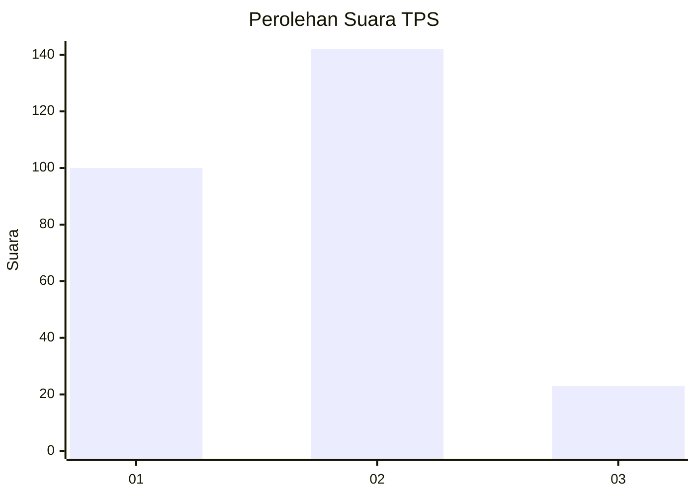

# Hasil

## Grafik

## Tabel

| No. | Nama Paslon    | Suara | Suara (raw) | Persentase |
|:--- |:-------------- | -----:| -----------:| ----------:|
| 1   | ANIES MUHAIMIN | 100   | [100][p-1]  | 37,74      |
| 2   | PRABOWO GIBRAN | 142   | [142][p-2]  | 53,58      |
| 3   | GANJAR MAHFUD  | 23    | [23][p-3]   | 8,68       |

[p-1]: https://github.com/gigit-pemilu/pemilu-2024-35-jawa-timur/blob/main/pilpres/hitung-suara/sub/35-jawa-timur/sub/73-kota-malang/sub/02-klojen/sub/1011-penanggungan/sub/024-tps/sub/paslon-1.txt
[p-2]: https://github.com/gigit-pemilu/pemilu-2024-35-jawa-timur/blob/main/pilpres/hitung-suara/sub/35-jawa-timur/sub/73-kota-malang/sub/02-klojen/sub/1011-penanggungan/sub/024-tps/sub/paslon-2.txt
[p-3]: https://github.com/gigit-pemilu/pemilu-2024-35-jawa-timur/blob/main/pilpres/hitung-suara/sub/35-jawa-timur/sub/73-kota-malang/sub/02-klojen/sub/1011-penanggungan/sub/024-tps/sub/paslon-3.txt

## Foto C Plano

https://sirekap-obj-formc.kpu.go.id/0007/pemilu/ppwp/35/73/02/10/11/3573021011024-20240214-220727--bf0369e8-debe-408b-9c2c-35091864705c.jpg

https://sirekap-obj-formc.kpu.go.id/0007/pemilu/ppwp/35/73/02/10/11/3573021011024-20240214-220744--a5d00042-5ab4-4fcc-bba8-095446de1c81.jpg

https://sirekap-obj-formc.kpu.go.id/0007/pemilu/ppwp/35/73/02/10/11/3573021011024-20240214-221146--31b50cf2-1be6-4d75-84c1-e5b6762611ff.jpg

## Metadata

| Key        | Value               |
| ---------- | ------------------- |
| Time Stamp | 2024-02-15 06:00:23 |

