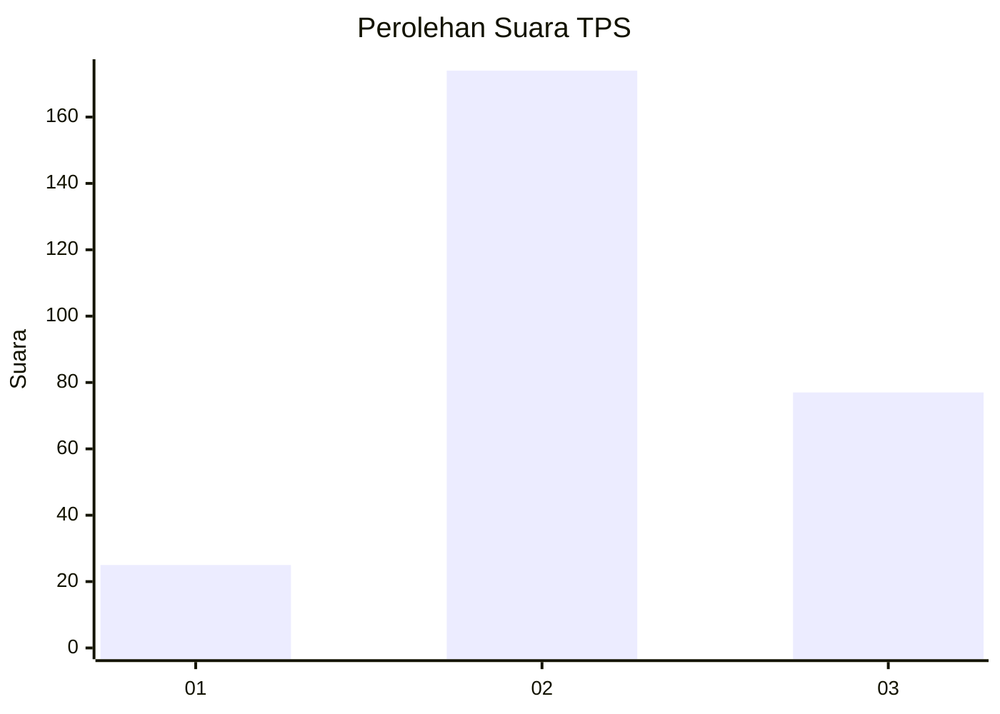
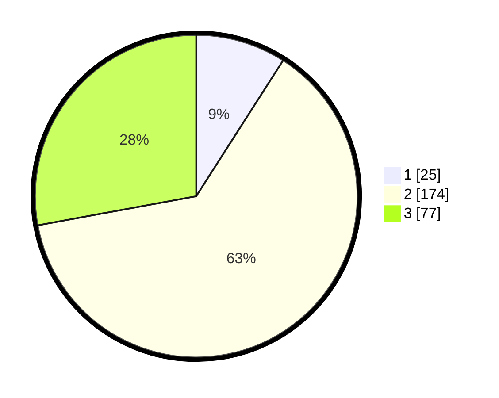

# Hasil

## Grafik

## Tabel

| No. | Nama Paslon    | Suara | Suara (raw) | Persentase |
|:--- |:-------------- | -----:| -----------:| ----------:|
| 1   | ANIES MUHAIMIN | 25    | [25][p-1]   | 9,06       |
| 2   | PRABOWO GIBRAN | 174   | [174][p-2]  | 63,04      |
| 3   | GANJAR MAHFUD  | 77    | [77][p-3]   | 27,90      |

[p-1]: https://github.com/gigit-pemilu/pemilu-2024/blob/main/pilpres/hitung-suara/sub/35-jawa-timur/sub/73-kota-malang/sub/03-kedungkandang/sub/1001-kotalama/sub/079-tps/sub/paslon-1.txt
[p-2]: https://github.com/gigit-pemilu/pemilu-2024/blob/main/pilpres/hitung-suara/sub/35-jawa-timur/sub/73-kota-malang/sub/03-kedungkandang/sub/1001-kotalama/sub/079-tps/sub/paslon-2.txt
[p-3]: https://github.com/gigit-pemilu/pemilu-2024/blob/main/pilpres/hitung-suara/sub/35-jawa-timur/sub/73-kota-malang/sub/03-kedungkandang/sub/1001-kotalama/sub/079-tps/sub/paslon-3.txt

## Foto C Plano

https://sirekap-obj-formc.kpu.go.id/a13f/pemilu/ppwp/35/73/03/10/01/3573031001079-20240215-003505--d22dea82-87d3-4f81-ac79-f0b2defba82d.jpg

https://sirekap-obj-formc.kpu.go.id/a13f/pemilu/ppwp/35/73/03/10/01/3573031001079-20240215-003713--ce3ed272-6749-4634-9ac0-cf588fea5a7d.jpg

https://sirekap-obj-formc.kpu.go.id/a13f/pemilu/ppwp/35/73/03/10/01/3573031001079-20240215-003939--33be5b93-67de-424a-8b18-c85e1090bea6.jpg

## Metadata

| Key        | Value               |
| ---------- | ------------------- |
| Time Stamp | 2024-02-15 19:30:26 |

