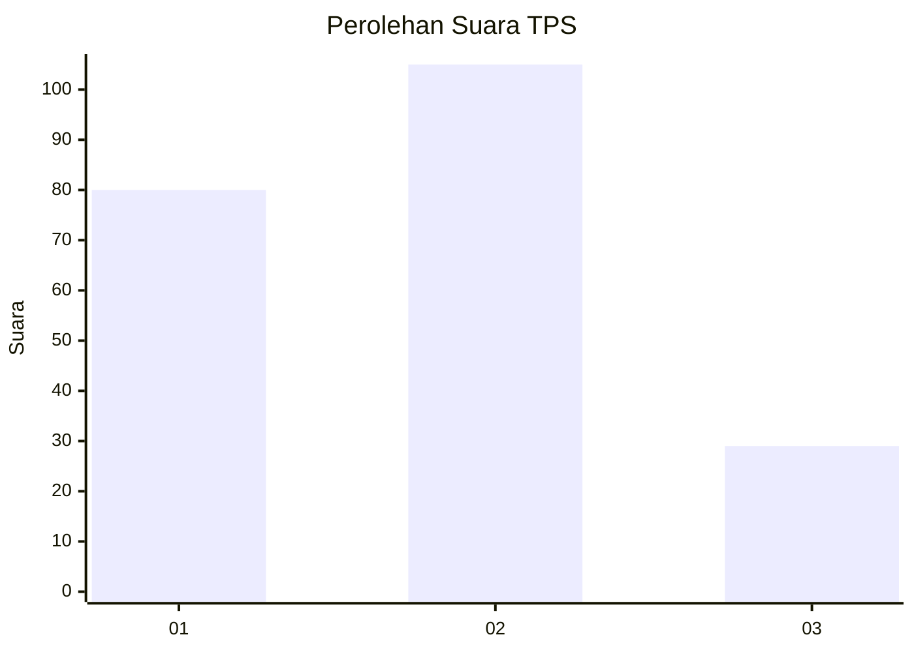
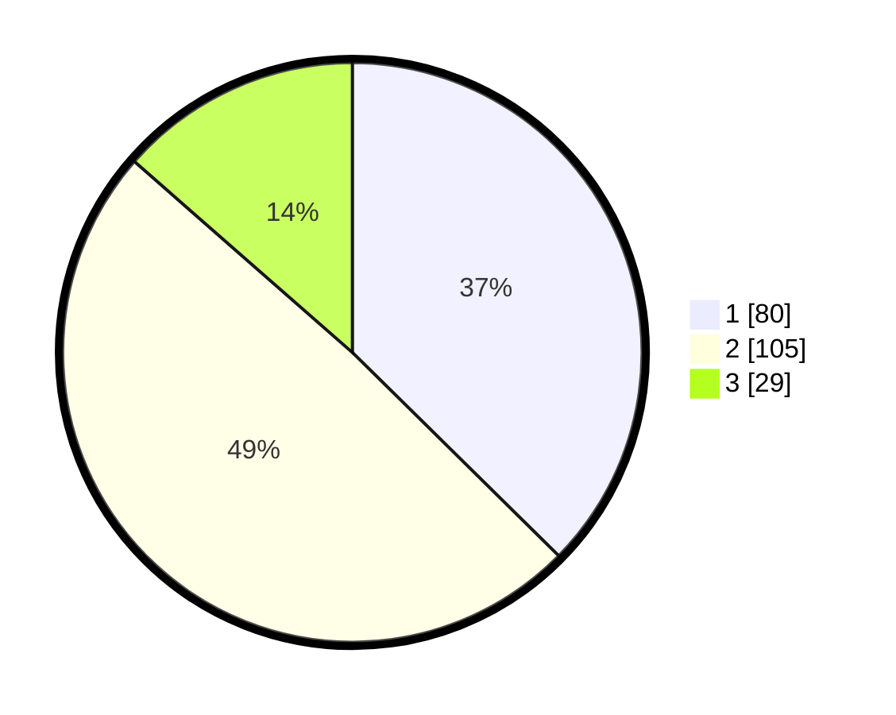

# Hasil

## Grafik

## Tabel

| No. | Nama Paslon    | Suara | Suara (raw) | Persentase |
|:--- |:-------------- | -----:| -----------:| ----------:|
| 1   | ANIES MUHAIMIN | 80    | [80][p-1]   | 37,38      |
| 2   | PRABOWO GIBRAN | 105   | [105][p-2]  | 49,07      |
| 3   | GANJAR MAHFUD  | 29    | [29][p-3]   | 13,55      |

[p-1]: https://github.com/gigit-pemilu/pemilu-2024-35-jawa-timur/blob/main/pilpres/hitung-suara/sub/35-jawa-timur/sub/73-kota-malang/sub/03-kedungkandang/sub/1003-bumiayu/sub/006-tps/sub/paslon-1.txt
[p-2]: https://github.com/gigit-pemilu/pemilu-2024-35-jawa-timur/blob/main/pilpres/hitung-suara/sub/35-jawa-timur/sub/73-kota-malang/sub/03-kedungkandang/sub/1003-bumiayu/sub/006-tps/sub/paslon-2.txt
[p-3]: https://github.com/gigit-pemilu/pemilu-2024-35-jawa-timur/blob/main/pilpres/hitung-suara/sub/35-jawa-timur/sub/73-kota-malang/sub/03-kedungkandang/sub/1003-bumiayu/sub/006-tps/sub/paslon-3.txt

## Foto C Plano

https://sirekap-obj-formc.kpu.go.id/3e35/pemilu/ppwp/35/73/03/10/03/3573031003006-20240214-210144--05b2bd46-4f90-4695-92bb-944615d1e8a1.jpg

https://sirekap-obj-formc.kpu.go.id/3e35/pemilu/ppwp/35/73/03/10/03/3573031003006-20240214-210337--7df166b0-13f4-48ce-864f-781da5b1b58c.jpg

https://sirekap-obj-formc.kpu.go.id/3e35/pemilu/ppwp/35/73/03/10/03/3573031003006-20240214-210357--7cf4cf80-cffb-4858-bf2f-baa45c43839f.jpg

## Metadata

| Key        | Value               |
| ---------- | ------------------- |
| Time Stamp | 2024-02-15 02:10:27 |

