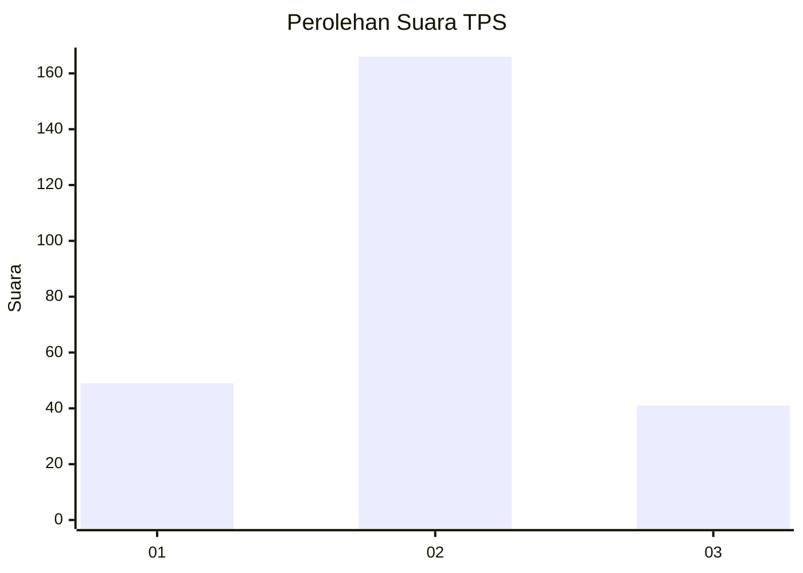
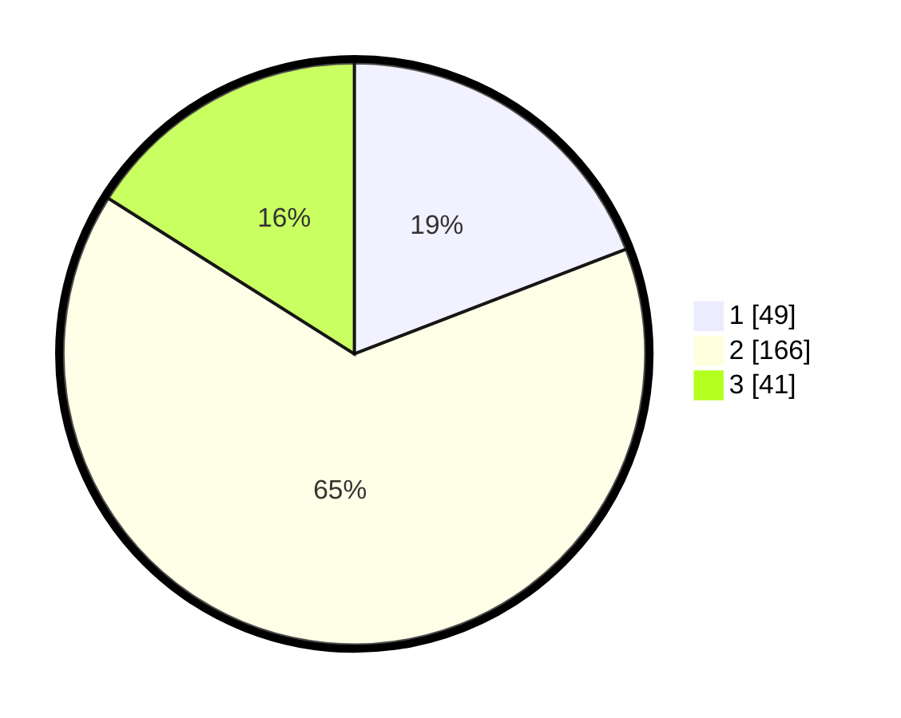

# Hasil

## Grafik

## Tabel

| No. | Nama Paslon    | Suara | Suara (raw) | Persentase |
|:--- |:-------------- | -----:| -----------:| ----------:|
| 1   | ANIES MUHAIMIN | 49    | [49][p-1]   | 19,14      |
| 2   | PRABOWO GIBRAN | 166   | [166][p-2]  | 64,84      |
| 3   | GANJAR MAHFUD  | 41    | [41][p-3]   | 16,02      |

[p-1]: https://github.com/gigit-pemilu/pemilu-2024-35-jawa-timur/blob/main/pilpres/hitung-suara/sub/35-jawa-timur/sub/73-kota-malang/sub/03-kedungkandang/sub/1007-lesanpuro/sub/007-tps/sub/paslon-1.txt
[p-2]: https://github.com/gigit-pemilu/pemilu-2024-35-jawa-timur/blob/main/pilpres/hitung-suara/sub/35-jawa-timur/sub/73-kota-malang/sub/03-kedungkandang/sub/1007-lesanpuro/sub/007-tps/sub/paslon-2.txt
[p-3]: https://github.com/gigit-pemilu/pemilu-2024-35-jawa-timur/blob/main/pilpres/hitung-suara/sub/35-jawa-timur/sub/73-kota-malang/sub/03-kedungkandang/sub/1007-lesanpuro/sub/007-tps/sub/paslon-3.txt

## Foto C Plano

https://sirekap-obj-formc.kpu.go.id/e06d/pemilu/ppwp/35/73/03/10/07/3573031007007-20240214-224239--992d9cc4-85f7-4c71-a735-14d49866a34a.jpg

https://sirekap-obj-formc.kpu.go.id/e06d/pemilu/ppwp/35/73/03/10/07/3573031007007-20240214-224509--72e60fc0-23b6-49f6-a9db-a000b56e83e1.jpg

https://sirekap-obj-formc.kpu.go.id/e06d/pemilu/ppwp/35/73/03/10/07/3573031007007-20240214-224628--a3f2bc3d-fda4-406a-911f-f663fa578189.jpg

## Metadata

| Key        | Value               |
| ---------- | ------------------- |
| Time Stamp | 2024-02-17 18:30:00 |

