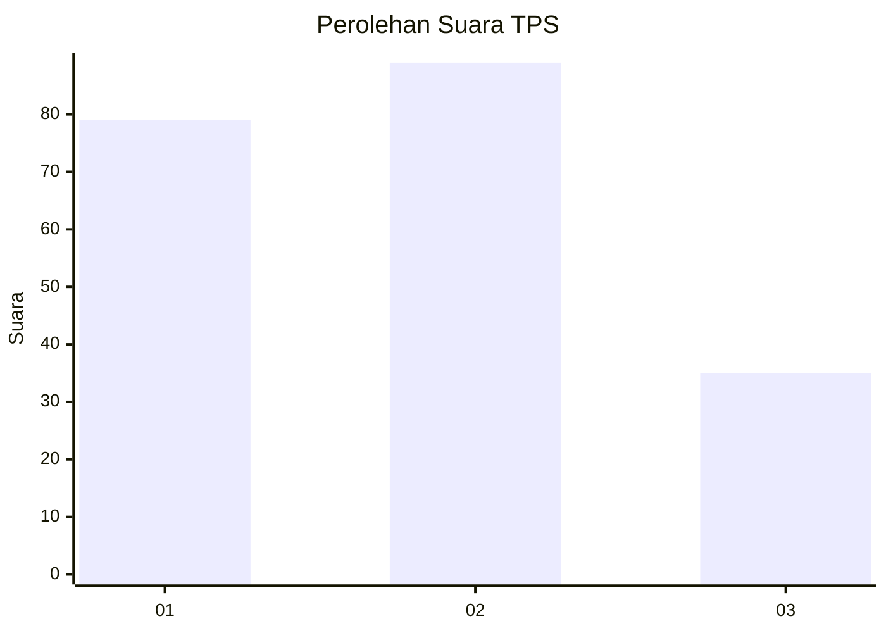
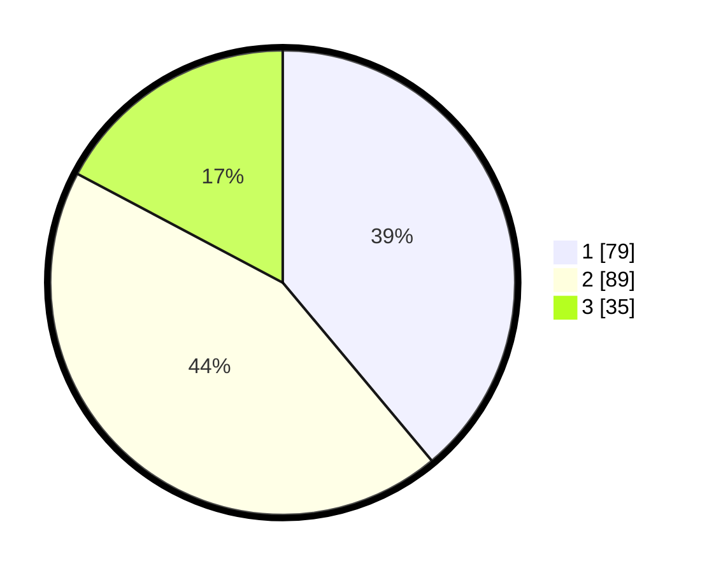

# Hasil

## Grafik

## Tabel

| No. | Nama Paslon    | Suara | Suara (raw) | Persentase |
|:--- |:-------------- | -----:| -----------:| ----------:|
| 1   | ANIES MUHAIMIN | 79    | [79][p-1]   | 38,92      |
| 2   | PRABOWO GIBRAN | 89    | [89][p-2]   | 43,84      |
| 3   | GANJAR MAHFUD  | 35    | [35][p-3]   | 17,24      |

[p-1]: https://github.com/gigit-pemilu/pemilu-2024/blob/main/pilpres/hitung-suara/sub/35-jawa-timur/sub/73-kota-malang/sub/03-kedungkandang/sub/1007-lesanpuro/sub/040-tps/sub/paslon-1.txt
[p-2]: https://github.com/gigit-pemilu/pemilu-2024/blob/main/pilpres/hitung-suara/sub/35-jawa-timur/sub/73-kota-malang/sub/03-kedungkandang/sub/1007-lesanpuro/sub/040-tps/sub/paslon-2.txt
[p-3]: https://github.com/gigit-pemilu/pemilu-2024/blob/main/pilpres/hitung-suara/sub/35-jawa-timur/sub/73-kota-malang/sub/03-kedungkandang/sub/1007-lesanpuro/sub/040-tps/sub/paslon-3.txt

## Foto C Plano

https://sirekap-obj-formc.kpu.go.id/e7b5/pemilu/ppwp/35/73/03/10/07/3573031007040-20240215-022114--720960c4-fbc6-4ac6-b570-692b282ba4f1.jpg

https://sirekap-obj-formc.kpu.go.id/e7b5/pemilu/ppwp/35/73/03/10/07/3573031007040-20240215-022217--8b7608e9-7ce3-4930-a081-4bb6298c5654.jpg

https://sirekap-obj-formc.kpu.go.id/e7b5/pemilu/ppwp/35/73/03/10/07/3573031007040-20240215-022342--e96ac5ef-fa9f-4362-be25-d55119761a7f.jpg

## Metadata

| Key        | Value               |
| ---------- | ------------------- |
| Time Stamp | 2024-02-24 22:31:28 |

