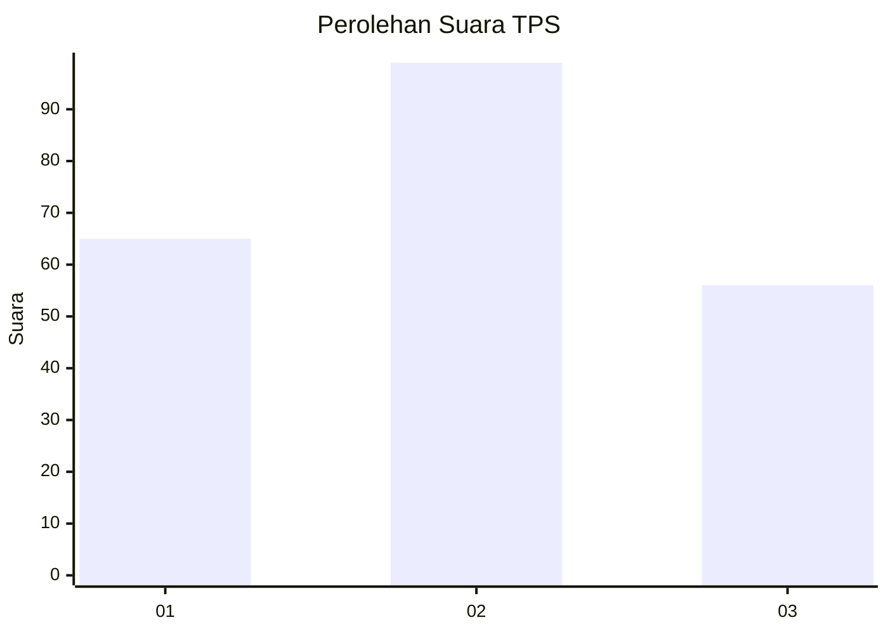
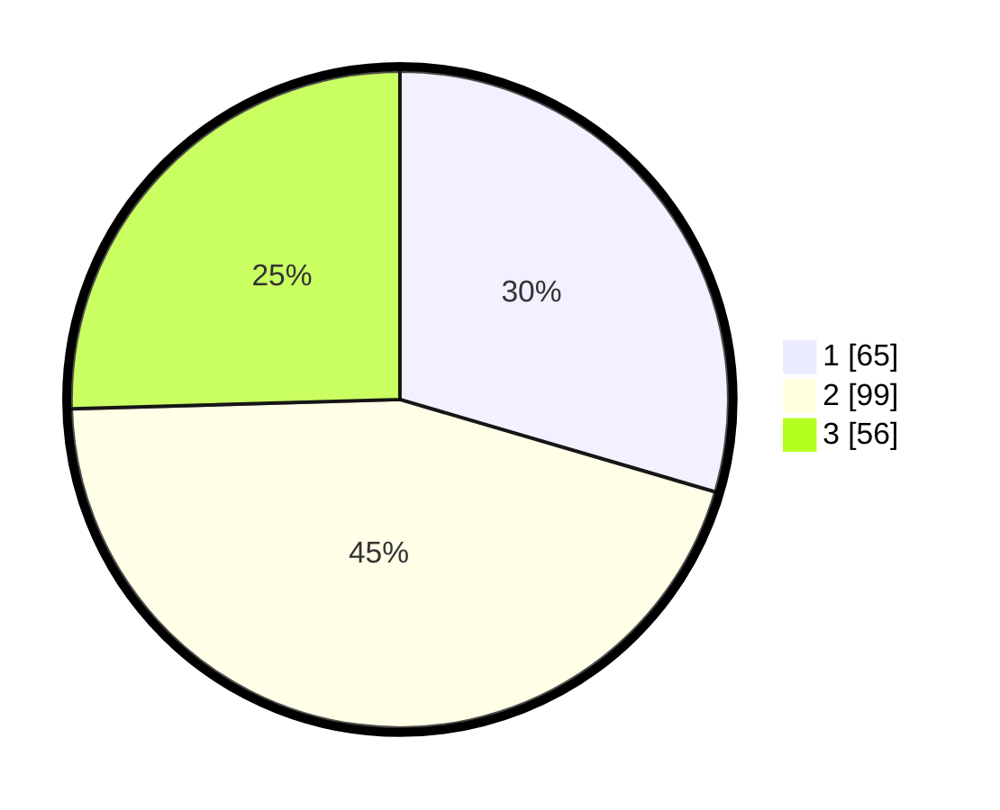

# Hasil

## Grafik

## Tabel

| No. | Nama Paslon    | Suara | Suara (raw) | Persentase |
|:--- |:-------------- | -----:| -----------:| ----------:|
| 1   | ANIES MUHAIMIN | 65    | [65][p-1]   | 29,55      |
| 2   | PRABOWO GIBRAN | 99    | [99][p-2]   | 45,00      |
| 3   | GANJAR MAHFUD  | 56    | [56][p-3]   | 25,45      |

[p-1]: https://github.com/gigit-pemilu/pemilu-2024-35-jawa-timur/blob/main/pilpres/hitung-suara/sub/35-jawa-timur/sub/73-kota-malang/sub/03-kedungkandang/sub/1007-lesanpuro/sub/052-tps/sub/paslon-1.txt
[p-2]: https://github.com/gigit-pemilu/pemilu-2024-35-jawa-timur/blob/main/pilpres/hitung-suara/sub/35-jawa-timur/sub/73-kota-malang/sub/03-kedungkandang/sub/1007-lesanpuro/sub/052-tps/sub/paslon-2.txt
[p-3]: https://github.com/gigit-pemilu/pemilu-2024-35-jawa-timur/blob/main/pilpres/hitung-suara/sub/35-jawa-timur/sub/73-kota-malang/sub/03-kedungkandang/sub/1007-lesanpuro/sub/052-tps/sub/paslon-3.txt

## Foto C Plano

https://sirekap-obj-formc.kpu.go.id/d8b9/pemilu/ppwp/35/73/03/10/07/3573031007052-20240215-035038--f71f04fb-d674-4a4f-83bf-c9aefdc9f00a.jpg

https://sirekap-obj-formc.kpu.go.id/d8b9/pemilu/ppwp/35/73/03/10/07/3573031007052-20240215-035158--8ec5bb3b-d5d9-4d75-b6c9-61c661b83062.jpg

https://sirekap-obj-formc.kpu.go.id/d8b9/pemilu/ppwp/35/73/03/10/07/3573031007052-20240215-035323--0b77d1e6-5992-4403-ae2e-01171ca07cd2.jpg

## Metadata

| Key        | Value               |
| ---------- | ------------------- |
| Time Stamp | 2024-02-25 12:00:00 |

