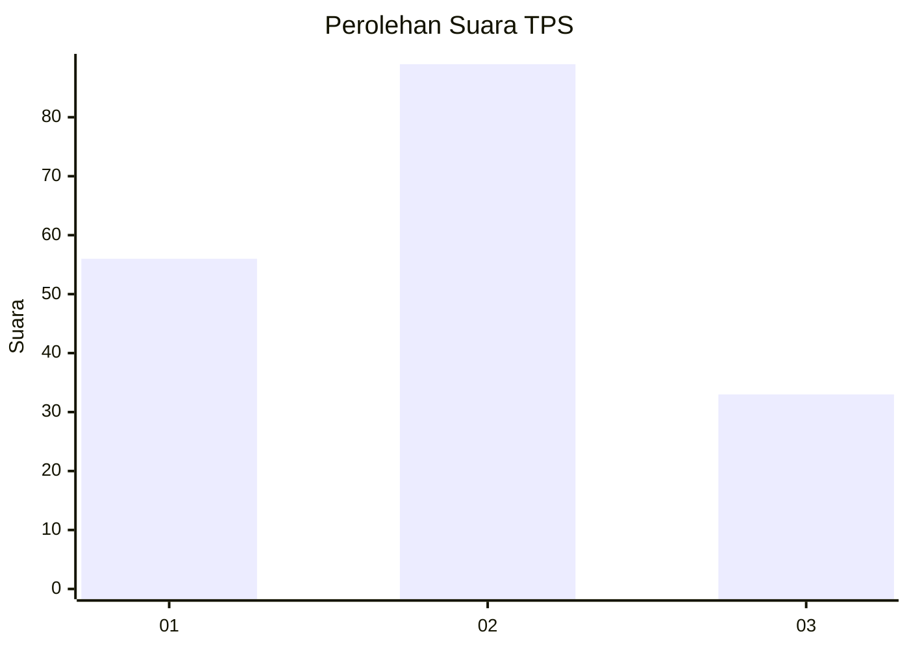
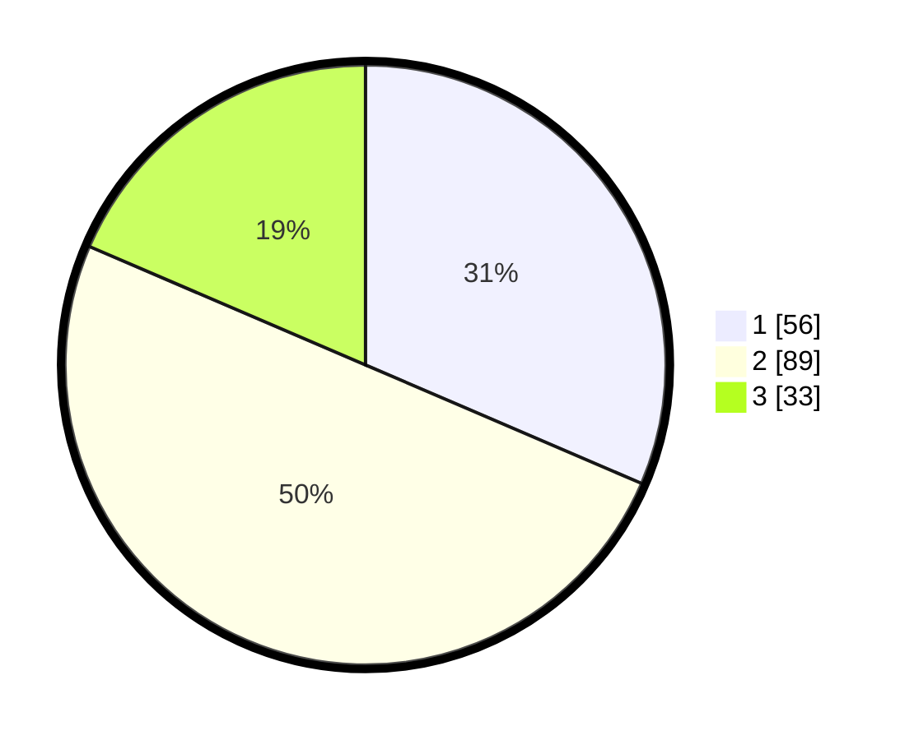

# Hasil

## Grafik

## Tabel

| No. | Nama Paslon    | Suara | Suara (raw) | Persentase |
|:--- |:-------------- | -----:| -----------:| ----------:|
| 1   | ANIES MUHAIMIN | 56    | [56][p-1]   | 31,46      |
| 2   | PRABOWO GIBRAN | 89    | [89][p-2]   | 50,00      |
| 3   | GANJAR MAHFUD  | 33    | [33][p-3]   | 18,54      |

[p-1]: https://github.com/gigit-pemilu/pemilu-2024/blob/main/pilpres/hitung-suara/sub/35-jawa-timur/sub/73-kota-malang/sub/03-kedungkandang/sub/1007-lesanpuro/sub/059-tps/sub/paslon-1.txt
[p-2]: https://github.com/gigit-pemilu/pemilu-2024/blob/main/pilpres/hitung-suara/sub/35-jawa-timur/sub/73-kota-malang/sub/03-kedungkandang/sub/1007-lesanpuro/sub/059-tps/sub/paslon-2.txt
[p-3]: https://github.com/gigit-pemilu/pemilu-2024/blob/main/pilpres/hitung-suara/sub/35-jawa-timur/sub/73-kota-malang/sub/03-kedungkandang/sub/1007-lesanpuro/sub/059-tps/sub/paslon-3.txt

## Foto C Plano

https://sirekap-obj-formc.kpu.go.id/a970/pemilu/ppwp/35/73/03/10/07/3573031007059-20240215-022853--ecd2d3e6-43bb-48f0-a352-d1c248d9a58e.jpg

https://sirekap-obj-formc.kpu.go.id/a970/pemilu/ppwp/35/73/03/10/07/3573031007059-20240215-022929--d08cd8af-207b-4dac-a7df-dd75af1891a3.jpg

https://sirekap-obj-formc.kpu.go.id/a970/pemilu/ppwp/35/73/03/10/07/3573031007059-20240215-023007--8fb7d97d-58c0-40bf-9080-4d1d1055f34b.jpg

## Metadata

| Key        | Value               |
| ---------- | ------------------- |
| Time Stamp | 2024-02-24 22:31:28 |

