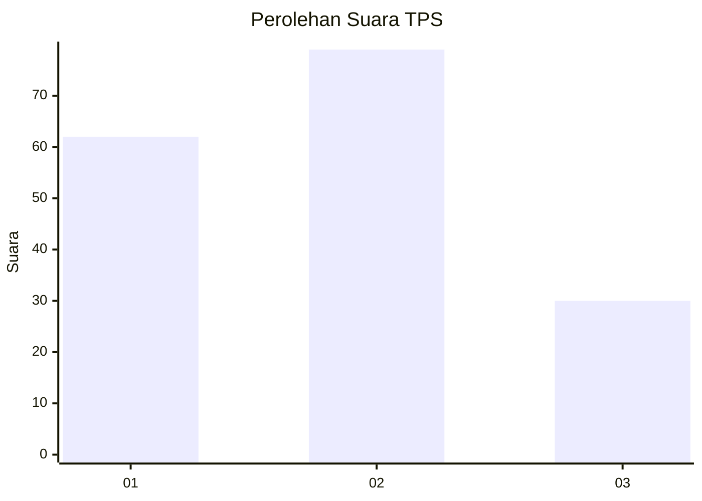
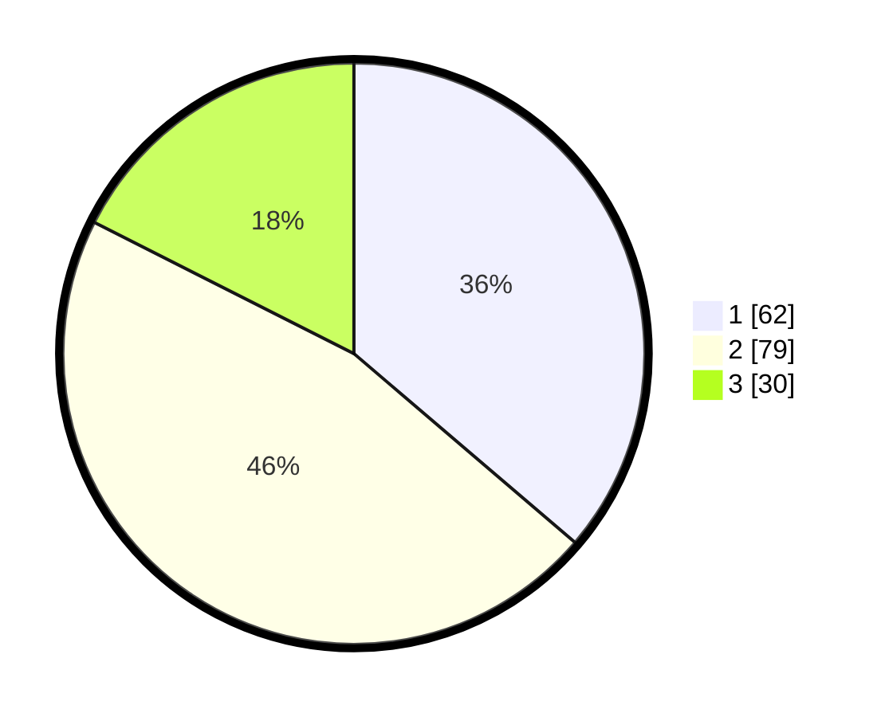

# Hasil

## Grafik

## Tabel

| No. | Nama Paslon    | Suara | Suara (raw) | Persentase |
|:--- |:-------------- | -----:| -----------:| ----------:|
| 1   | ANIES MUHAIMIN | 62    | [62][p-1]   | 36,26      |
| 2   | PRABOWO GIBRAN | 79    | [79][p-2]   | 46,20      |
| 3   | GANJAR MAHFUD  | 30    | [30][p-3]   | 17,54      |

[p-1]: https://github.com/gigit-pemilu/pemilu-2024/blob/main/pilpres/hitung-suara/sub/35-jawa-timur/sub/73-kota-malang/sub/03-kedungkandang/sub/1008-sawojajar/sub/036-tps/sub/paslon-1.txt
[p-2]: https://github.com/gigit-pemilu/pemilu-2024/blob/main/pilpres/hitung-suara/sub/35-jawa-timur/sub/73-kota-malang/sub/03-kedungkandang/sub/1008-sawojajar/sub/036-tps/sub/paslon-2.txt
[p-3]: https://github.com/gigit-pemilu/pemilu-2024/blob/main/pilpres/hitung-suara/sub/35-jawa-timur/sub/73-kota-malang/sub/03-kedungkandang/sub/1008-sawojajar/sub/036-tps/sub/paslon-3.txt

## Foto C Plano

https://sirekap-obj-formc.kpu.go.id/3e44/pemilu/ppwp/35/73/03/10/08/3573031008036-20240214-224741--1cfc7ff0-0dd0-43f3-be1c-b096668ef06f.jpg

https://sirekap-obj-formc.kpu.go.id/3e44/pemilu/ppwp/35/73/03/10/08/3573031008036-20240214-224832--9a509ed6-ccc6-4441-a952-08b55555e7b7.jpg

https://sirekap-obj-formc.kpu.go.id/3e44/pemilu/ppwp/35/73/03/10/08/3573031008036-20240214-224931--47e73897-17e1-4251-b2c2-673763268a36.jpg

## Metadata

| Key        | Value               |
| ---------- | ------------------- |
| Time Stamp | 2024-02-25 12:00:00 |

