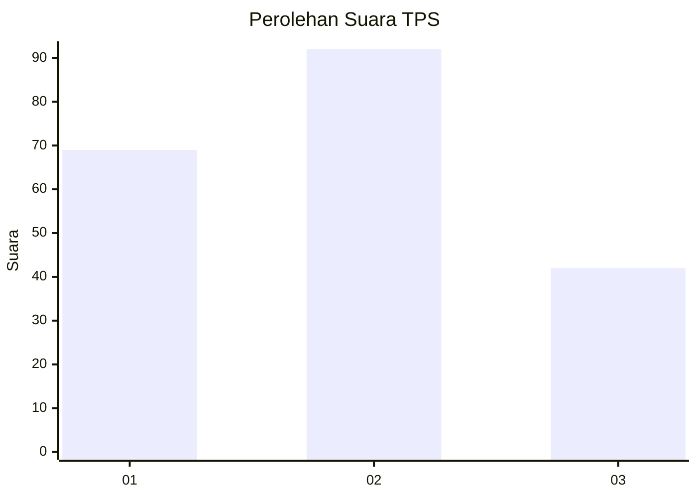
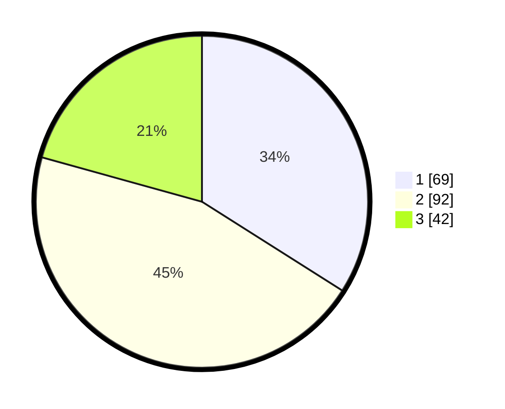

# Hasil

## Grafik

## Tabel

| No. | Nama Paslon    | Suara | Suara (raw) | Persentase |
|:--- |:-------------- | -----:| -----------:| ----------:|
| 1   | ANIES MUHAIMIN | 69    | [69][p-1]   | 33,99      |
| 2   | PRABOWO GIBRAN | 92    | [92][p-2]   | 45,32      |
| 3   | GANJAR MAHFUD  | 42    | [42][p-3]   | 20,69      |

[p-1]: https://github.com/gigit-pemilu/pemilu-2024/blob/main/pilpres/hitung-suara/sub/35-jawa-timur/sub/73-kota-malang/sub/03-kedungkandang/sub/1008-sawojajar/sub/053-tps/sub/paslon-1.txt
[p-2]: https://github.com/gigit-pemilu/pemilu-2024/blob/main/pilpres/hitung-suara/sub/35-jawa-timur/sub/73-kota-malang/sub/03-kedungkandang/sub/1008-sawojajar/sub/053-tps/sub/paslon-2.txt
[p-3]: https://github.com/gigit-pemilu/pemilu-2024/blob/main/pilpres/hitung-suara/sub/35-jawa-timur/sub/73-kota-malang/sub/03-kedungkandang/sub/1008-sawojajar/sub/053-tps/sub/paslon-3.txt

## Foto C Plano

https://sirekap-obj-formc.kpu.go.id/b51d/pemilu/ppwp/35/73/03/10/08/3573031008053-20240214-225707--284f9e75-a344-48f1-9438-02c4089950cf.jpg

https://sirekap-obj-formc.kpu.go.id/b51d/pemilu/ppwp/35/73/03/10/08/3573031008053-20240214-225850--242c3496-0ff0-44dc-a6f5-7fafa2384571.jpg

https://sirekap-obj-formc.kpu.go.id/b51d/pemilu/ppwp/35/73/03/10/08/3573031008053-20240214-225955--ad6c2dfd-8bf7-44cd-8b05-26720e6f74c8.jpg

## Metadata

| Key        | Value               |
| ---------- | ------------------- |
| Time Stamp | 2024-02-24 22:31:28 |

